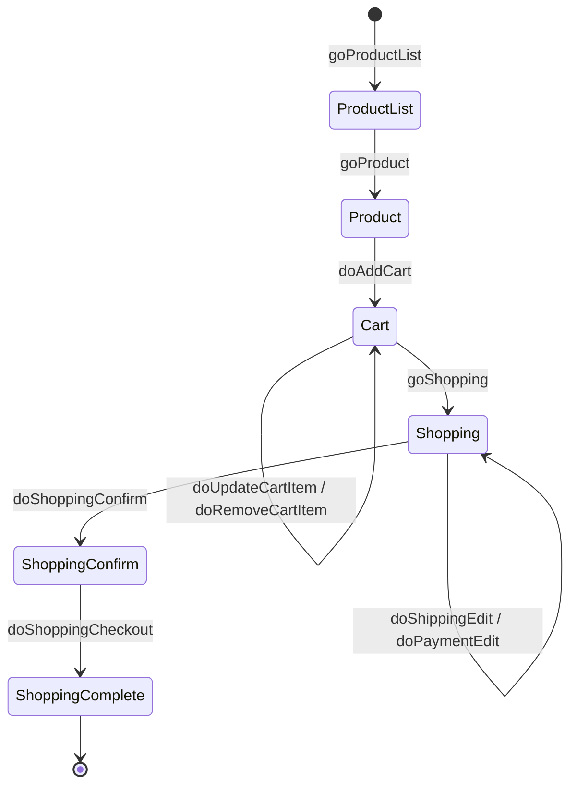

# EC-CUBE 4.3 ALPS Profile

[EC-CUBE 4.3](https://github.com/EC-CUBE/ec-cube) の ALPS（Application-Level Profile Semantics）プロファイル。

[HTML ドキュメントを見る](https://koriym.github.io/ec-cube-alps/alps.json.html) | [OpenAPI サンプル](https://koriym.github.io/ec-cube-alps/openapi.html) | [ブログ記事](https://koriym.github.io/ec-cube-alps/)

## ALPS とは

[ALPS](https://www.app-state-diagram.com/manuals/1.0/ja/index.html) はアプリケーションのセマンティクス（データ語彙と状態遷移）を記述するための仕様。APIフォーマット（HTML, HAL, Collection+JSON 等）から独立してアプリケーションの意味を定義する。

このプロファイルを作成した目的:

- EC-CUBE のドメインモデルと画面遷移を機械可読な形式で文書化する
- フロントエンドとバックエンドの間でデータ語彙を統一する
- API 設計の出発点として利用する

## 戦略: ソースコード駆動プロファイリング

推測ではなく、実際のソースコードから構築した。情報源は以下の通り:

- **`@Route` アノテーション** — URL パスと HTTP メソッドから状態遷移を導出
- **Controller クラス** — リクエストパラメータとレスポンス構造から操作を定義
- **Doctrine Entity** — プロパティ名と型からセマンティックディスクリプタを生成
- **Twig テンプレート** — 画面表示項目からデータ要素を補完

全ディスクリプタに情報源タグ（`src-router`, `src-entity`, `src-controller`, `src-template`）を付与し、根拠を追跡可能にしている。

## プロファイル概要

3層のディスクリプタで構成:

| 層 | 説明 | 数 |
|---|---|---|
| セマンティック | データ語彙（商品名、価格、数量など） | 276 |
| safe (GET) | 情報取得の状態遷移 | 58 |
| unsafe (POST) | 状態変更の操作 | 35 |
| idempotent (PUT/DELETE) | 冪等な状態変更 | 44 |
| **合計** | | **413** |

情報源タグの内訳:

| タグ | 説明 | 数 |
|---|---|---|
| `src-entity` | Doctrine Entity 由来 | 193 |
| `src-router` | ルート定義由来 | 156 |
| `src-template` | Twig テンプレート由来 | 80 |
| `src-controller` | Controller ロジック由来 | 10 |

## カバレッジ

- フロント（顧客向け）ルート: ほぼ 100%
- 管理画面ルート: 30 ルート未カバー（システム設定 8、コンテンツ管理 6、商品規格 5、ショップ設定 5 等）
- 全体の実効カバレッジ: 82.6%（250 ルート中）

## 購入フローの例

EC-CUBE の主要なユースケースである購入フローの状態遷移:



## ファイル構成

| ファイル | 説明 |
|---|---|
| `alps.json` | ALPS プロファイル本体（機械可読） |
| `alps.json.html` | [app-state-diagram](https://github.com/alps-asd/app-state-diagram) で生成した HTML ドキュメント |
| `openapi.yaml` | ALPS から変換した OpenAPI 3.1 仕様（フロントエンドのみ・参考実装） |
| `openapi.html` | OpenAPI の HTML ドキュメント（Redoc で生成・参考実装） |
| `tag.md` | タグ分類体系（ワークフロー・ドメイン・アクター・情報源の命名規則） |
| `handover.json` | 構築プロセスの記録（カバレッジ、情報源、戦略の説明） |

## 移植検討用の補助資料

このリポジトリの主目的は `alps.json` と公開ドキュメントの保守だが、EC-CUBE を Be / BEAR.Sunday へ移植するための補助資料と実験的ツールも同居している。

| ファイル / ディレクトリ | 説明 |
|---|---|
| `ec-cube-bear-be-migration-plan.md` | 移植全体の段階計画 |
| `be-first-migration-method.md` | 最初は Be-only で進める方針の共有用要約 |
| `autonomous-execution-runbook.md` | 長時間作業の再開手順と停止条件 |
| `day0-workflow.md` | 実移植 repo を立ち上げる初日手順 |
| `skills-matrix.md` | 利用する skill の一覧と位置づけ |
| `task_plan.md` / `findings.md` / `progress.md` | file-based planning 用の作業メモ |
| `orchestrator-v1.md` | JSON-first orchestrator の概要 |
| `.migrate/` | workflow, packet DSL, task queue, schema, run artifact の置き場 |
| `.migrate/packets/*.json` | `resource-contract` packet と `be-semantic` packet の定義 |
| `bin/orchestrator` | task / run / worker / generic packet executor を扱う CLI |
| `tests/OrchestratorTest.php` | orchestrator と packet の PHPUnit |

現時点では、`catalog/ProductList` などの `resource-contract` packet に加えて、[`cart-quantity.json`](~/git/ec-cube-alps/.migrate/packets/cart-quantity.json) のような最小 `Be-first` packet と、[`cart-add-cart-item-input.json`](~/git/ec-cube-alps/.migrate/packets/cart-add-cart-item-input.json) のようなその上位 packet も置いている。

これらは ALPS 本体の公開成果物ではなく、移植検討と検証のための補助資料として扱う。

## 使い方

### HTML ドキュメントの閲覧

[https://koriym.github.io/ec-cube-alps/alps.json.html](https://koriym.github.io/ec-cube-alps/alps.json.html) で閲覧できる。状態遷移図・ディスクリプタ一覧・タグフィルタが利用できる。

### asd コマンドでの操作

[app-state-diagram](https://github.com/alps-asd/app-state-diagram) がインストール済みの場合:

```bash
# プロファイルの検証
asd --lint alps.json

# HTML ドキュメント生成
asd -e alps.json

# SVG 状態遷移図の生成
asd -s alps.json
```

## 参考

- [ALPS 仕様](https://www.app-state-diagram.com/manuals/1.0/ja/index.html)
- [app-state-diagram](https://github.com/alps-asd/app-state-diagram) — ALPS プロファイルの可視化ツール
- [EC-CUBE 4.3](https://github.com/EC-CUBE/ec-cube) — 対象アプリケーション
- [Be Framework](https://be-framework.github.io/llms-full.txt) — 移植先候補のドメイン変換フレームワーク
- [BEAR.Sunday](https://bearsunday.github.io/llms-full.txt) — 移植先候補の resource 指向フレームワーク
