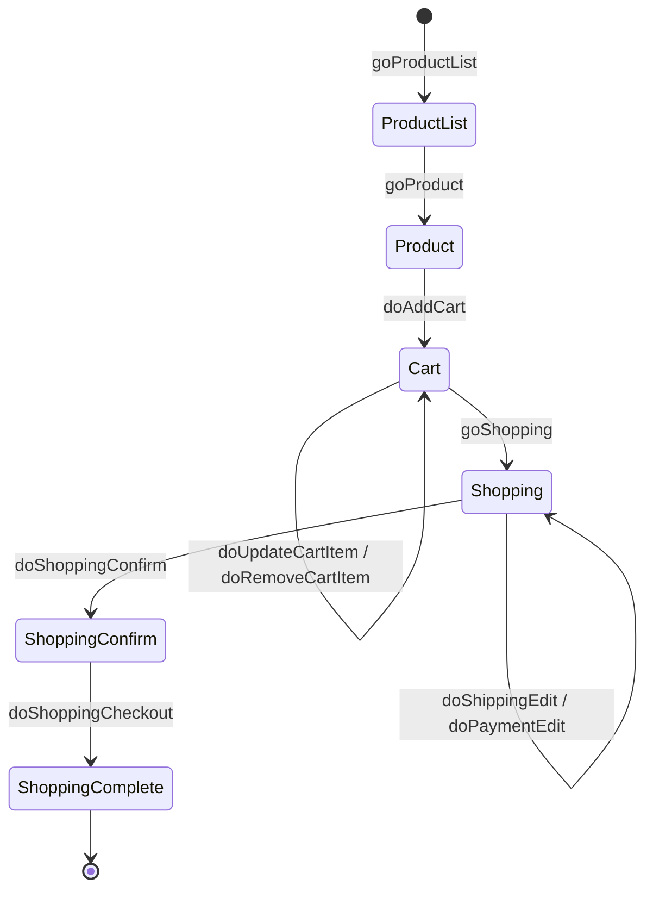

# EC-CUBE 4.3 ALPS Profile

[EC-CUBE 4.3](https://github.com/EC-CUBE/ec-cube) の ALPS（Application-Level Profile Semantics）プロファイル。

[HTML ドキュメントを見る](https://koriym.github.io/ec-cube-alps/alps.json.html) | [OpenAPI サンプル](https://koriym.github.io/ec-cube-alps/openapi.html) | [ブログ記事](https://koriym.github.io/ec-cube-alps/)

## ALPS とは

[ALPS](https://www.app-state-diagram.com/manuals/1.0/ja/index.html) はアプリケーションのセマンティクス（データ語彙と状態遷移）を記述するための仕様。APIフォーマット（HTML, HAL, Collection+JSON 等）から独立してアプリケーションの意味を定義する。

このプロファイルを作成した目的:

- EC-CUBE のドメインモデルと画面遷移を機械可読な形式で文書化する
- フロントエンドとバックエンドの間でデータ語彙を統一する
- API 設計の出発点として利用する

## 戦略: ソースコード駆動プロファイリング

推測ではなく、実際のソースコードから構築した。情報源は以下の通り:

- **`@Route` アノテーション** — URL パスと HTTP メソッドから状態遷移を導出
- **Controller クラス** — リクエストパラメータとレスポンス構造から操作を定義
- **Doctrine Entity** — プロパティ名と型からセマンティックディスクリプタを生成
- **Twig テンプレート** — 画面表示項目からデータ要素を補完

全ディスクリプタに情報源タグ（`src-router`, `src-entity`, `src-controller`, `src-template`）を付与し、根拠を追跡可能にしている。

## プロファイル概要

3層のディスクリプタで構成:

| 層 | 説明 | 数 |
|---|---|---|
| セマンティック | データ語彙（商品名、価格、数量など） | 276 |
| safe (GET) | 情報取得の状態遷移 | 58 |
| unsafe (POST) | 状態変更の操作 | 35 |
| idempotent (PUT/DELETE) | 冪等な状態変更 | 44 |
| **合計** | | **413** |

情報源タグの内訳:

| タグ | 説明 | 数 |
|---|---|---|
| `src-entity` | Doctrine Entity 由来 | 193 |
| `src-router` | ルート定義由来 | 156 |
| `src-template` | Twig テンプレート由来 | 80 |
| `src-controller` | Controller ロジック由来 | 10 |

## カバレッジ

- フロント（顧客向け）ルート: ほぼ 100%
- 管理画面ルート: 30 ルート未カバー（システム設定 8、コンテンツ管理 6、商品規格 5、ショップ設定 5 等）
- 全体の実効カバレッジ: 82.6%（250 ルート中）

## 購入フローの例

EC-CUBE の主要なユースケースである購入フローの状態遷移:



## ファイル構成

| ファイル | 説明 |
|---|---|
| `alps.json` | ALPS プロファイル本体（機械可読） |
| `alps.json.html` | [app-state-diagram](https://github.com/alps-asd/app-state-diagram) で生成した HTML ドキュメント |
| `openapi.yaml` | ALPS から変換した OpenAPI 3.1 仕様（フロントエンドのみ・参考実装） |
| `openapi.html` | OpenAPI の HTML ドキュメント（Redoc で生成・参考実装） |
| `docs/tag.md` | タグ分類体系（ワークフロー・ドメイン・アクター・情報源の命名規則） |
| `docs/HANDOVER.md` | 構築プロセスの記録（カバレッジ、Pilot 1/2 完了報告、次の AI への助言） |

## 移植プロジェクト（BeMart）

このリポジトリの主目的は `alps.json` と公開ドキュメントの保守だが、EC-CUBE 4.3 を
Be Framework + BEAR.Sunday へ移植する実装プロジェクト（**BeMart**）が同じ monorepo に
同居している。移植は ALPS を契約として 3 フェーズ進行している:

- **Phase A** — ALPS の状態遷移を Be Framework ドメイン層 + BEAR.Sunday JSON リソースへ移植（`docs/HANDOVER.md`）
- **Phase 2** — 全 34 ストレージインターフェースを Fake → SQL（MariaDB/MySQL）へ移植し、本番バインディングへ切替（`sql/`）
- **Phase 3** — HTML プレゼンテーション層。EC-CUBE テンプレートの忠実移植 + レンダー差分テスト（`var/templates/`、進行中）

**現在の移植ステータス（レイヤ別の at-a-glance マトリクス）→ [`docs/migration-status.md`](docs/migration-status.md)**。
本 README はエントリポイントであり、ステータスログではない。最新の進捗・残作業はそちらを参照。

| ファイル / ディレクトリ | 説明 |
|---|---|
| `docs/migration-status.md` | **移植ステータスの正**（レイヤ別マトリクス・残作業 punch-list） |
| `docs/HANDOVER.md` | 移植の構築プロセス記録（Phase A / Phase 2 / Phase 3 の決定ログ） |
| `src/` | BEAR.Sunday アプリケーション層（`Resource/`, `Module/`, `Form/`） |
| `be/` | Be Framework ドメイン層（`my-vendor/be-mart-be`、path repo として参照） |
| `sql/` | EC-CUBE 4.3 スキーマダンプ・`mtb_*` マスタ seed・`setup-db.sh`（Phase 2 成果物） |
| `var/templates/` | HTML テンプレート（EC-CUBE storefront + admin テーマの移植、Phase 3 成果物） |
| `docs/phases/alps-audit-phase3.md` | Phase 3 準備の ALPS 監査記録 |
| `docs/skills/` | 移植で発見した skill gap（G-14 〜 G-23）の外部化ドキュメント |
| `docs/archive/ec-cube-bear-be-migration-plan.md` | 移植全体の段階計画（初期版・アーカイブ） |
| `docs/README.md` | `docs/` 配下のドキュメントマップ（各ファイル・サブディレクトリの索引） |
| `.claude/commands/run.md` | `/run <workflow> <args>` を解釈するコマンド |
| `.claude/workflows/migrate.json` | ALPS 起点の 2 層移植ワークフロー定義 |
| `.claude/workflows/workflow.schema.json` | ワークフロー定義の JSON Schema |
| `.claude/prompts/*.md` | 各ステップのプロンプト（analyze / domain / review / application / security） |

`/run migrate <descriptor-id>` を実行すると、`alps-analyze → domain → domain-review → application → application-review → (security)` のステップが実行される。レビューステップはサブエージェント（独立コンテキスト）で走る。

`docs/archive/task_plan.md` / `docs/archive/findings.md` / `docs/archive/progress.md` は計画初期の作業メモで、現状とは乖離している（`docs/migration-status.md` を参照）。`docs/` 配下のドキュメント全体の索引は [`docs/README.md`](docs/README.md) を参照。

## 使い方

### HTML ドキュメントの閲覧

[https://koriym.github.io/ec-cube-alps/alps.json.html](https://koriym.github.io/ec-cube-alps/alps.json.html) で閲覧できる。状態遷移図・ディスクリプタ一覧・タグフィルタが利用できる。

### asd コマンドでの操作

[app-state-diagram](https://github.com/alps-asd/app-state-diagram) がインストール済みの場合:

```bash
# プロファイルの検証
asd --lint alps.json

# HTML ドキュメント生成
asd -e alps.json

# SVG 状態遷移図の生成
asd -s alps.json
```

## 参考

- [ALPS 仕様](https://www.app-state-diagram.com/manuals/1.0/ja/index.html)
- [app-state-diagram](https://github.com/alps-asd/app-state-diagram) — ALPS プロファイルの可視化ツール
- [EC-CUBE 4.3](https://github.com/EC-CUBE/ec-cube) — 対象アプリケーション
- [Be Framework](https://be-framework.github.io/llms-full.txt) — 移植先候補のドメイン変換フレームワーク
- [BEAR.Sunday](https://bearsunday.github.io/llms-full.txt) — 移植先候補の resource 指向フレームワーク
