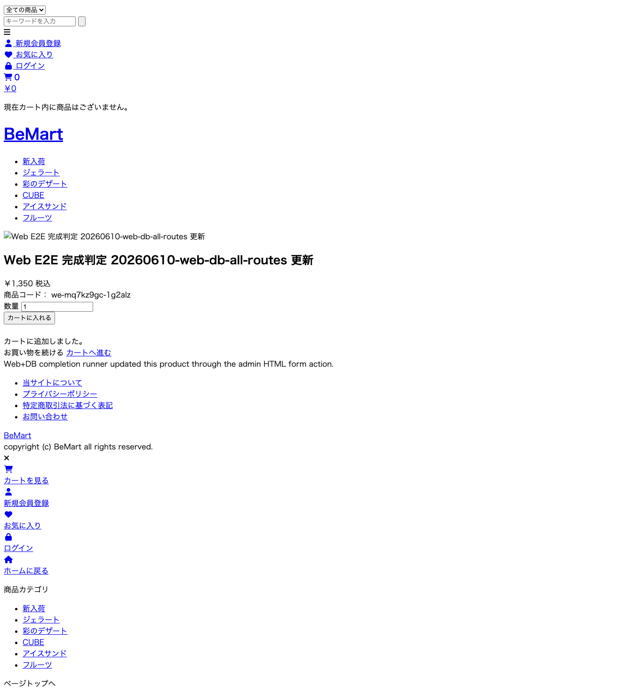
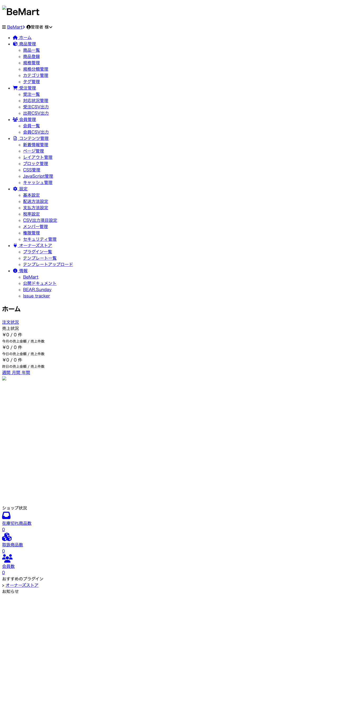

# BeMart feature evidence

BeMart は、EC-CUBE 4.3 の意味論を別フレームワークへ移し替えただけの
サンプルではありません。元のアプリケーションに散らばっていた業務語彙、状態遷移、
入力制約、SQL、HTML affordance を分解し、契約として読める形に再配置した実証です。

このページは、その主張を支える証拠への入口です。数値は 2026-06-10 時点の
Web+DB 全件run `20260610-web-db-all-routes` を反映しています。

## Evidence inventory

| 境界 | 証拠 | 規模 |
|---|---|---:|
| 意味論 | [`alps.json`](https://github.com/be-framework/BeMart/blob/1.x/alps.json) / [`alps.json.html`](alps.json.html) | 534 descriptor / 207 transition |
| 機能対応 | [`eccube-feature-alps-status.html`](eccube-feature-alps-status.html) | 165 route names / 270 method entries |
| ドメイン | `be/src` | 147 Input / 148 Final / 157 Semantic / 14 Being |
| HTTP Resource | `src/Resource/Page` | 146 page resources |
| API契約 | [`api/`](api/) / [`api/openapi.json`](api/openapi.json) | 236 operations / 235 JSON Schema |
| SQL境界 | `be/src/Reason/Query` / `var/sql` | 54 MediaQuery interfaces / 150 `#[DbQuery]` / 150 SQL files |
| HTML | `var/templates` | 133 Twig templates |
| Workflow evidence | `tests/Hypermedia/Flow*.php` / `tests/Http/Flow*.php` / `tests/Http/HttpResourceHrefTest.php` | PHP Resource / real HTTP / HTML semantic-link fallback |
| Web E2E | [`web-e2e/feature-implementation-matrix.md`](web-e2e/feature-implementation-matrix.md) | 186 features, 102 pass / 79 fail / 5 targetOut |
| 画面証跡 | [`web-e2e/screenshots/20260610-web-db-all-routes/`](web-e2e/screenshots/20260610-web-db-all-routes/) | 213 screenshots |

この表で重要なのは、規模そのものよりも、各レイヤが同じ意味論を別の表現として
支えている点です。ALPS は語彙と遷移を定義し、Be domain は状態遷移を型にし、
BEAR Resource は HTTP 境界に置き、Ray.MediaQuery は SQL を interface 境界へ閉じ込め、
Twig HTML と workflow evidence はユーザーが辿る affordance を固定します。

「ハイパーメディアテスト」という名前より重要なのは、1 つの状態遷移契約が
複数の境界で再確認されることです。`tests/Hypermedia/Flow*.php` は PHP Resource 境界で
シナリオを辿り、`tests/Http/Flow*.php` は同じ workflow を継承して Resource 実装だけを
`HttpResource` へ差し替えます。HTML 側では `rel` / `class` / `href` / `form action` と
browser evidence が、同じ遷移が画面上の affordance として残っていることを確認します。

## Browser evidence

2026-06-10 の Web E2E run は、`html-eccube-sql-hal-app` + 実DBで実施されました。
Fake JSON、Fake context、直接DB seed は使わず、会員・商品・注文・配送先・お気に入り・問い合わせをWeb/HTTP操作で作成しています。

- 結果: feature 102 pass / 79 fail / 5 targetOut、OpenAPI 156 pass / 77 fail / 3 targetOut、NG 19 pass / 0 fail
- レポート: [`web-e2e/20260610-web-db-all-routes-report.md`](web-e2e/20260610-web-db-all-routes-report.md)
- 機能表: [`web-e2e/feature-implementation-matrix.md`](web-e2e/feature-implementation-matrix.md)
- JSON結果: [`web-e2e/results/20260610-web-db-all-routes.json`](web-e2e/results/20260610-web-db-all-routes.json)
- スクリーンショット: [`web-e2e/screenshots/20260610-web-db-all-routes/`](web-e2e/screenshots/20260610-web-db-all-routes/)
- Follow-up: [`web-e2e/20260610-web-db-followups.md`](web-e2e/20260610-web-db-followups.md)

注文履歴詳細と再注文は、Web購入flow由来の注文で green に戻りました。一方で、Admin の unsafe CRUD/update は画面到達だけでは完成扱いにしていません。実フォーム、`_links`、`Location`、ALPS rel から操作でき、readback で副作用を確認できるまでは fail として残します。

  <figure>
    
    <figcaption>Storefront top</figcaption>
  </figure>
  <figure>
    
    <figcaption>Product detail</figcaption>
  </figure>
  <figure>
    
    <figcaption>Checkout confirm</figcaption>
  </figure>
  <figure>
    
    <figcaption>Admin dashboard</figcaption>
  </figure>
  <figure>
    
    <figcaption>Customer list</figcaption>
  </figure>
  <figure>
    
    <figcaption>Order detail</figcaption>
  </figure>

## What the evidence means

BeMart の実証は、EC-CUBE の全副作用を完全互換で再現し切ったという主張ではありません。
そこは [`complete-replacement-residuals.md`](complete-replacement-residuals.md) に残差として分けています。

実証の主張は別です。大規模な既存アプリケーションを、意味論、境界、契約、画面遷移、
SQL、テストへ分解し、次に続く実装構造として再配置できることを示した、という主張です。
未完了も「未知の穴」ではなく、互換 fidelity、production verification、scope boundary として
名前を付けて管理できる状態になっています。

## Read next

| 知りたいこと | 入口 |
|---|---|
| プロジェクトの意味 | [`migration-goal-review.md`](migration-goal-review.md) |
| 実証総括 | [`PROJECT-REPORT.md`](PROJECT-REPORT.md) |
| 最新ステータス | [`migration-status.md`](migration-status.md) |
| 完全代替への残差 | [`complete-replacement-residuals.md`](complete-replacement-residuals.md) |
| flow / workflow の考え方 | [`flow-ontology.md`](flow-ontology.md) |

