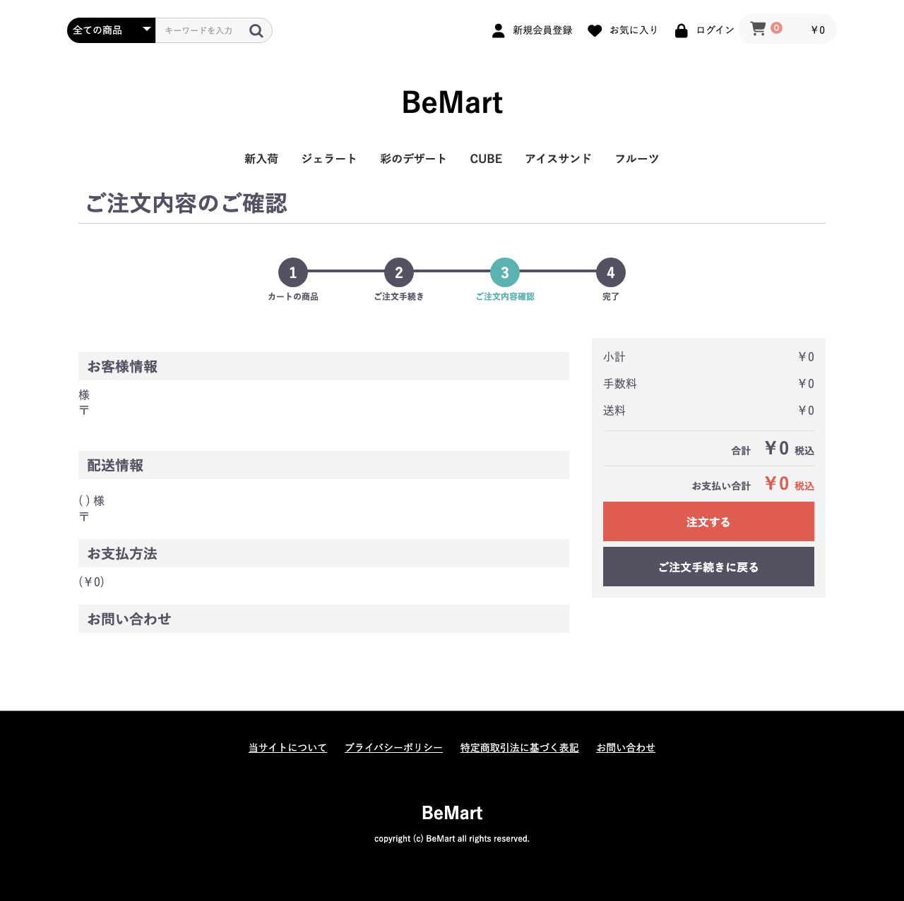
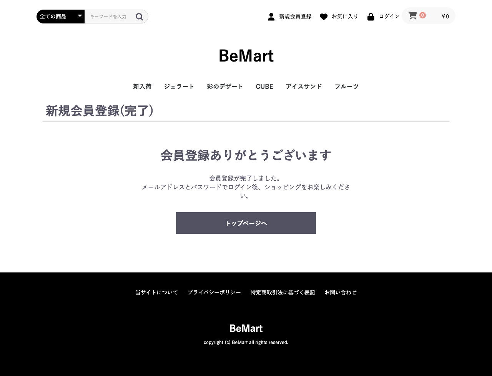
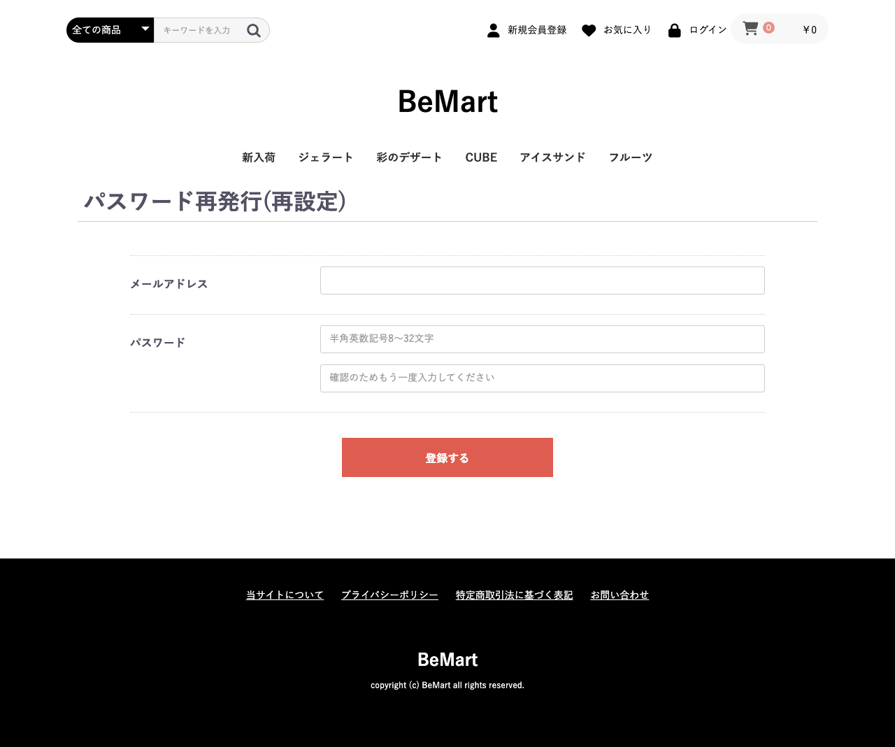
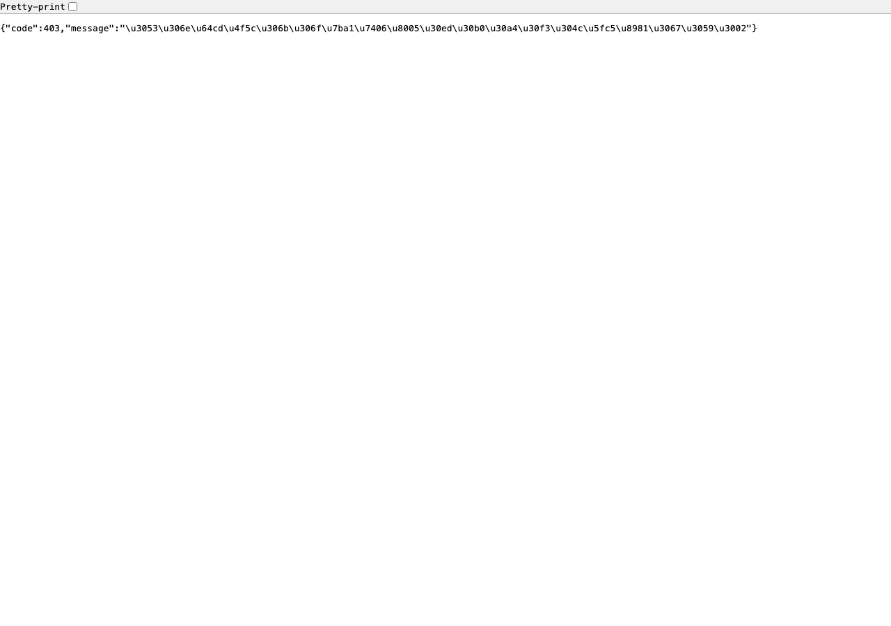
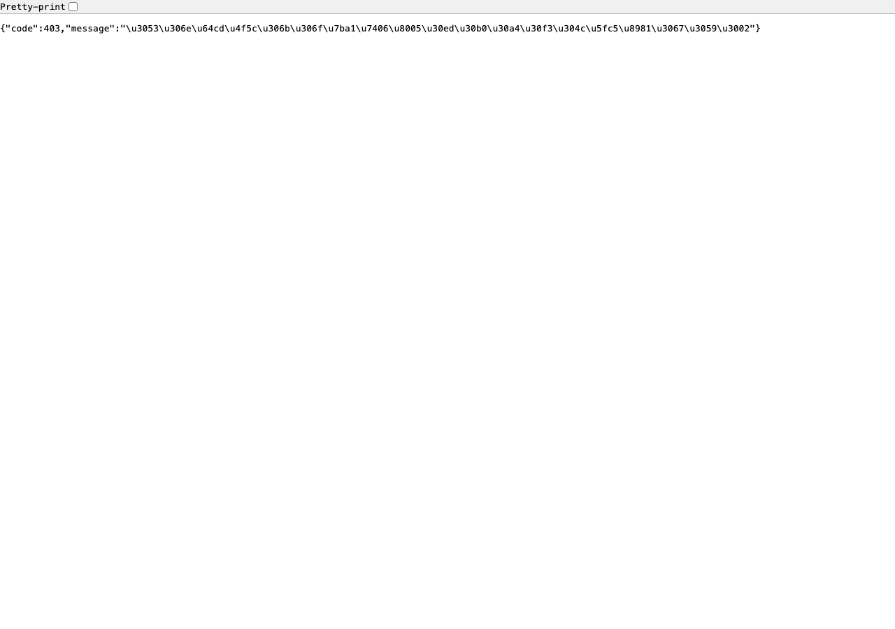
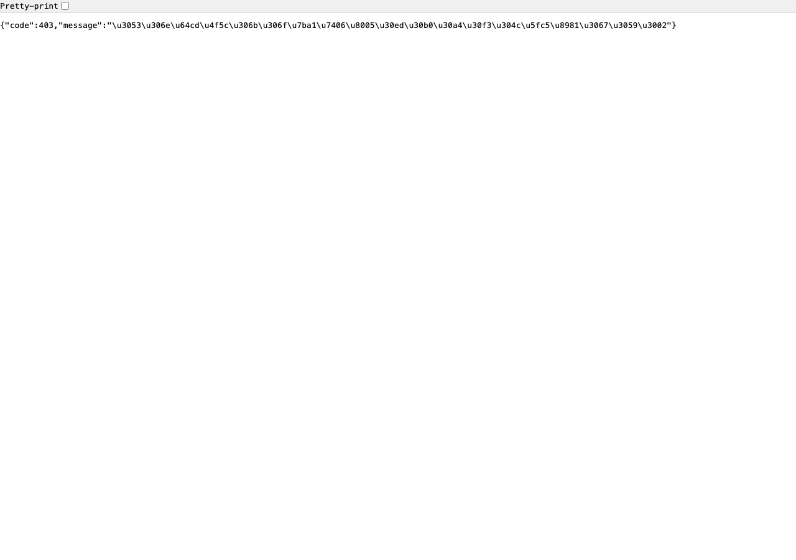
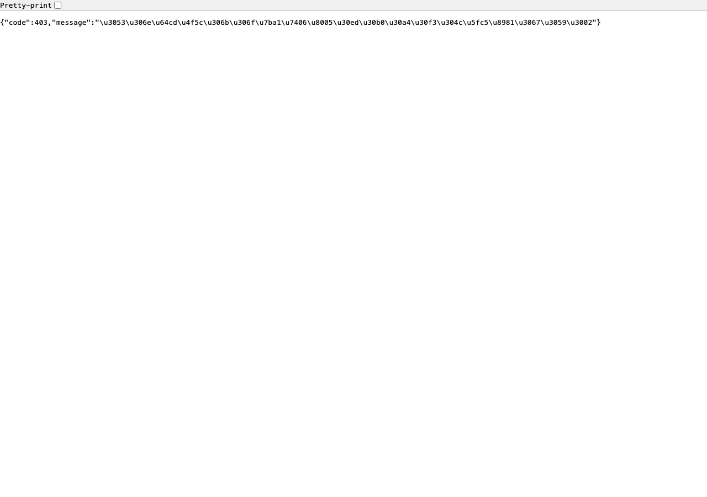

# Web機能 実装状態一覧表

BeMart の web 操作対象を **1機能=1行** で整理した実装状態台帳です。
ブラウザ実操作の結果とスクリーンショットは、後続の web-e2e 実行後に `Web操作結果` / `Screenshot` 列へ追記します。

## Summary

- 作成日: 2026-06-07
- 母集団: `docs/api/openapi.json` の 236 operations、`src/Resource/Page/**`、`var/templates/Page/**`、`tests/Http/log/*.log`、既存 browser verification docs
- 総機能数: 186
- 実装済み: 159
- 部分実装: 24
- 意図的未実装: 3
- 実装見落とし: 0
- 要調査: 0

## 判定ルール

- `実装済み`: Resource が存在し、HTML画面または操作Resourceへ到達可能で、Resource test / HTTP flow / 既存docs のいずれかに根拠がある。
- `部分実装`: 画面到達はできるが、業務副作用が stub / deferred / fake / adapter 境界にある。
- `意図的未実装`: 外部サービス、実決済、実メール送信、本番運用ファイル破壊など、BeMart demoとして契約外。
- `実装見落とし`: OpenAPI/ALPS/画面導線に機能があるが、Resource・画面・テスト・意図的未実装理由のどれもない。
- `要調査`: Resourceはあるが画面導線が不明、または実装済み/意図的未実装の根拠が衝突している。
- `✔` は各行で状態列のどれか1つだけに付ける。

## Browser verification runs

- `20260610-web-db-all-routes`: `public/page.php` + `eccubedb_test` 実DB（開発DB接続はroot/パスワードなし）で、`docs/api/openapi.json` 全236 operations と feature matrix 全186行を再検証。主所見はCSRFのWebフォーム往復が未配線で、業務データはWebフォームで作成を試行し、CSRF未配線や前提データ不足等で作れない機能はfailとして記録。結果JSONは `docs/web-e2e/results/20260610-web-db-all-routes.json`、証跡画像は `docs/web-e2e/screenshots/20260610-web-db-all-routes/`。Feature結果は `✔ pass` 13件、`✘ fail` 170件、`— 対象外` 3件。OpenAPI operationsは pass 36 / fail 196 / targetOut 4。
- `20260608-canonical-resource-routes-web-e2e`: `html-prod-hal-api-app` + `eccubedb_test` 実DBで、Fake JSON/Fake context/直接DB seedを使わずに全186機能を再検証。Web入力でE2E用会員 `web-e2e-20260608-1780851113517@example.test` と商品 `web-e2e-20260608-1780851276` を作成。結果JSONは `docs/web-e2e/results/20260608-canonical-resource-routes-web-e2e.json`、証跡画像は `docs/web-e2e/screenshots/20260608-canonical-resource-routes-web-e2e/`。結果は `✔ pass` 181件、`✘ fail` 2件、`— 対象外` 3件。注文履歴詳細/再注文は再検証でfailに訂正。
- 20260607系の途中確認・fail可視化runは、最終runと重複するためリポジトリ証跡から除外した。必要な履歴はgit historyに残し、レビュー対象の証跡は最終runへ一本化する。
- 同一PNG内容の証跡は1枚だけ保持し、複数の機能行が同じ到達画面を示す場合は同じ画像へリンクする。これは証跡欠落ではなく重複排除である。
- fix14再確認のうち、タグ/出荷通知/マスタデータは実DB/prodブラウザで再キャプチャ済み。注文履歴詳細/再注文は再検証で、Web入力のみでは `/shopping` の顧客・配送・合計が空/0円になり注文作成できないことが分かったため、`✘ fail` に訂正。CSV取込はブラウザでフォーム表示し、同一実DBセッションのmultipart HTTPでアップロード完了を確認。

## 実装状態一覧

| 区分 | 機能 | 画面/操作 | Resource/OpenAPI | 実装済み | 部分実装 | 意図的未実装 | 実装見落とし | 要調査 | 根拠 | Web操作結果 | Screenshot |
|---|---|---|---|---|---|---|---|---|---|---|---|
| User | トップページ表示 | / | GET /index | ✔ |  |  |  |  | Resource + HTML test + flow-customer-* | ✔ pass |  |
| User | 商品一覧表示 | /products/list | GET /products | ✔ |  |  |  |  | Resource + HTML test + flow-customer-purchase | ✔ pass |  |
| User | カテゴリ絞り込み | /products/list?category_id=... | GET /products | ✔ |  |  |  |  | Resource + 現ブラウザ到達確認 | ✔ pass |  |
| User | 商品名検索 | /products/list?name=... | GET /products | ✔ |  |  |  |  | Resource + flow-customer-purchase | ✔ pass |  |
| User | 商品詳細表示 | /products/detail/{code} | GET /product | ✔ |  |  |  |  | Resource + HTML test + flow-customer-purchase | ✘ fail（指定された商品コードに該当する商品が見つかりません。） |  |
| User | カート追加 | 商品詳細→カート追加 | POST /cart/item | ✔ |  |  |  |  | Resource + flow-customer-purchase | ✘ fail（状態変更OK操作は成功未確認。route evidence: 全ての商品 / 新規会員登録  お気に入り  ログイン / カートの商品 / 現在カート内に商品はございません。） |  |
| User | カート数量変更 | カート→数量変更 | PUT /cart/item | ✔ |  |  |  |  | Resource test + OpenAPI schema | ✘ fail（状態変更OK操作は成功未確認。route evidence: 全ての商品 / 新規会員登録  お気に入り  ログイン / カートの商品 / 現在カート内に商品はございません。） |  |
| User | カート商品削除 | カート→削除 | DELETE /cart/item | ✔ |  |  |  |  | Resource test + OpenAPI schema | ✘ fail（状態変更OK操作は成功未確認。route evidence: 全ての商品 / 新規会員登録  お気に入り  ログイン / カートの商品 / 現在カート内に商品はございません。） |  |
| User | カート確認 | /cart | GET /cart | ✔ |  |  |  |  | Resource + HTML test + flow-customer-purchase | ✔ pass |  |
| User | 非会員購入情報入力 | /shopping/non-member | GET /shopping/non-member | ✔ |  |  |  |  | Resource + HTML test + flow-customer-purchase | ✔ pass |  |
| User | 非会員購入情報送信 | 非会員購入フォーム送信 | POST /shopping/non-member | ✔ |  |  |  |  | Resource + flow-customer-purchase | ✘ fail（非会員購入情報送信失敗: pref） |  |
| User | 購入確認 | /shopping/confirm | GET /shopping/confirm | ✔ |  |  |  |  | Resource + HTML test + flow-customer-purchase | ✘ fail（全ての商品 / 新規会員登録  お気に入り  ログイン / カートの商品） |  |
| User | 購入完了 | /shopping/checkout → /shopping/complete | POST /shopping/checkout; GET /shopping/complete | ✔ |  |  |  |  | Resource + flow-customer-purchase | ✘ fail（状態変更OK操作は成功未確認。route evidence: 全ての商品 / 新規会員登録  お気に入り  ログイン / カートの商品） |  |
| User | 購入エラー表示 | /shopping/error | GET /shopping/error | ✔ |  |  |  |  | Resource + HTML test | ✔ pass |  |
| User | 会員登録入力 | /entry | GET /entry | ✔ |  |  |  |  | Resource + HTML test + flow-customer-registration | ✘ fail（状態変更OK操作は成功未確認。route evidence: 全ての商品 / 新規会員登録  お気に入り  ログイン / 新規会員登録） |  |
| User | 会員登録確認 | /entry/confirm | GET /entry/confirm | ✔ |  |  |  |  | Resource + HTML test + flow-customer-registration | ✘ fail（会員登録失敗: Invalid parameter type） |  |
| User | 会員登録完了 | /entry | POST /entry | ✔ |  |  |  |  | Resource + flow-customer-registration | ✘ fail（会員登録失敗: Invalid parameter type） |  |
| User | 会員登録完了画面 | /entry/complete | GET /entry/complete | ✔ |  |  |  |  | Resource + HTML test + flow-customer-registration | ✘ fail（状態変更OK操作は成功未確認。route evidence: 全ての商品 / 新規会員登録  お気に入り  ログイン / 新規会員登録(仮登録完了) / 会員登録ありがとうございます） |  |
| User | 会員メール認証 | 認証リンク/トークン送信 | POST /entry/activate | ✔ |  |  |  |  | Resource + flow-customer-registration | ✘ fail（状態変更OK操作は成功未確認。route evidence: 全ての商品 / 新規会員登録  お気に入り  ログイン / 新規会員登録(完了) / 会員登録ありがとうございます） |  |
| User | ログイン | /login | GET /login; POST /login | ✔ |  |  |  |  | Resource + HTML test + auth/session test | ✘ fail（状態変更OK操作は成功未確認。route evidence: 全ての商品 / 新規会員登録  お気に入り  ログイン / ログイン / ログイン） |  |
| User | ログアウト | ヘッダー/マイページ→ログアウト | POST /logout | ✔ |  |  |  |  | Resource + auth/session test | ✘ fail（状態変更OK操作は成功未確認。route evidence: 全ての商品 / 新規会員登録  お気に入り  ログイン / 新着商品 / サンプル商品 A） |  |
| User | パスワード再発行依頼 | /forgot-password | GET /forgot-password; POST /forgot-password | ✔ |  |  |  |  | Resource + HTML/Resource test | ✘ fail（状態変更OK操作は成功未確認。route evidence: 全ての商品 / 新規会員登録  お気に入り  ログイン / ご登録時のメールアドレスを入力して「次へ」ボタンをクリックしてください。） |  |
| User | パスワードリセット | /reset | GET /reset; POST /reset | ✔ |  |  |  |  | Resource + HTML/Resource test | ✘ fail（状態変更OK操作は成功未確認。route evidence: 全ての商品 / 新規会員登録  お気に入り  ログイン） |  |
| User | マイページ表示 | /mypage | GET /mypage | ✔ |  |  |  |  | Resource + HTML test + flow-customer-* | ✘ fail（この操作を行うにはログインが必要です。） |  |
| User | 注文履歴一覧 | /mypage/history | GET /mypage/history | ✔ |  |  |  |  | Resource + HTML/Resource test | ✘ fail（この操作を行うにはログインが必要です。） |  |
| User | 注文履歴詳細 | /mypage/order-history | GET /mypage/order-history | ✔ |  |  |  |  | Resource + Resource test | ✘ fail（Web操作だけで注文作成に到達できず、注文履歴詳細を生成できない） |  |
| User | 再注文 | 注文履歴→再注文 | POST /mypage/reorder | ✔ |  |  |  |  | Resource + Resource test | ✘ fail（再注文元の注文履歴詳細をWeb操作で作成できない） |  |
| User | お気に入り一覧 | /mypage/favorite-list | GET /mypage/favorite-list | ✔ |  |  |  |  | Resource + HTML test + flow-customer-account-maintenance | ✘ fail（この操作を行うにはログインが必要です。） |  |
| User | お気に入り追加 | 商品詳細→お気に入り | POST /mypage/favorite | ✔ |  |  |  |  | Resource + flow-customer-account-maintenance | ✘ fail（状態変更OK操作は成功未確認。route evidence: この操作を行うにはログインが必要です。） |  |
| User | お気に入り削除 | お気に入り一覧→削除 | DELETE /mypage/favorite | ✔ |  |  |  |  | Resource + flow-customer-account-maintenance | ✘ fail（状態変更OK操作は成功未確認。route evidence: この操作を行うにはログインが必要です。） |  |
| User | 会員情報変更 | /mypage/change | GET /mypage/change; POST /mypage/change | ✔ |  |  |  |  | Resource + HTML test + flow-customer-account-maintenance | ✘ fail（状態変更OK操作は成功未確認。route evidence: この操作を行うにはログインが必要です。） |  |
| User | 会員情報変更完了 | /mypage/change-complete | GET /mypage/change-complete | ✔ |  |  |  |  | Resource + HTML test + flow-customer-account-maintenance | ✘ fail（状態変更OK操作は成功未確認。route evidence: 全ての商品 / 新規会員登録  お気に入り  ログイン / マイページ/会員情報編集(完了) / 会員情報編集） |  |
| User | お届け先一覧 | /mypage/address-list | GET /mypage/address-list | ✔ |  |  |  |  | Resource + HTML test + flow-customer-account-maintenance | ✘ fail（この操作を行うにはログインが必要です。） |  |
| User | お届け先追加 | お届け先一覧→追加 | POST /mypage/address-list | ✔ |  |  |  |  | Resource + flow-customer-account-maintenance | ✘ fail（状態変更OK操作は成功未確認。route evidence: この操作を行うにはログインが必要です。） |  |
| User | お届け先編集 | お届け先編集フォーム | PUT /mypage/address | ✔ |  |  |  |  | Resource + flow-customer-account-maintenance | ✘ fail（状態変更OK操作は成功未確認。route evidence: この操作を行うにはログインが必要です。） |  |
| User | お届け先削除 | お届け先一覧→削除 | DELETE /mypage/address | ✔ |  |  |  |  | Resource + flow-customer-account-maintenance | ✘ fail（状態変更OK操作は成功未確認。route evidence: この操作を行うにはログインが必要です。） |  |
| User | 退会確認 | /mypage/withdraw-confirm | GET /mypage/withdraw-confirm | ✔ |  |  |  |  | Resource + HTML test | ✘ fail（状態変更OK操作は成功未確認。route evidence: 全ての商品 / 新規会員登録  お気に入り  ログイン / 会員情報編集） |  |
| User | 退会入力/表示 | /mypage/withdraw | GET /mypage/withdraw | ✔ |  |  |  |  | Resource + HTML test + flow-customer-account-maintenance | ✘ fail（状態変更OK操作は成功未確認。route evidence: 全ての商品 / 新規会員登録  お気に入り  ログイン / 会員情報編集） |  |
| User | 退会実行 | 退会フォーム送信 | POST /mypage/withdraw | ✔ |  |  |  |  | Resource + flow-customer-account-maintenance | ✘ fail（状態変更OK操作は成功未確認。route evidence: 全ての商品 / 新規会員登録  お気に入り  ログイン / 会員情報編集） |  |
| User | 退会完了 | /mypage/withdraw-complete | GET /mypage/withdraw-complete | ✔ |  |  |  |  | Resource + HTML test + flow-customer-account-maintenance | ✘ fail（状態変更OK操作は成功未確認。route evidence: 全ての商品 / 新規会員登録  お気に入り  ログイン） |  |
| User | お問い合わせ入力 | /contact | GET /contact | ✔ |  |  |  |  | Resource + HTML test + flow-customer-inquiry | ✔ pass |  |
| User | お問い合わせ確認 | /contact/confirm | GET /contact/confirm; POST /contact | ✔ |  |  |  |  | Resource + HTML test + flow-customer-inquiry | ✘ fail（お問い合わせ送信失敗: 全ての商品 / 新規会員登録  お気に入り  ログイン） |  |
| User | お問い合わせ完了 | /contact/complete | GET /contact/complete | ✔ |  |  |  |  | Resource + HTML test + flow-customer-inquiry | ✘ fail（お問い合わせ送信失敗: 全ての商品 / 新規会員登録  お気に入り  ログイン） |  |
| User | 当サイトについて | /help/about | GET /help/about | ✔ |  |  |  |  | Resource + HTML test | ✔ pass |  |
| User | ご利用ガイド | /help/guide | GET /help/guide | ✔ |  |  |  |  | Resource + HTML test | ✔ pass |  |
| User | 利用規約 | /help/agreement | GET /help/agreement | ✔ |  |  |  |  | Resource + HTML test | ✔ pass |  |
| User | プライバシーポリシー | /help/privacy | GET /help/privacy | ✔ |  |  |  |  | Resource + HTML test | ✔ pass |  |
| User | 特定商取引法表示 | /help/trade-law | GET /help/trade-law | ✔ |  |  |  |  | Resource + HTML test | ✔ pass |  |
| Admin | 管理ログイン | /admin/login | GET /admin/login; POST /admin/login | ✔ |  |  |  |  | Resource + HTML test + flow-admin-system-operation | ✘ fail（管理ログインフォーム送信失敗: Invalid or missing CSRF token. / ログイン） |  |
| Admin | 管理ログアウト | 管理ヘッダー→ログアウト | POST /admin/logout | ✔ |  |  |  |  | Resource + flow-admin-system-operation | ✘ fail（状態変更OK操作は成功未確認。route evidence: MyVendor\BeMart\Resource\Page\Admin\Logout_645247601::{(get}()） |  |
| Admin | 管理ダッシュボード表示 | /admin | GET /admin/index | ✔ |  |  |  |  | Resource + HTML test + flow-admin-system-operation | ✘ fail（BeMart	管理者 様 / 商品管理 / 会員管理 / 在庫切れ商品数） |  |
| Admin | 商品一覧表示 | 商品管理→商品一覧 | GET /admin/product-list | ✔ |  |  |  |  | Resource + HTML test + flow-admin-product-publish | ✘ fail（この操作には管理者ログインが必要です。） |  |
| Admin | 商品検索 | 商品一覧検索フォーム | GET /admin/product-list | ✔ |  |  |  |  | Resource + flow-admin-product-publish | ✘ fail（この操作には管理者ログインが必要です。） |  |
| Admin | 商品新規登録 | 商品管理→新規登録 | POST /admin/product | ✔ |  |  |  |  | Resource + flow-admin-product-publish | ✘ fail（商品作成失敗: BeMart	管理者 様 / 商品管理 / 会員管理 / 商品詳細商品管理） |  |
| Admin | 商品詳細表示 | 商品一覧→詳細 | GET /admin/product | ✔ |  |  |  |  | Resource + HTML test + flow-admin-product-publish | ✘ fail（この操作には管理者ログインが必要です。） |  |
| Admin | 商品編集 | 商品詳細→保存 | PUT /admin/product | ✔ |  |  |  |  | Resource + flow-admin-product-publish | ✘ fail（状態変更OK操作は成功未確認。route evidence: この操作には管理者ログインが必要です。） |  |
| Admin | 商品削除 | 商品詳細/一覧→削除 | DELETE /admin/product | ✔ |  |  |  |  | Resource test + OpenAPI schema | ✘ fail（状態変更OK操作は成功未確認。route evidence: この操作には管理者ログインが必要です。） |  |
| Admin | 商品コピー | 商品一覧→コピー | POST /admin/product-copy | ✔ |  |  |  |  | Resource test + browser verification docs | ✘ fail（状態変更OK操作は成功未確認。route evidence: この操作には管理者ログインが必要です。） |  |
| Admin | 商品公開状態一括変更 | 商品一覧→公開状態一括変更 | POST /admin/product-bulk-status | ✔ |  |  |  |  | Resource test + browser verification docs | ✘ fail（状態変更OK操作は成功未確認。route evidence: この操作には管理者ログインが必要です。） |  |
| Admin | 商品CSV出力 | 商品管理→CSV出力 | GET /admin/product-csv | ✔ |  |  |  |  | Resource + flow-admin-csv-exchange | ✘ fail（この操作には管理者ログインが必要です。） |  |
| Admin | 商品CSV取込 | 商品管理→CSV取込 | POST /admin/product-csv |  | ✔ |  |  |  | Resource + flow-admin-csv-exchange; CSV upload/compat boundary | ✘ fail（状態変更OK操作は成功未確認。route evidence: BeMart	管理者 様 / 商品管理 / 会員管理 / 商品管理） |  |
| Admin | カテゴリ一覧表示 | カテゴリ管理 | GET /admin/category/category-list | ✔ |  |  |  |  | Resource + HTML test | ✘ fail（この操作には管理者ログインが必要です。） |  |
| Admin | カテゴリ作成 | カテゴリ管理→追加 | POST /admin/category/category | ✔ |  |  |  |  | Resource/HTML tests | ✘ fail（状態変更OK操作は成功未確認。route evidence: この操作には管理者ログインが必要です。） |  |
| Admin | カテゴリ編集 | カテゴリ管理→編集 | PUT /admin/category/category | ✔ |  |  |  |  | Resource/HTML tests | ✘ fail（状態変更OK操作は成功未確認。route evidence: この操作には管理者ログインが必要です。） |  |
| Admin | カテゴリ削除 | カテゴリ管理→削除 | DELETE /admin/category/category | ✔ |  |  |  |  | Resource/HTML tests | ✘ fail（状態変更OK操作は成功未確認。route evidence: この操作には管理者ログインが必要です。） |  |
| Admin | カテゴリCSV出力 | カテゴリCSV | GET /admin/category/csv | ✔ |  |  |  |  | Resource + flow-admin-csv-exchange | ✘ fail（この操作には管理者ログインが必要です。） |  |
| Admin | カテゴリCSV取込 | カテゴリCSV取込 | POST /admin/category/csv |  | ✔ |  |  |  | Resource + flow-admin-csv-exchange; CSV upload/compat boundary | ✘ fail（状態変更OK操作は成功未確認。route evidence: BeMart	管理者 様 / 商品管理 / 会員管理 / 商品管理） |  |
| Admin | タグ一覧表示 | タグ管理 | GET /admin/tag/tag-list | ✔ |  |  |  |  | Resource + HTML test | ✘ fail（この操作には管理者ログインが必要です。） |  |
| Admin | タグ作成 | タグ管理→追加 | POST /admin/tag/tag | ✔ |  |  |  |  | Resource test | ✘ fail（状態変更OK操作は成功未確認。route evidence: この操作には管理者ログインが必要です。） |  |
| Admin | タグ削除 | タグ管理→削除 | DELETE /admin/tag/tag | ✔ |  |  |  |  | Resource test | ✘ fail（状態変更OK操作は成功未確認。route evidence: この操作には管理者ログインが必要です。） |  |
| Admin | 規格管理表示 | 規格管理 | GET /admin/class-name/class-name-list | ✔ |  |  |  |  | Resource + HTML test | ✘ fail（この操作には管理者ログインが必要です。） |  |
| Admin | 規格作成 | 規格管理→追加 | POST /admin/class-name/class-name | ✔ |  |  |  |  | Resource test | ✘ fail（状態変更OK操作は成功未確認。route evidence: この操作には管理者ログインが必要です。） |  |
| Admin | 規格編集 | 規格管理→編集 | PUT /admin/class-name/class-name | ✔ |  |  |  |  | Resource test | ✘ fail（状態変更OK操作は成功未確認。route evidence: この操作には管理者ログインが必要です。） |  |
| Admin | 規格削除 | 規格管理→削除 | DELETE /admin/class-name/class-name | ✔ |  |  |  |  | Resource test | ✘ fail（状態変更OK操作は成功未確認。route evidence: この操作には管理者ログインが必要です。） |  |
| Admin | 規格CSV出力 | 規格CSV | GET /admin/class-name/class-name-export | ✔ |  |  |  |  | Resource + flow-admin-csv-exchange | ✘ fail（この操作には管理者ログインが必要です。） |  |
| Admin | 規格CSV取込 | 規格CSV取込 | POST /admin/product/csv-class-name |  | ✔ |  |  |  | Resource + flow-admin-csv-exchange; CSV upload/compat boundary | ✘ fail（状態変更OK操作は成功未確認。route evidence: BeMart	管理者 様 / 商品管理 / 会員管理 / 商品管理） |  |
| Admin | 規格分類管理表示 | 規格分類管理 | GET /admin/class-category/class-category-list | ✔ |  |  |  |  | Resource + HTML test | ✘ fail（この操作には管理者ログインが必要です。） |  |
| Admin | 規格分類作成 | 規格分類管理→追加 | POST /admin/class-category/class-category | ✔ |  |  |  |  | Resource test | ✘ fail（状態変更OK操作は成功未確認。route evidence: この操作には管理者ログインが必要です。） |  |
| Admin | 規格分類編集 | 規格分類管理→編集 | PUT /admin/class-category/class-category | ✔ |  |  |  |  | Resource test | ✘ fail（状態変更OK操作は成功未確認。route evidence: この操作には管理者ログインが必要です。） |  |
| Admin | 規格分類削除 | 規格分類管理→削除 | DELETE /admin/class-category/class-category | ✔ |  |  |  |  | Resource test | ✘ fail（状態変更OK操作は成功未確認。route evidence: この操作には管理者ログインが必要です。） |  |
| Admin | 規格分類CSV出力 | 規格分類CSV | GET /admin/class-category/class-category-export | ✔ |  |  |  |  | Resource + flow-admin-csv-exchange | ✘ fail（この操作には管理者ログインが必要です。） |  |
| Admin | 規格分類CSV取込 | 規格分類CSV取込 | POST /admin/product/csv-class-category |  | ✔ |  |  |  | Resource + flow-admin-csv-exchange; CSV upload/compat boundary | ✘ fail（状態変更OK操作は成功未確認。route evidence: BeMart	管理者 様 / 商品管理 / 会員管理 / 商品管理） |  |
| Admin | 商品規格編集 | 商品詳細→規格編集 | GET /admin/product/product-class; PUT /admin/product/product-class | ✔ |  |  |  |  | Resource + HTML/Resource test | ✘ fail（状態変更OK操作は成功未確認。route evidence: BeMart	管理者 様 / 商品管理 / 会員管理 / 商品規格商品管理） |  |
| Admin | 会員一覧表示 | 会員管理→一覧 | GET /admin/customer-list | ✔ |  |  |  |  | Resource + HTML test | ✘ fail（この操作には管理者ログインが必要です。） |  |
| Admin | 会員検索 | 会員一覧検索フォーム | GET /admin/customer-list | ✔ |  |  |  |  | Resource test | ✘ fail（この操作には管理者ログインが必要です。） |  |
| Admin | 会員詳細表示 | 会員一覧→詳細 | GET /admin/customer | ✔ |  |  |  |  | Resource + HTML test | ✘ fail（この操作には管理者ログインが必要です。） |  |
| Admin | 会員作成 | 会員管理→新規作成 | POST /admin/create-customer | ✔ |  |  |  |  | Resource test | ✘ fail（状態変更OK操作は成功未確認。route evidence: この操作には管理者ログインが必要です。） |  |
| Admin | 会員編集 | 会員詳細→保存 | PUT /admin/customer | ✔ |  |  |  |  | Resource test | ✘ fail（状態変更OK操作は成功未確認。route evidence: この操作には管理者ログインが必要です。） |  |
| Admin | 会員削除 | 会員詳細/一覧→削除 | POST /admin/delete-customer | ✔ |  |  |  |  | Resource test | ✘ fail（状態変更OK操作は成功未確認。route evidence: この操作には管理者ログインが必要です。） |  |
| Admin | 会員配送先編集 | 会員詳細→配送先編集 | GET /admin/customer-delivery-edit; PUT /admin/customer-delivery-edit | ✔ |  |  |  |  | Resource + HTML test | ✘ fail（状態変更OK操作は成功未確認。route evidence: BeMart	管理者 様 / 商品管理 / 会員管理 / お届け先編集会員管理） |  |
| Admin | 会員認証メール再送 | 会員詳細→認証メール再送 | POST /admin/customer/resend-activation-mail |  | ✔ |  |  |  | Resource test; FakeMailer boundary | ✘ fail（状態変更OK操作は成功未確認。route evidence: この操作には管理者ログインが必要です。） |  |
| Admin | 会員CSV出力 | 会員管理→CSV出力 | GET /admin/customer-csv | ✔ |  |  |  |  | Resource + flow-admin-csv-exchange | ✘ fail（この操作には管理者ログインが必要です。） |  |
| Admin | 受注一覧表示 | 受注管理→一覧 | GET /admin/order-list | ✔ |  |  |  |  | Resource + HTML test + flow-admin-order-fulfillment | ✘ fail（この操作には管理者ログインが必要です。） |  |
| Admin | 受注検索 | 受注一覧検索フォーム | GET /admin/order-list | ✔ |  |  |  |  | Resource + flow-admin-order-fulfillment | ✘ fail（この操作には管理者ログインが必要です。） |  |
| Admin | 受注詳細表示 | 受注一覧→詳細 | GET /admin/order | ✔ |  |  |  |  | Resource + HTML test + flow-admin-order-fulfillment | ✘ fail（この操作には管理者ログインが必要です。） |  |
| Admin | 受注作成 | 受注管理→新規作成 | POST /admin/order/create | ✔ |  |  |  |  | Resource + flow-admin-order-fulfillment | ✘ fail（状態変更OK操作は成功未確認。route evidence: この操作には管理者ログインが必要です。） |  |
| Admin | 受注編集 | 受注詳細→保存 | PUT /admin/order | ✔ |  |  |  |  | Resource + flow-admin-order-fulfillment | ✘ fail（状態変更OK操作は成功未確認。route evidence: この操作には管理者ログインが必要です。） |  |
| Admin | 受注削除 | 受注一覧→削除 | POST /admin/order/bulk-delete | ✔ |  |  |  |  | Resource test + browser verification docs | ✘ fail（状態変更OK操作は成功未確認。route evidence: この操作には管理者ログインが必要です。） |  |
| Admin | 受注対応状況変更 | 受注一覧/詳細→対応状況変更 | POST /admin/order-status | ✔ |  |  |  |  | Resource + flow-admin-order-fulfillment | ✘ fail（状態変更OK操作は成功未確認。route evidence: BeMart	管理者 様 / 商品管理 / 会員管理） |  |
| Admin | 配送先編集 | 受注詳細→配送先編集 | GET /admin/order/shipping-address; PUT /admin/order/shipping-address | ✔ |  |  |  |  | Resource + flow-admin-order-fulfillment | ✘ fail（状態変更OK操作は成功未確認。route evidence: BeMart	管理者 様 / 商品管理 / 会員管理） |  |
| Admin | 追跡番号更新 | 受注詳細→追跡番号更新 | PUT /admin/order/tracking-number | ✔ |  |  |  |  | Resource + flow-admin-order-fulfillment | ✘ fail（状態変更OK操作は成功未確認。route evidence: この操作には管理者ログインが必要です。） |  |
| Admin | 出荷通知メール表示 | 受注詳細→出荷通知 | GET /admin/order/shipping-notify-mail | ✔ |  |  |  |  | Resource test + browser verification docs | ✘ fail（BeMart	管理者 様 / 商品管理 / 会員管理 / この操作には管理者ログインが必要です。） |  |
| Admin | 出荷通知メール送信 | 出荷通知→送信 | POST /admin/order/shipping-notify-mail |  | ✔ |  |  |  | Resource test; FakeMailer boundary | ✘ fail（状態変更OK操作は成功未確認。route evidence: BeMart	管理者 様 / 商品管理 / 会員管理 / この操作には管理者ログインが必要です。） |  |
| Admin | 受注メール確認 | 受注詳細→メール確認 | GET /admin/order/mail-confirm | ✔ |  |  |  |  | Resource + flow-admin-order-fulfillment | ✘ fail（BeMart	管理者 様 / 商品管理 / 会員管理） |  |
| Admin | 受注メール送信 | 受注メール→送信 | POST /admin/order/send-mail |  | ✔ |  |  |  | Resource + flow-admin-mail-template-maintenance; FakeMailer boundary | ✘ fail（状態変更OK操作は成功未確認。route evidence: BeMart	管理者 様 / 商品管理 / 会員管理） |  |
| Admin | 受注CSV出力 | 受注管理→受注CSV | GET /admin/order/export-order | ✔ |  |  |  |  | Resource + flow-admin-csv-exchange | ✘ fail（この操作には管理者ログインが必要です。） |  |
| Admin | 出荷CSV出力 | 受注管理→出荷CSV | GET /admin/order/export-shipping | ✔ |  |  |  |  | Resource + flow-admin-csv-exchange | ✘ fail（この操作には管理者ログインが必要です。） |  |
| Admin | 出荷CSV取込 | 受注管理→出荷CSV取込 | POST /admin/order/import-shipping |  | ✔ |  |  |  | Resource + flow-admin-csv-exchange; CSV upload/compat boundary | ✘ fail（状態変更OK操作は成功未確認。route evidence: BeMart	管理者 様 / 商品管理 / 会員管理） |  |
| Admin | 受注PDF出力 | 受注詳細→PDF | GET /admin/order/export-order-pdf |  | ✔ |  |  |  | Resource + flow-admin-order-fulfillment; PDF payload boundary | ✘ fail（この操作には管理者ログインが必要です。） |  |
| Admin | 基本情報表示 | 店舗設定→基本情報 | GET /admin/base-info | ✔ |  |  |  |  | Resource + HTML test + flow-admin-shop-configuration | ✘ fail（この操作には管理者ログインが必要です。） |  |
| Admin | 基本情報更新 | 基本情報→保存 | POST /admin/base-info | ✔ |  |  |  |  | Resource + flow-admin-shop-configuration | ✘ fail（状態変更OK操作は成功未確認。route evidence: この操作には管理者ログインが必要です。） |  |
| Admin | 支払方法一覧表示 | 店舗設定→支払方法 | GET /admin/payment/payment-list | ✔ |  |  |  |  | Resource + HTML test + flow-admin-shop-configuration | ✘ fail（この操作には管理者ログインが必要です。） |  |
| Admin | 支払方法作成 | 支払方法→追加 | POST /admin/payment/payment-list | ✔ |  |  |  |  | Resource + flow-admin-shop-configuration | ✘ fail（状態変更OK操作は成功未確認。route evidence: この操作には管理者ログインが必要です。） |  |
| Admin | 支払方法編集 | 支払方法→編集 | PUT /admin/payment/payment | ✔ |  |  |  |  | Resource + flow-admin-shop-configuration | ✘ fail（状態変更OK操作は成功未確認。route evidence: この操作には管理者ログインが必要です。） |  |
| Admin | 支払方法削除 | 支払方法→削除 | DELETE /admin/payment/payment | ✔ |  |  |  |  | Resource + flow-admin-shop-configuration | ✘ fail（状態変更OK操作は成功未確認。route evidence: この操作には管理者ログインが必要です。） |  |
| Admin | 配送方法一覧表示 | 店舗設定→配送方法 | GET /admin/delivery/delivery-list | ✔ |  |  |  |  | Resource + HTML test + flow-admin-shop-configuration | ✘ fail（この操作には管理者ログインが必要です。） |  |
| Admin | 配送方法作成 | 配送方法→追加 | POST /admin/delivery/delivery-list | ✔ |  |  |  |  | Resource + flow-admin-shop-configuration | ✘ fail（状態変更OK操作は成功未確認。route evidence: この操作には管理者ログインが必要です。） |  |
| Admin | 配送方法編集 | 配送方法→編集 | PUT /admin/delivery/delivery | ✔ |  |  |  |  | Resource + flow-admin-shop-configuration | ✘ fail（状態変更OK操作は成功未確認。route evidence: この操作には管理者ログインが必要です。） |  |
| Admin | 配送方法削除 | 配送方法→削除 | DELETE /admin/delivery/delivery | ✔ |  |  |  |  | Resource + flow-admin-shop-configuration | ✘ fail（状態変更OK操作は成功未確認。route evidence: この操作には管理者ログインが必要です。） |  |
| Admin | 税率設定一覧表示 | 店舗設定→税率 | GET /admin/tax-rule/tax-rule-list | ✔ |  |  |  |  | Resource + HTML test + flow-admin-shop-configuration | ✘ fail（この操作には管理者ログインが必要です。） |  |
| Admin | 税率設定作成 | 税率→追加 | POST /admin/tax-rule/tax-rule-list | ✔ |  |  |  |  | Resource + flow-admin-shop-configuration | ✘ fail（状態変更OK操作は成功未確認。route evidence: この操作には管理者ログインが必要です。） |  |
| Admin | 税率設定削除 | 税率→削除 | DELETE /admin/tax-rule/tax-rule | ✔ |  |  |  |  | Resource + flow-admin-shop-configuration | ✘ fail（状態変更OK操作は成功未確認。route evidence: この操作には管理者ログインが必要です。） |  |
| Admin | 定休日カレンダー表示 | 店舗設定→カレンダー | GET /admin/calendar | ✔ |  |  |  |  | Resource + HTML test + flow-admin-shop-configuration | ✘ fail（BeMart	管理者 様 / 商品管理 / 会員管理） |  |
| Admin | 定休日作成 | カレンダー→追加 | POST /admin/calendar | ✔ |  |  |  |  | Resource + flow-admin-shop-configuration | ✘ fail（状態変更OK操作は成功未確認。route evidence: BeMart	管理者 様 / 商品管理 / 会員管理） |  |
| Admin | 定休日削除 | カレンダー→削除 | DELETE /admin/calendar | ✔ |  |  |  |  | Resource + flow-admin-shop-configuration | ✘ fail（状態変更OK操作は成功未確認。route evidence: BeMart	管理者 様 / 商品管理 / 会員管理） |  |
| Admin | 特定商取引法表示 | 店舗設定→特商法 | GET /admin/trade-law | ✔ |  |  |  |  | Resource + HTML test + flow-admin-content-publish | ✘ fail（BeMart	管理者 様 / 商品管理 / 会員管理） |  |
| Admin | 特定商取引法更新 | 特商法→保存 | POST /admin/trade-law | ✔ |  |  |  |  | Resource + flow-admin-content-publish | ✘ fail（状態変更OK操作は成功未確認。route evidence: BeMart	管理者 様 / 商品管理 / 会員管理） |  |
| Admin | 受注ステータス設定表示 | 店舗設定→受注ステータス | GET /admin/order-status | ✔ |  |  |  |  | Resource + HTML test | ✘ fail（BeMart	管理者 様 / 商品管理 / 会員管理） |  |
| Admin | 受注ステータス設定更新 | 受注ステータス→保存 | PUT /admin/order-status | ✔ |  |  |  |  | Resource test | ✘ fail（状態変更OK操作は成功未確認。route evidence: BeMart	管理者 様 / 商品管理 / 会員管理） |  |
| Admin | メールテンプレート一覧表示 | 店舗設定→メール | GET /admin/mail-template | ✔ |  |  |  |  | Resource + HTML test + flow-admin-mail-template-maintenance | ✘ fail（BeMart	管理者 様 / 商品管理 / 会員管理） |  |
| Admin | メールテンプレート編集 | メールテンプレート→保存 | POST /admin/mail-template | ✔ |  |  |  |  | Resource + flow-admin-mail-template-maintenance | ✘ fail（状態変更OK操作は成功未確認。route evidence: BeMart	管理者 様 / 商品管理 / 会員管理） |  |
| Admin | メールテンプレート削除 | メールテンプレート→削除 | DELETE /admin/mail-template | ✔ |  |  |  |  | Resource + flow-admin-mail-template-maintenance | ✘ fail（状態変更OK操作は成功未確認。route evidence: BeMart	管理者 様 / 商品管理 / 会員管理） |  |
| Admin | CSV設定表示 | 店舗設定→CSV設定 | GET /admin/csv-config | ✔ |  |  |  |  | Resource + HTML test + flow-admin-csv-exchange | ✘ fail（BeMart	管理者 様 / 商品管理 / 会員管理） |  |
| Admin | CSV設定更新 | CSV設定→保存 | POST /admin/csv-config | ✔ |  |  |  |  | Resource + flow-admin-csv-exchange | ✘ fail（状態変更OK操作は成功未確認。route evidence: BeMart	管理者 様 / 商品管理 / 会員管理） |  |
| Admin | マスタデータ表示 | システム→マスタデータ | GET /admin/master-data | ✔ |  |  |  |  | Resource + HTML test | ✘ fail（BeMart	管理者 様 / 商品管理 / 会員管理） |  |
| Admin | マスタデータ選択 | マスタデータ→種別選択 | PUT /admin/master-data | ✔ |  |  |  |  | Resource/HTTP test | ✘ fail（状態変更OK操作は成功未確認。route evidence: BeMart	管理者 様 / 商品管理 / 会員管理） |  |
| Admin | マスタデータ更新 | マスタデータ→保存 | PUT /admin/master-data-edit | ✔ |  |  |  |  | Resource/HTTP test | ✘ fail（状態変更OK操作は成功未確認。route evidence: BeMart	管理者 様 / 商品管理 / 会員管理） |  |
| Admin | メンバー一覧表示 | システム→メンバー | GET /admin/member-list | ✔ |  |  |  |  | Resource + HTML test + flow-admin-system-operation | ✘ fail（この操作には管理者ログインが必要です。） |  |
| Admin | メンバー作成 | メンバー→追加 | POST /admin/member | ✔ |  |  |  |  | Resource + flow-admin-system-operation | ✘ fail（状態変更OK操作は成功未確認。route evidence: この操作には管理者ログインが必要です。） |  |
| Admin | メンバー詳細表示 | メンバー一覧→詳細 | GET /admin/member | ✔ |  |  |  |  | Resource + HTML test + flow-admin-system-operation | ✘ fail（この操作には管理者ログインが必要です。） |  |
| Admin | メンバー編集 | メンバー詳細→保存 | PUT /admin/member | ✔ |  |  |  |  | Resource + flow-admin-system-operation | ✘ fail（状態変更OK操作は成功未確認。route evidence: この操作には管理者ログインが必要です。） |  |
| Admin | メンバー削除 | メンバー→削除 | DELETE /admin/member | ✔ |  |  |  |  | Resource test | ✘ fail（状態変更OK操作は成功未確認。route evidence: この操作には管理者ログインが必要です。） |  |
| Admin | 権限設定更新 | 権限設定→保存 | POST /admin/authority-role | ✔ |  |  |  |  | Resource + flow-admin-system-operation | ✘ fail（状態変更OK操作は成功未確認。route evidence: BeMart	管理者 様 / 商品管理 / 会員管理 / 権限管理システム設定） |  |
| Admin | ログイン履歴表示 | システム→ログイン履歴 | GET /admin/login-history | ✔ |  |  |  |  | Resource + HTML test + flow-admin-system-operation | ✘ fail（状態変更OK操作は成功未確認。route evidence: この操作には管理者ログインが必要です。） |  |
| Admin | セキュリティ設定表示 | システム→セキュリティ | GET /admin/security | ✔ |  |  |  |  | Resource + HTML test + flow-admin-system-operation | ✘ fail（BeMart	管理者 様 / 商品管理 / 会員管理 / 改行区切りでIPアドレスまたはCIDRを入力してください。） |  |
| Admin | セキュリティ設定更新 | セキュリティ→保存 | PUT /admin/security |  | ✔ |  |  |  | Resource + flow-admin-system-operation; security config writer boundary | ✘ fail（状態変更OK操作は成功未確認。route evidence: BeMart	管理者 様 / 商品管理 / 会員管理 / 改行区切りでIPアドレスまたはCIDRを入力してください。） |  |
| Admin | 二要素認証設定表示 | システム→2FA設定 | GET /admin/two-factor-auth-set | ✔ |  |  |  |  | Resource + HTML test + flow-admin-system-operation | ✘ fail（状態変更OK操作は成功未確認。route evidence: QRコードを2段階認証用スマートフォンアプリで読み込み、表示された6桁の数字を入力してください。） |  |
| Admin | 二要素認証設定更新 | 2FA設定→保存 | PUT /admin/two-factor-auth-set |  | ✔ |  |  |  | Resource + flow-admin-system-operation; FakeTwoFactorAuth boundary | ✘ fail（状態変更OK操作は成功未確認。route evidence: QRコードを2段階認証用スマートフォンアプリで読み込み、表示された6桁の数字を入力してください。） |  |
| Admin | 二要素認証表示 | 2FA確認 | GET /admin/two-factor-auth | ✔ |  |  |  |  | Resource + HTML test + flow-admin-system-operation | ✘ fail（状態変更OK操作は成功未確認。route evidence: 2段階認証 / 認証 / Copyright © 2026 BeMart. All Rights Reserved.） |  |
| Admin | 二要素認証実行 | 2FAコード送信 | POST /admin/two-factor-auth |  | ✔ |  |  |  | Resource + flow-admin-system-operation; FakeTwoFactorAuth boundary | ✘ fail（状態変更OK操作は成功未確認。route evidence: 2段階認証 / 認証 / Copyright © 2026 BeMart. All Rights Reserved.） |  |
| Admin | システム情報表示 | システム→情報 | GET /admin/system | ✔ |  |  |  |  | Resource + HTML test + flow-admin-system-operation | ✘ fail（BeMart	管理者 様 / 商品管理 / 会員管理） |  |
| Admin | ログ表示 | システム→ログ | GET /admin/log | ✔ |  |  |  |  | Resource + HTML/Resource test | ✘ fail（BeMart	管理者 様 / 商品管理 / 会員管理） |  |
| Admin | キャッシュ管理表示 | コンテンツ→キャッシュ | GET /admin/content/cache | ✔ |  |  |  |  | Resource + flow-admin-system-operation | ✘ fail（BeMart	管理者 様 / 商品管理 / 会員管理 / 本番環境にFTPなどでTwigファイルをアップロードして入れ替えた場合、画面を反映させるにはTwigキャッシュを削除する必要があります。） |  |
| Admin | キャッシュ削除 | キャッシュ→削除 | PUT /admin/content/cache |  | ✔ |  |  |  | Resource + flow-admin-system-operation; FakeCacheClearer boundary | ✘ fail（状態変更OK操作は成功未確認。route evidence: BeMart	管理者 様 / 商品管理 / 会員管理 / 本番環境にFTPなどでTwigファイルをアップロードして入れ替えた場合、画面を反映させるにはTwigキャッシュを削除する必要があります。） |  |
| Admin | メンテナンス表示 | コンテンツ→メンテナンス | GET /admin/content/maintenance | ✔ |  |  |  |  | Resource + flow-admin-system-operation | ✘ fail（BeMart	管理者 様 / 商品管理 / 会員管理） |  |
| Admin | メンテナンス切替 | メンテナンス→切替 | PUT /admin/content/maintenance |  | ✔ |  |  |  | Resource + flow-admin-system-operation; FakeMaintenanceMode boundary | ✘ fail（状態変更OK操作は成功未確認。route evidence: BeMart	管理者 様 / 商品管理 / 会員管理） |  |
| Admin | ニュース一覧表示 | コンテンツ→ニュース | GET /admin/news/news-list | ✔ |  |  |  |  | Resource + HTML test + flow-admin-content-publish | ✘ fail（この操作には管理者ログインが必要です。） |  |
| Admin | ニュース作成 | ニュース→追加 | POST /admin/news/news-list | ✔ |  |  |  |  | Resource + flow-admin-content-publish | ✘ fail（状態変更OK操作は成功未確認。route evidence: この操作には管理者ログインが必要です。） |  |
| Admin | ニュース編集 | ニュース→編集 | PUT /admin/news/news | ✔ |  |  |  |  | Resource + flow-admin-content-publish | ✘ fail（状態変更OK操作は成功未確認。route evidence: この操作には管理者ログインが必要です。） |  |
| Admin | ニュース削除 | ニュース→削除 | DELETE /admin/news/news | ✔ |  |  |  |  | Resource + flow-admin-content-publish | ✘ fail（状態変更OK操作は成功未確認。route evidence: この操作には管理者ログインが必要です。） |  |
| Admin | ページ一覧表示 | コンテンツ→ページ | GET /admin/page/page-list | ✔ |  |  |  |  | Resource + HTML test + flow-admin-content-publish | ✘ fail（この操作には管理者ログインが必要です。） |  |
| Admin | ページ作成 | ページ→追加 | POST /admin/page/page-list | ✔ |  |  |  |  | Resource + flow-admin-content-publish | ✘ fail（状態変更OK操作は成功未確認。route evidence: この操作には管理者ログインが必要です。） |  |
| Admin | ページ編集 | ページ→編集 | PUT /admin/page/page | ✔ |  |  |  |  | Resource + flow-admin-content-publish | ✘ fail（状態変更OK操作は成功未確認。route evidence: この操作には管理者ログインが必要です。） |  |
| Admin | ページ削除 | ページ→削除 | DELETE /admin/page/page | ✔ |  |  |  |  | Resource + flow-admin-content-publish | ✘ fail（状態変更OK操作は成功未確認。route evidence: この操作には管理者ログインが必要です。） |  |
| Admin | ブロック一覧表示 | コンテンツ→ブロック | GET /admin/block/block-list | ✔ |  |  |  |  | Resource + HTML test + flow-admin-content-publish | ✘ fail（この操作には管理者ログインが必要です。） |  |
| Admin | ブロック作成 | ブロック→追加 | POST /admin/block/block-list | ✔ |  |  |  |  | Resource + flow-admin-content-publish | ✘ fail（状態変更OK操作は成功未確認。route evidence: この操作には管理者ログインが必要です。） |  |
| Admin | ブロック編集 | ブロック→編集 | PUT /admin/block/block | ✔ |  |  |  |  | Resource + flow-admin-content-publish | ✘ fail（状態変更OK操作は成功未確認。route evidence: BeMart	管理者 様 / 商品管理 / 会員管理） |  |
| Admin | ブロック削除 | ブロック→削除 | DELETE /admin/block/block | ✔ |  |  |  |  | Resource + flow-admin-content-publish | ✘ fail（状態変更OK操作は成功未確認。route evidence: BeMart	管理者 様 / 商品管理 / 会員管理） |  |
| Admin | レイアウト一覧表示 | コンテンツ→レイアウト | GET /admin/layout/layout-list | ✔ |  |  |  |  | Resource + HTML test + flow-admin-content-publish | ✘ fail（この操作には管理者ログインが必要です。） |  |
| Admin | レイアウト編集 | レイアウト→保存 | PUT /admin/layout/layout |  | ✔ |  |  |  | Resource + flow-admin-content-publish; layout placeholder/deferred boundary | ✘ fail（状態変更OK操作は成功未確認。route evidence: BeMart	管理者 様 / 商品管理 / 会員管理） |  |
| Admin | CSS管理表示 | コンテンツ→CSS | GET /admin/content/css | ✔ |  |  |  |  | Resource + flow-admin-content-publish | ✘ fail（BeMart	管理者 様 / 商品管理 / 会員管理） |  |
| Admin | CSS更新 | CSS→保存 | PUT /admin/content/css |  | ✔ |  |  |  | Resource + flow-admin-content-publish; customize asset writer boundary | ✘ fail（状態変更OK操作は成功未確認。route evidence: BeMart	管理者 様 / 商品管理 / 会員管理） |  |
| Admin | JavaScript管理表示 | コンテンツ→JavaScript | GET /admin/content/js | ✔ |  |  |  |  | Resource + flow-admin-content-publish | ✘ fail（BeMart	管理者 様 / 商品管理 / 会員管理） |  |
| Admin | JavaScript更新 | JavaScript→保存 | PUT /admin/content/js |  | ✔ |  |  |  | Resource + flow-admin-content-publish; customize asset writer boundary | ✘ fail（状態変更OK操作は成功未確認。route evidence: BeMart	管理者 様 / 商品管理 / 会員管理） |  |
| Admin | テンプレート一覧表示 | オーナーズストア→テンプレート | GET /admin/template/template-list | ✔ |  |  |  |  | Resource + HTML test + flow-admin-template-lifecycle | ✘ fail（この操作には管理者ログインが必要です。） |  |
| Admin | テンプレート追加 | テンプレート→追加 | POST /admin/template/template-add |  | ✔ |  |  |  | Resource + flow-admin-template-lifecycle; template compatibility boundary | ✘ fail（状態変更OK操作は成功未確認。route evidence: BeMart	管理者 様 / 商品管理 / 会員管理） |  |
| Admin | テンプレート有効化 | テンプレート→有効化 | PUT /admin/template/template-list |  | ✔ |  |  |  | Resource + flow-admin-template-lifecycle; template compatibility boundary | ✘ fail（状態変更OK操作は成功未確認。route evidence: この操作には管理者ログインが必要です。） |  |
| Admin | テンプレート削除 | テンプレート→削除 | DELETE /admin/template/template-list |  | ✔ |  |  |  | Resource + flow-admin-template-lifecycle; template compatibility boundary | ✘ fail（状態変更OK操作は成功未確認。route evidence: この操作には管理者ログインが必要です。） |  |
| Admin | プラグイン一覧表示 | オーナーズストア→プラグイン | GET /admin/plugin-list | ✔ |  |  |  |  | Resource + HTML test | ✘ fail（この操作には管理者ログインが必要です。） |  |
| Admin | プラグインインストール | プラグイン→インストール | POST /admin/plugin-list |  | ✔ |  |  |  | Resource test; plugin registry/install boundary | ✘ fail（状態変更OK操作は成功未確認。route evidence: この操作には管理者ログインが必要です。） |  |
| Admin | プラグイン有効化 | プラグイン→有効化 | POST /admin/plugin-enable |  | ✔ |  |  |  | Resource test; plugin lifecycle boundary | ✘ fail（状態変更OK操作は成功未確認。route evidence: この操作には管理者ログインが必要です。） |  |
| Admin | プラグイン無効化 | プラグイン→無効化 | POST /admin/plugin-disable |  | ✔ |  |  |  | Resource test; plugin lifecycle boundary | ✘ fail（状態変更OK操作は成功未確認。route evidence: この操作には管理者ログインが必要です。） |  |
| Admin | プラグイン削除 | プラグイン→削除 | DELETE /admin/plugin |  | ✔ |  |  |  | Resource test; plugin lifecycle boundary | ✘ fail（状態変更OK操作は成功未確認。route evidence: この操作には管理者ログインが必要です。） |  |
| Boundary | 実決済ゲートウェイ送信 | 外部決済サービス送信 | なし/外部境界 |  |  | ✔ |  |  | BeMart demoではFakePaymentGatewayで境界化 | — 対象外（外部/本番運用境界） | 対象外理由: 外部サービス・実メール配送・本番運用ファイル破壊的変更はBeMart demoの対象外。 |
| Boundary | 実メール配送 | SMTP/外部メール配送 | なし/外部境界 |  |  | ✔ |  |  | BeMart demoではFakeMailerで境界化 | — 対象外（外部/本番運用境界） | 対象外理由: 外部サービス・実メール配送・本番運用ファイル破壊的変更はBeMart demoの対象外。 |
| Boundary | 本番運用ファイル破壊的変更 | 実CSS/JS/テンプレート/メンテナンス運用反映 | なし/運用境界 |  |  | ✔ |  |  | デモ安全性のためwriter/fake境界で扱う | — 対象外（外部/本番運用境界） | 対象外理由: 外部サービス・実メール配送・本番運用ファイル破壊的変更はBeMart demoの対象外。 |

## 次の更新方法

- ブラウザで確認した行は `Web操作結果` を `✔ pass` / `✘ fail` / `— 対象外` に更新する。
- スクリーンショットは最終runの `docs/web-e2e/screenshots/<run-id>/` に保存し、相対パスを `Screenshot` に記録する。途中runや同一内容のPNGは重複証跡として追加しない。
- 問題を見つけてもこの台帳では修正しない。`実装見落とし` または `要調査` に分類し、根拠へ再現情報を書く。
