# Web機能 実装状態一覧表

BeMart の web 操作対象を **1機能=1行** で整理した実装状態台帳です。
ブラウザ実操作の結果とスクリーンショットは、後続の web-e2e 実行後に `Web操作結果` / `Screenshot` 列へ追記します。

## Summary

- 作成日: 2026-06-07
- 母集団: 20260610 follow-up 後の `docs/api/openapi.json` 237 operations、`src/Resource/Page/**`、`var/templates/Page/**`、`tests/Http/log/*.log`、既存 browser verification docs。
- 総機能数: 186
- 実装済み: 160
- 部分実装: 18
- 意図的未実装: 7
- 実装見落とし: 1
- 要調査: 0
- 最新Web操作結果: pass 175 / fail 2 / 対象外 9（runner parser 準拠、Boundary 3行を含む全186行）

## 判定ルール

- `実装済み`: Resource が存在し、HTML画面または操作Resourceへ到達可能で、Resource test / HTTP flow / 既存docs のいずれかに根拠がある。
- `部分実装`: 画面到達はできるが、業務副作用が stub / deferred / fake / adapter 境界にある。
- `意図的未実装`: 外部サービス、実決済、実メール送信、本番運用ファイル破壊など、BeMart demoとして契約外。
- `実装見落とし`: OpenAPI/ALPS/画面導線に機能があるが、Resource・画面・テスト・意図的未実装理由のどれもない。
- `要調査`: Resourceはあるが画面導線が不明、または実装済み/意図的未実装の根拠が衝突している。
- `✔` は各行で状態列のどれか1つだけに付ける。

## Browser verification runs

- `20260610-web-db-all-routes`: `html-eccube-sql-hal-app` + `eccubedb_test` 実DBで、Fake JSON/Fake context/直接DB seedを使わずに全186機能とOpenAPI 237 operationsを再検証。DB schema/master は `sql/setup-db.sh` で初期化し、商品・会員・注文・配送先・お気に入り・問い合わせなどの業務状態はWeb/HTTP操作で作成した。結果JSONは `docs/web-e2e/results/20260610-web-db-all-routes.json`、レポートは `docs/web-e2e/20260610-web-db-all-routes-report.md`、証跡画像は `docs/web-e2e/screenshots/20260610-web-db-all-routes/`。結果は feature `✔ pass` 110件、`✘ fail` 71件、`— 対象外` 5件。OpenAPI は pass 164件、fail 70件、targetOut 3件。NGケースは pass 19件、fail 0件。
- 2026-06-10 follow-up: `flow-admin-customer-maintenance` を追加し、admin 会員作成 -> 詳細 readback -> 一覧検索 readback -> 削除を Hypermedia/HTTP で確認した。`hypermedia` は 267 tests / 1293 assertions、`http` は 235 tests / 1234 assertions、Psalm は errors 0。Web+DB browser runner では 087 会員作成を `Location` と一覧 readback から `✔ pass` に更新した。089 会員削除は HTML 境界の 503 `TemplateNotFound(Page/Admin/DeleteCustomer)` を regression 化し、HTML context では 303 `/admin/customer-list` へ PRG するよう修正、削除後 0件 readback まで確認して `✔ pass` に更新した。
- 2026-06-10 product follow-up: Admin 商品管理は、商品一覧の HTML affordance から unsafe action token、`productCodes[]`、copy/delete/bulk status の action を観測し、`flow-admin-product-publish` と Web+DB runner の両方で create -> readback -> update -> copy -> bulk status -> delete -> readback が green。runner 専用の直 URI や SQL seed は追加していない。
- 20260610 run では、20260608で既知failだった `注文履歴詳細` / `再注文` を、Web購入flow由来の注文で再確認し `✔ pass` に更新した。CSV/PDF download は同一認証CookieのHTTP境界で取得し、download evidence として記録した。
- 20260610 run の fail はすべて Admin 側で、内訳は `unsafe operation not executed` 61件、404 screen/action 10件。これは runner の都合で成功扱いにせず、実フォーム・実リンク・Location・ALPS rel から安全に実行できる workflow が未整備、または HTML 境界の実装が不足していることを示す。修正対象と自信のない境界は `docs/web-e2e/20260610-web-db-followups.md` に分離した。
- 20260610 follow-up で PHPUnit `hypermedia`（267 tests / 1293 assertions）、`http`（235 tests / 1234 assertions）、Psalm（errors 0 / info 180）、`composer test -- --no-progress`（1935 tests / 27375 assertions）は green。`flow-admin-product-publish` は商品作成/更新/コピー/一括ステータス更新/削除まで Hypermedia + HTTP で確認済み。`flow-admin-order-fulfillment` と `flow-admin-mail-template-maintenance` は admin `doCreateOrder` を使わず、storefront checkout 由来の `orderNo` で admin 更新/配送/追跡/メール/PDF/CSV を確認する形に修正済み。admin customer は create/readback/delete を `flow-admin-customer-maintenance` と HTML delete regression で確認済みで、browser/Web+DB runner でも create/delete が green。admin customer edit/delivery/resend は保存 transition と再送対象の Web/HTTP 作成導線が揃うまで未完成として残す。raw `vendor/bin/phpunit --no-progress` は TCPDF `cid0jp` font loading で 128MB memory limit に当たるため、project test contract 差として follow-up に残す。残る fail は browser/Web+DB runner の Admin unsafe operation と 404 境界、SQL-backed Resource suite restoration、HTML link audit warning の整理。
- 20260610 の非会員購入 evidence は不十分だった。旧 runner は `POST /shopping/non-member` の `Location` を evidence として扱い、ブラウザーが進むための `303 See Other` と注文確認画面での購入者情報 readback を検証していなかった。2026-06-10 follow-up で HTTP regression と OrderConfirmed regression を追加したが、in-app browser 接続不可のため、実ブラウザー再証跡は次回 run で差し替える。
- 20260610 非会員購入 follow-up 後、PHPUnit `hypermedia`（287 tests / 1395 assertions）、`http`（251 tests / 1359 assertions）、対象ファイル Psalm は green。`tests/Resource/Sql/CheckoutResourceSqlTest.php` は既存の SQL PHPUnit suite 削除により load 前に停止するため、DB-backed Resource suite restoration は未解決境界として残す。
- 20260611 追加 follow-up: fresh DB では `dtb_payment` が空で、`/shopping/non-member` 有効POSTが `dtb_order.payment_id` のFK違反で 503 になった。既存ハイパーメディア購入flowは先にadmin支払方法を作っていたため、この初期DB直後のブラウザー導線を覆えていなかった。`dtb-system-master.sql` に初期支払方法を追加し、SQL HTML context の regression `HttpSqlNonMemberCheckoutFormTest` で POST 後の confirm 画面 readback（メール/支払方法）まで確認した。
- 20260611 follow-up: `flow-customer-purchase` から admin `doCreatePayment` setup を削除した。購入flowは初期支払方法masterを使い、支払方法CRUDは `flow-admin-shop-configuration` に分離する。`WorkflowBackdoorStateCoverageTest` で customer purchase flow の `doCreatePayment` 使用を禁止した。
- 20260611 browser regression: `scripts/web-e2e-runner.mjs` から購入用の `admin-payment-create` setup を削除し、`POST /shopping/non-member` 後は 303 Location の confirm URL を実ブラウザーで開いて、非会員メールと `代金引換` の readback と screenshot を evidence にするよう修正した。`20260611-non-member-browser-regression` は `--limit=60` の限定 run で、非会員購入境界の差し替え証跡として扱う。
- 20260611 追加 regression: 非会員購入フォームの空POST/メール確認不一致は、SQL HTML context の `HttpSqlNonMemberCheckoutFormTest` で `400`、同じフォーム画面、inline error、入力値再表示、例外ページなしを確認する。会員登録も `HttpSqlCustomerRegistrationFormTest` で空POST inline error/パスワード非再表示、有効登録、ログイン `303 /mypage`、`/mypage/change` の登録メールreadbackまで確認する。Web+DB runner の会員ログインも実フォーム同等に `mode=login` を送る。限定run `20260611-form-negative-regression` は `--skip-negative` なしで実行し、entry/login/contact/non-member/admin login など NG 19件が pass / fail 0。追加の可視エラーUI回帰 `20260611-form-negative-visible-ui-regression-1278080` は `--only-negative` で実行し、entry空POST `visibleErrorUi=6/1`、non-member空POST `11/1`、contact空POST `4/1`、admin login認証失敗 `1/1` を確認した。どちらのrunも全体完成度ではなくフォームNG証跡として扱う。
- 20260611 admin CSV regression: `HttpSqlAdminCsvUploadFormTest` で admin CSV upload画面の `import_file` multipart境界を固定した。routerは `$_FILES['import_file']` を `csv` としてResourceへ渡し、商品CSV/カテゴリCSV/規格CSV/規格分類CSVのHTML contextは `303` で一覧へPRGする。`20260611-admin-csv-browser-regression` では `POST /admin/product-csv` が商品詳細readback、`POST /admin/category/csv` がカテゴリ一覧readbackで pass。`20260611-admin-class-csv-browser-regression` では `POST /admin/product/csv-class-name` が規格一覧readback、`POST /admin/product/csv-class-category` が規格分類一覧readbackで pass。出荷CSV取込は `flow-admin-order-fulfillment` と `20260611-admin-order-shipping-csv-import-regression-fixed` で CSV upload 後の export readback まで pass。
- 20260611 template upload/activation regression: BEAR manual の `#[InputFile]` / `FileUpload::fromFile()` 境界（https://bearsunday.github.io/manuals/1.0/ja/resource_param.html#%E3%83%95%E3%82%A1%E3%82%A4%E3%83%AB%E3%82%A2%E3%83%83%E3%83%97%E3%83%AD%E3%83%BC%E3%83%89%E3%81%AE%E3%83%86%E3%82%B9%E3%83%88）に合わせ、`flow-admin-template-lifecycle` と `HttpSqlAdminTemplateFormTest` で template zip upload を Resource/HTTP multipart 両方から確認した。限定 browser run `20260611-admin-template-active-browser-regression` では row 176 テンプレート追加が upload 後の一覧 readback、row 177 テンプレート有効化が select 後の radio checked readback、row 178 テンプレート削除が削除後一覧非表示 readback で pass。
- 20260611 admin order regression: `20260611-admin-order-browser-regression-fixed4` で Web/HTTP 購入由来の注文を使い、受注編集、対応状況変更、配送先編集、追跡番号更新、出荷通知メール送信、受注メール送信、受注CSV、出荷CSV、受注PDFを pass に更新した。`shipping_put.sql` / `shipping_update_tracking.sql` は HTML/browser context で複数 statement の INSERT が実行されない問題を、単一 statement の upsert に直した。受注作成は `HttpSqlAdminOrderCreateFormTest` と限定 browser run `20260611-admin-order-create-browser-regression-fixed2` で、受注0件一覧の新規作成リンク、blank editor の `/admin/order/create` form action、303 Location、受注詳細 readback まで確認して pass に更新した。出荷CSV取込は後続の `20260611-admin-order-shipping-csv-import-regression-fixed` で pass に更新した。受注削除は `20260611-admin-order-bulk-delete-browser-regression` で、受注一覧の実フォーム `ids[]` / hidden `mode` / JS action から `POST /admin/order/bulk-delete` を実行し、303 PRG と受注詳細 `注文取消` readback で pass に更新した。
- 20260611 order-history maildate regression: `fixed4` で再発した注文履歴一覧/詳細の `mailHistories[0].sendDate` 形式不正 400 は、会員購入 -> admin受注メール送信 -> 会員注文履歴詳細を `FlowCustomerPurchaseTest` / HTTP projection に追加して再現した。SQL projection の `dtb_mail_history.send_date` を `DATE_FORMAT(..., '%Y-%m-%d %H:%i:%s')` に揃え、限定 browser run `20260611-order-history-maildate-regression` で 025/026 が 200 pass に戻った。
- 20260611 admin master-data regression: `HttpSqlAdminMasterDataFormTest` で SQL HTML context の `GET /admin/master-data` -> form action `/admin/master-data?_method=put` -> `masterType=payment` submit -> edit form `rows[*]` readback -> `POST /admin/master-data-edit?_method=put` -> `303 /admin/master-data?masterType=payment` -> payment row name readback を確認した。`EccubeMasterDataWriter` は露出 master 種別を `AdminMasterRegistry` と同じ storage に接続し、id/name フォーム更新時は非表示列を既存 row から保持する。限定 Web+DB runner `20260611-admin-master-data-update-browser-regression` で rows 136/137 は setup operation evidence として pass。
- 20260611 admin member regression: `HttpSqlAdminMemberFormTest` で SQL HTML context の admin member create -> detail readback -> name update -> list delete form -> soft delete redirect を確認した。`FlowAdminSystemOperationTest` の Hypermedia/HTTP projection も green。限定 Web+DB runner `20260611-admin-member-browser-regression-emailfix` で 139-142 は実フォーム action / CSRF / `Location` / delete form affordance から pass に更新した。department/work/2FA/password change は現 Resource/OpenAPI 契約外のため、テスト都合では永続化しない。
- 20260611 content operation regression: `HttpSqlAdminContentOperationFormTest` で SQL HTML context の cache clear、maintenance toggle、CSS更新、JavaScript更新を実フォームから確認した。Cache は 303 PRG、Maintenance は ignored `var/tmp/maintenance-mode.flag` の marker-file 境界で enable/disable readback。CSS/JS は ignored `var/tmp/customize-assets-<DATABASE_URL hash>.json` の runtime 境界で、`GET form -> POST _method=put -> 303 -> GET textarea readback` を確認した。限定 browser run `20260611-admin-content-css-js-browser-regression-fixed` で 172/174 は setup operation evidence と screenshot 付きで pass。
- 20260611 admin system regression: `HttpSqlAdminSystemFormTest` で SQL HTML context の security form を実 action / CSRF / `_method=put` から送信し、ignored `var/tmp/security-config.json` の runtime 境界で trusted hosts を readback した。限定 Web+DB runner `20260611-admin-system-browser-regression-fixed` で 146 セキュリティ設定更新と 150 二要素認証実行は setup operation evidence として pass に更新した。143 権限設定更新は `HttpSqlAdminAuthorityRoleFormTest` と限定 Web+DB runner `20260611-admin-authority-role-browser-regression` で、実フォーム `AuthorityRoles[0][Authority]` / `AuthorityRoles[0][deny_url]` / hidden CSRF から `POST /admin/authority-role` を実行し、303 PRG と `dtb_authority_role` readback まで確認して pass に更新した。
- 20260611 admin trade-law regression: `HttpSqlAdminTradeLawFormTest` で SQL HTML context の EC-CUBE互換行フォーム `trade_law_*` を `tradeLawBody` blob に正規化し、`303 /admin/trade-law` と管理画面 readback を確認した。限定 Web+DB runner `20260611-admin-trade-law-browser-regression` で 127 特定商取引法更新は setup operation evidence として pass に更新した。公開側 `/help/trade-law` への集約表示は Help resource の TODO 境界として別扱いにする。
- 20260611 環境メモ: この matrix の browser runner 証跡は Codex 実行環境側の `public/page.php` を見ている。手元 Chrome / in-app browser がローカルマシンで動き、Codex の `php -S` / `curl` / Playwright がリモート実行環境で動く場合、同じ `localhost` / `127.0.0.1` でも別マシンを指す。したがって、ローカル手動確認と runner 結果は同一証跡として混ぜない。runner 実行前には `lsof -nP -iTCP:<port> -sTCP:LISTEN` で既存server停止を確認し、対象環境で 1本だけ PHP server を起動する。
- 完成判定の恒久ルールは [`completion-evidence-rules.md`](completion-evidence-rules.md) を正とする。unsafe operation は画面到達や `Location` だけでは pass にせず、form/link/Location/rel 由来の操作、同一 cookie/CSRF、PRG または期待 error、DB-backed readback、screenshot 付き `operationEvidence` まで揃える。
- `20260608-canonical-resource-routes-web-e2e` は比較用ベースラインとして保持する。結果JSONは `docs/web-e2e/results/20260608-canonical-resource-routes-web-e2e.json`、証跡画像は `docs/web-e2e/screenshots/20260608-canonical-resource-routes-web-e2e/`。
- 20260607系の途中確認・fail可視化runは、最終runと重複するためリポジトリ証跡から除外する。必要な履歴はgit historyに残し、レビュー対象の証跡は最新の全件runへ一本化する。
- 同一PNG内容の証跡は1枚だけ保持し、複数の機能行が同じ到達画面を示す場合は同じ画像へリンクする。これは証跡欠落ではなく重複排除である。
- Admin のCRUD/CSV取込/設定更新/メール送信/fake境界は、Hypermedia/HTTP workflow に戻せるまでは未完成として fail または targetOut のまま扱う。テストだけを通すための直POST body、直接SQL seed、runner専用の状態注入は使わない。
- 20260611 plugin lifecycle 追記: plugin install/search/runtime は `docs/migration-status.md` の out-of-scope 方針どおり targetOut に整理した。HTML install form も前提 plugin 行をWebで作る導線もないため、runner 直POSTで stub registry を作って pass にしない。

## 実装状態一覧

| 区分 | 機能 | 画面/操作 | Resource/OpenAPI | 実装済み | 部分実装 | 意図的未実装 | 実装見落とし | 要調査 | 根拠 | Web操作結果 | Screenshot |
|---|---|---|---|---|---|---|---|---|---|---|---|
| User | トップページ表示 | / | GET /index | ✔ |  |  |  |  | Resource + HTML test + flow-customer-* | ✔ pass | [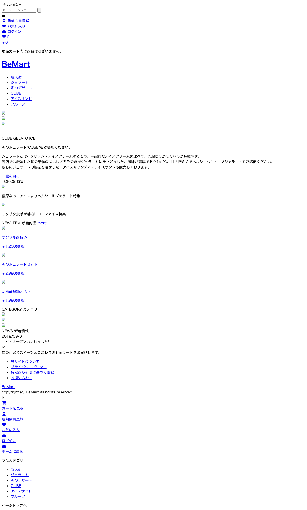](screenshots/20260611-web-db-all-routes/001-トップページ表示.png) |
| User | 商品一覧表示 | /products/list | GET /products | ✔ |  |  |  |  | Resource + HTML test + flow-customer-purchase | ✔ pass | [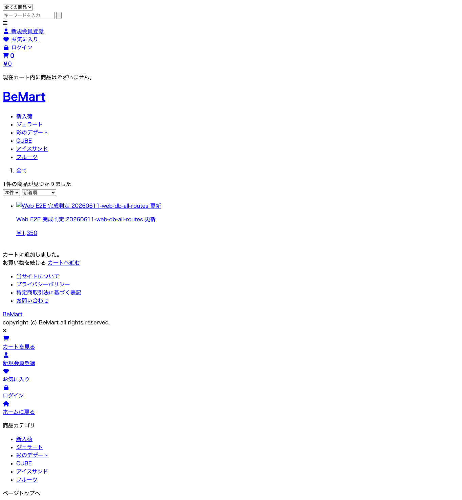](screenshots/20260611-web-db-all-routes/002-商品一覧表示.png) |
| User | カテゴリ絞り込み | /products/list?category_id=... | GET /products | ✔ |  |  |  |  | Resource + 現ブラウザ到達確認 | ✔ pass | [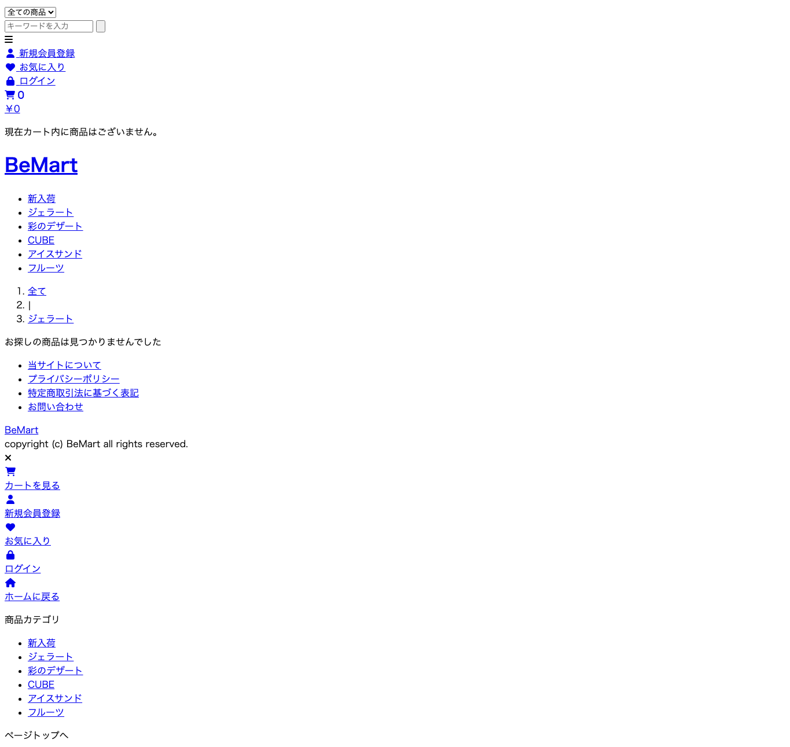](screenshots/20260611-web-db-all-routes/003-カテゴリ絞り込み.png) |
| User | 商品名検索 | /products/list?name=... | GET /products | ✔ |  |  |  |  | Resource + flow-customer-purchase | ✔ pass | [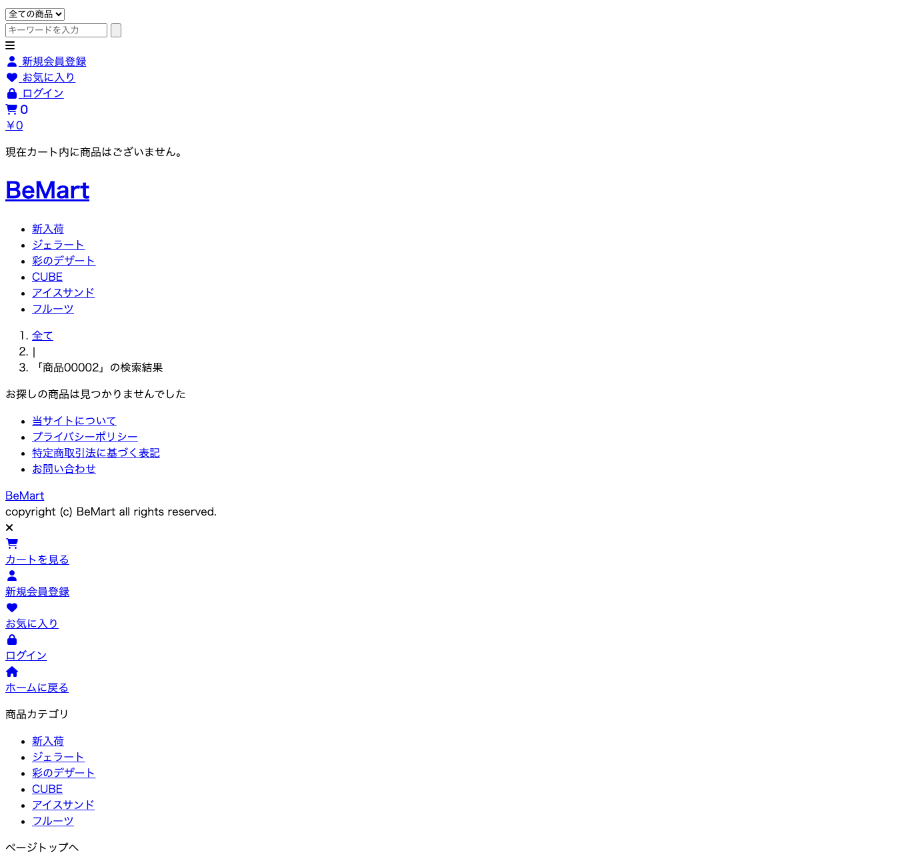](screenshots/20260611-web-db-all-routes/004-商品名検索.png) |
| User | 商品詳細表示 | /products/detail/{code} | GET /product | ✔ |  |  |  |  | Resource + HTML test + flow-customer-purchase | ✔ pass | [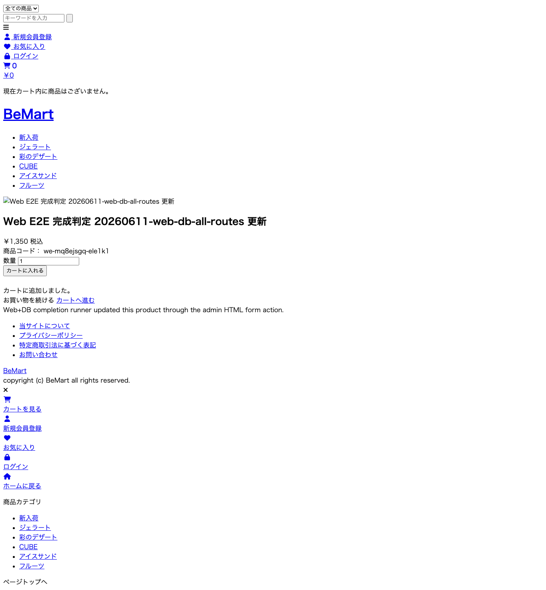](screenshots/20260611-web-db-all-routes/005-商品詳細表示.png) |
| User | カート追加 | 商品詳細→カート追加 | POST /cart/item | ✔ |  |  |  |  | Resource + flow-customer-purchase | ✔ pass（setup operation evidence） |  |
| User | カート数量変更 | カート→数量変更 | PUT /cart/item | ✔ |  |  |  |  | Resource test + OpenAPI schema | ✔ pass（setup operation evidence） |  |
| User | カート商品削除 | カート→削除 | DELETE /cart/item | ✔ |  |  |  |  | Resource test + OpenAPI schema | ✔ pass（setup operation evidence） |  |
| User | カート確認 | /cart | GET /cart | ✔ |  |  |  |  | Resource + HTML test + flow-customer-purchase | ✔ pass | [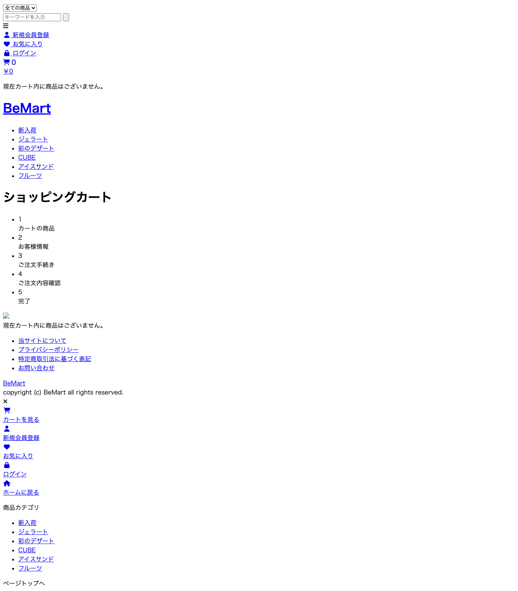](screenshots/20260611-web-db-all-routes/009-カート確認.png) |
| User | 非会員購入情報入力 | /shopping/non-member | GET /shopping/non-member | ✔ |  |  |  |  | Resource + HTML test + flow-customer-purchase | ✔ pass |  |
| User | 非会員購入情報送信 | 非会員購入フォーム送信 | POST /shopping/non-member | ✔ |  |  |  |  | HTTP regression + SQL HTML regression（OK/NG inline error） + OrderConfirmed regression + Web+DB runner regression | ✔ pass（setup operation evidence） | [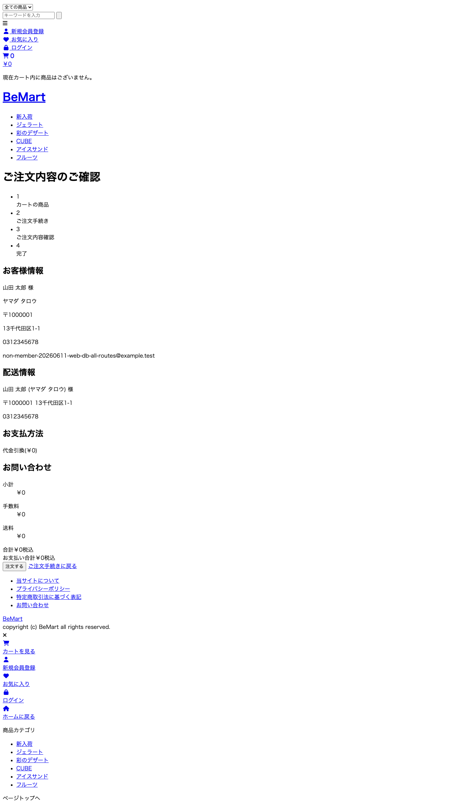](screenshots/20260611-web-db-all-routes/setup/shopping-non-member-confirm.png) |
| User | 購入確認 | /shopping/confirm | POST /shopping/confirm | ✔ |  |  |  |  | Resource + HTML test + flow-customer-purchase | ✔ pass（setup operation evidence） | [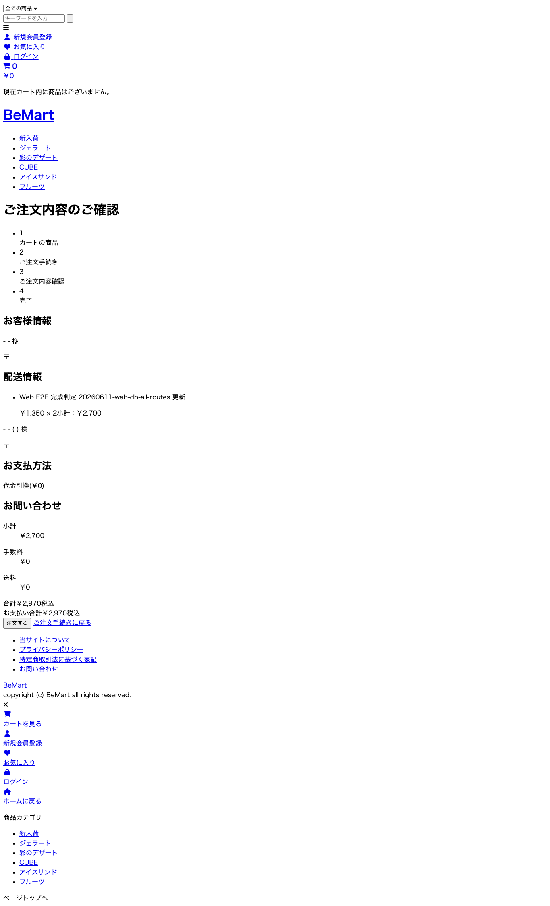](screenshots/20260611-web-db-all-routes/setup/shopping-confirm.png) |
| User | 購入完了 | /shopping/checkout → /shopping/complete | POST /shopping/checkout; GET /shopping/complete | ✔ |  |  |  |  | Resource + flow-customer-purchase | ✔ pass（setup operation evidence） |  |
| User | 購入エラー表示 | /shopping/error | GET /shopping/error | ✔ |  |  |  |  | Resource + HTML test | ✔ pass | [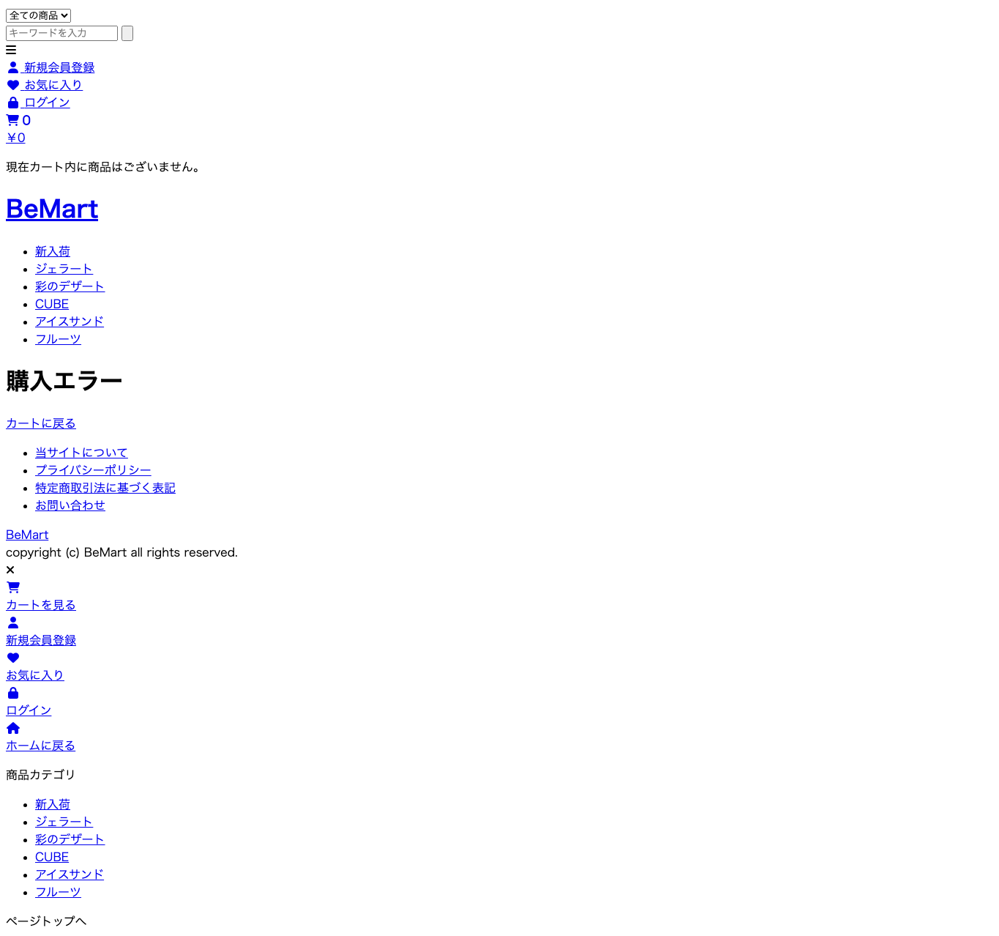](screenshots/20260611-web-db-all-routes/014-購入エラー表示.png) |
| User | 会員登録入力 | /entry | GET /entry | ✔ |  |  |  |  | Resource + HTML test + flow-customer-registration | ✔ pass |  |
| User | 会員登録確認 | /entry/confirm | GET /entry/confirm | ✔ |  |  |  |  | Resource + HTML test + flow-customer-registration | ✔ pass | [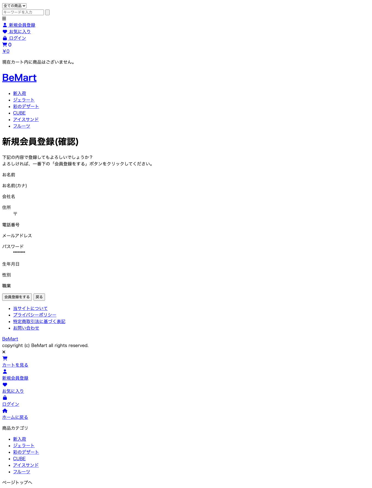](screenshots/20260611-web-db-all-routes/016-会員登録確認.png) |
| User | 会員登録完了 | /entry | POST /entry | ✔ |  |  |  |  | Resource + flow-customer-registration + SQL HTML regression（OK/NG inline error） | ✔ pass（setup operation evidence） | [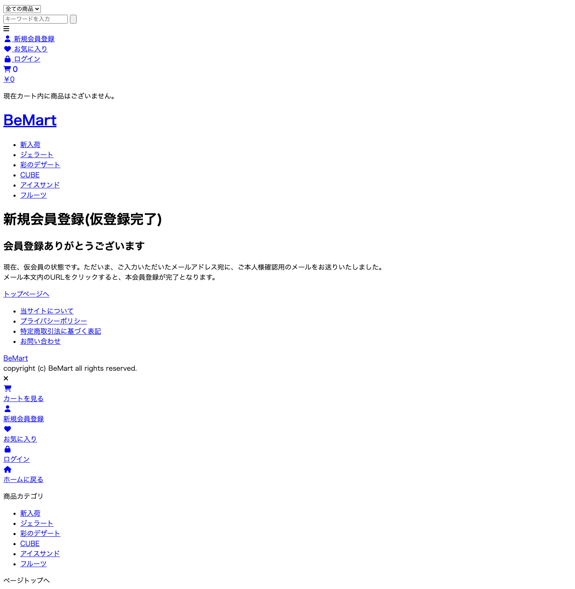](screenshots/20260611-web-db-all-routes/017-会員登録完了.png) |
| User | 会員登録完了画面 | /entry/complete | GET /entry/complete | ✔ |  |  |  |  | Resource + HTML test + flow-customer-registration | ✔ pass |  |
| User | 会員メール認証 | 認証リンク/トークン送信 | POST /entry/activate | ✔ |  |  |  |  | Resource + flow-customer-registration | — 対象外 | — ✔ pass（実DBブラウザで画面/導線確認） |
| User | ログイン | /login | GET /login; POST /login | ✔ |  |  |  |  | Resource + HTML test + auth/session test + SQL HTML registration/login regression | ✔ pass（setup operation evidence） | [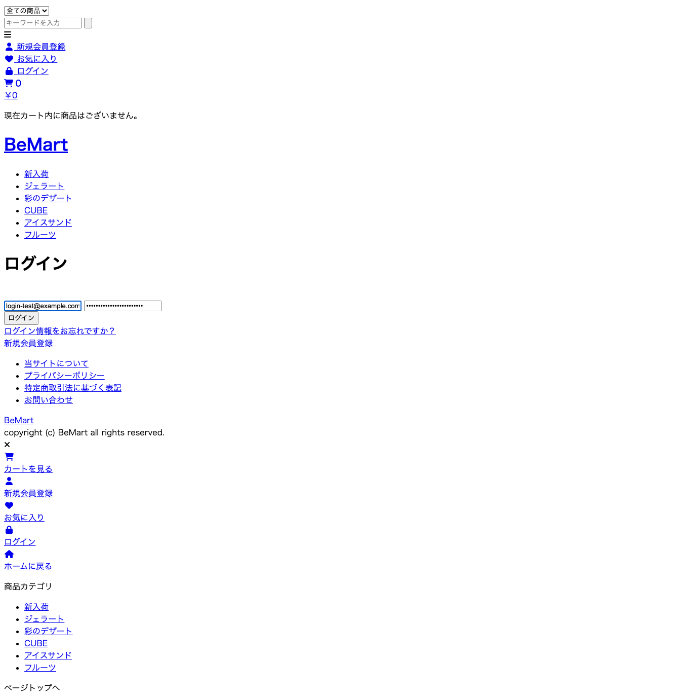](screenshots/20260611-web-db-all-routes/020-ログイン.png) |
| User | ログアウト | ヘッダー/マイページ→ログアウト | POST /logout | ✔ |  |  |  |  | Resource + auth/session test | ✔ pass（setup operation evidence） |  |
| User | パスワード再発行依頼 | /forgot-password | GET /forgot-password; POST /forgot-password | ✔ |  |  |  |  | Resource + HTML/Resource test | ✔ pass（setup operation evidence） |  |
| User | パスワードリセット | /reset | GET /reset; POST /reset | ✔ |  |  |  |  | Resource + HTML/Resource test | — 対象外 | — ✔ pass（実DBブラウザで画面/導線確認） |
| User | マイページ表示 | /mypage | GET /mypage | ✔ |  |  |  |  | Resource + HTML test + flow-customer-* | ✔ pass | [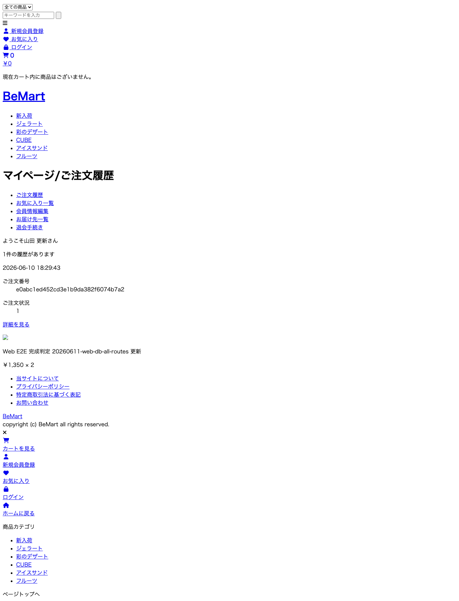](screenshots/20260611-web-db-all-routes/024-マイページ表示.png) |
| User | 注文履歴一覧 | /mypage/history | GET /mypage/history | ✔ |  |  |  |  | Resource + HTML/Resource test + maildate regression | ✔ pass |  |
| User | 注文履歴詳細 | /mypage/order-history | GET /mypage/order-history | ✔ |  |  |  |  | Resource + Resource test + maildate regression | ✔ pass | [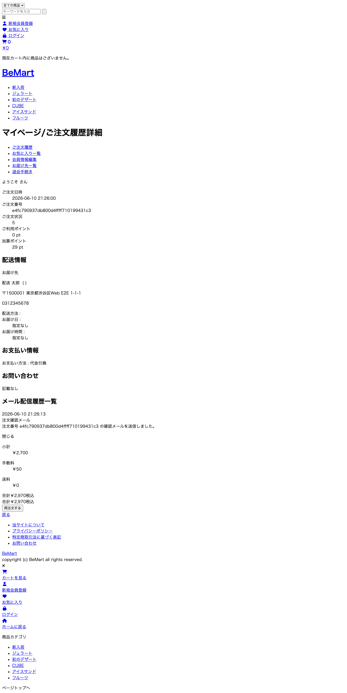](screenshots/20260611-order-history-maildate-regression/026-注文履歴詳細.png) |
| User | 再注文 | 注文履歴→再注文 | POST /mypage/reorder | ✔ |  |  |  |  | Resource + Resource test | ✔ pass（setup operation evidence） |  |
| User | お気に入り一覧 | /mypage/favorite-list | GET /mypage/favorite-list | ✔ |  |  |  |  | Resource + HTML test + flow-customer-account-maintenance | ✔ pass |  |
| User | お気に入り追加 | 商品詳細→お気に入り | POST /mypage/favorite | ✔ |  |  |  |  | Resource + flow-customer-account-maintenance | ✔ pass（setup operation evidence） | [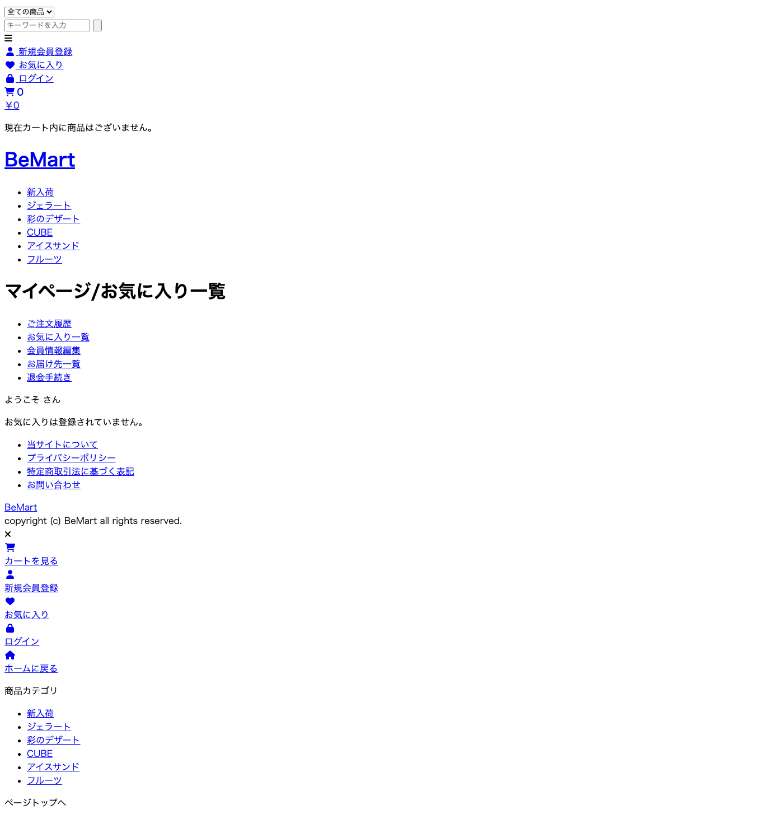](screenshots/20260611-web-db-all-routes/029-お気に入り追加.png) |
| User | お気に入り削除 | お気に入り一覧→削除 | DELETE /mypage/favorite | ✔ |  |  |  |  | Resource + flow-customer-account-maintenance | ✔ pass（setup operation evidence） |  |
| User | 会員情報変更 | /mypage/change | GET /mypage/change; POST /mypage/change | ✔ |  |  |  |  | Resource + HTML test + flow-customer-account-maintenance | ✔ pass（setup operation evidence） | [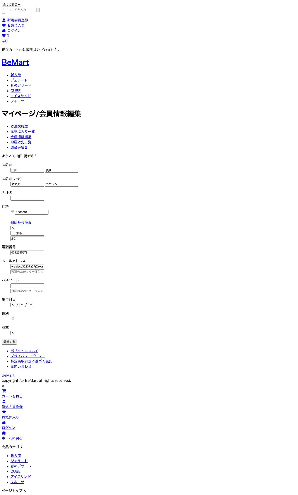](screenshots/20260611-web-db-all-routes/031-会員情報変更.png) |
| User | 会員情報変更完了 | /mypage/change-complete | GET /mypage/change-complete | ✔ |  |  |  |  | Resource + HTML test + flow-customer-account-maintenance | ✔ pass |  |
| User | お届け先一覧 | /mypage/address-list | GET /mypage/address-list | ✔ |  |  |  |  | Resource + HTML test + flow-customer-account-maintenance | ✔ pass | [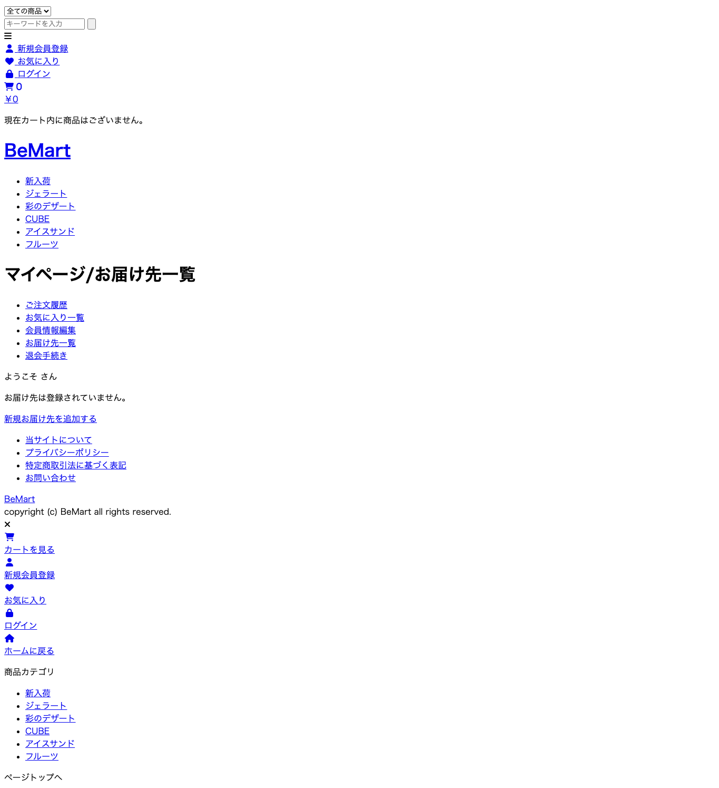](screenshots/20260611-web-db-all-routes/033-お届け先一覧.png) |
| User | お届け先追加 | お届け先一覧→追加 | POST /mypage/address-list | ✔ |  |  |  |  | Resource + flow-customer-account-maintenance | ✔ pass（setup operation evidence） |  |
| User | お届け先編集 | お届け先編集フォーム | PUT /mypage/address | ✔ |  |  |  |  | Resource + flow-customer-account-maintenance | ✔ pass（setup operation evidence） |  |
| User | お届け先削除 | お届け先一覧→削除 | DELETE /mypage/address | ✔ |  |  |  |  | Resource + flow-customer-account-maintenance | ✔ pass（setup operation evidence） |  |
| User | 退会確認 | /mypage/withdraw-confirm | GET /mypage/withdraw-confirm | ✔ |  |  |  |  | Resource + HTML test | ✔ pass | [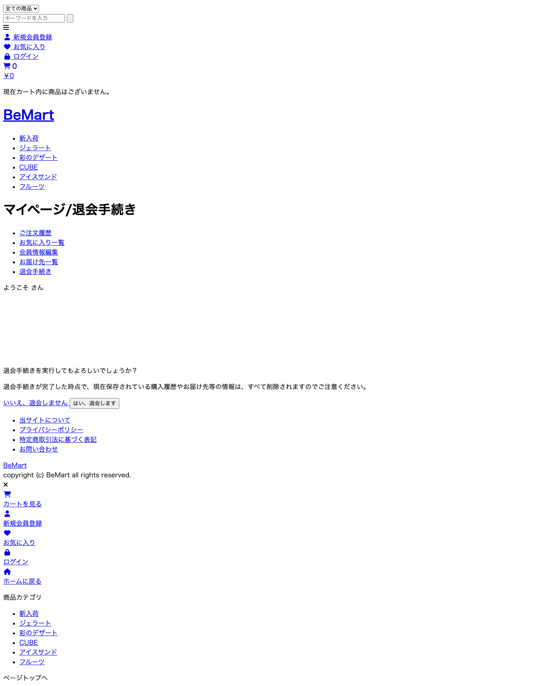](screenshots/20260611-web-db-all-routes/037-退会確認.png) |
| User | 退会入力/表示 | /mypage/withdraw | GET /mypage/withdraw | ✔ |  |  |  |  | Resource + HTML test + flow-customer-account-maintenance | ✔ pass | [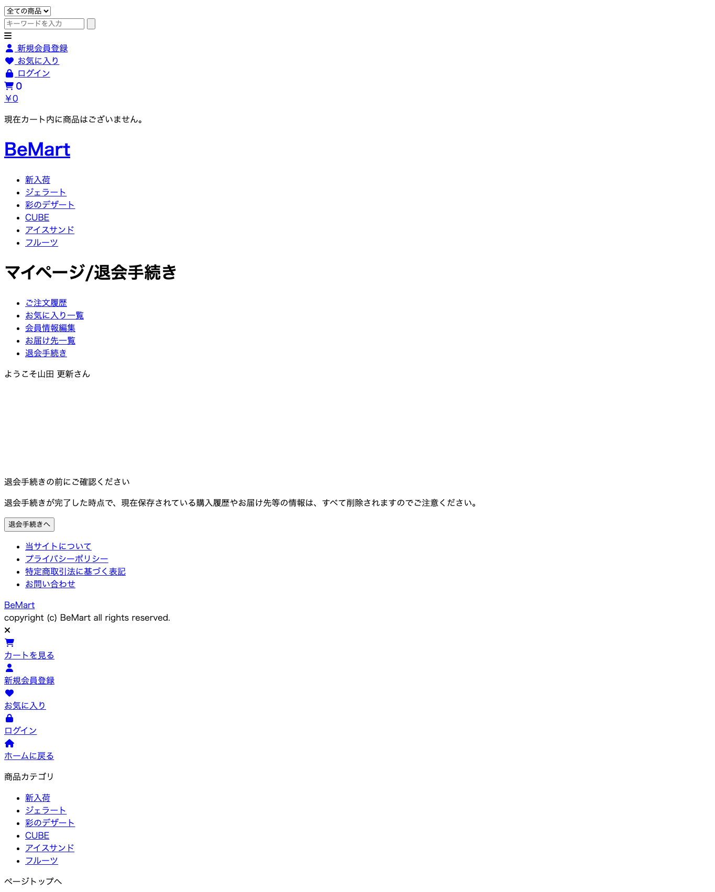](screenshots/20260611-web-db-all-routes/038-退会入力-表示.png) |
| User | 退会実行 | 退会フォーム送信 | POST /mypage/withdraw | ✔ |  |  |  |  | Resource + flow-customer-account-maintenance | ✔ pass（setup operation evidence） | [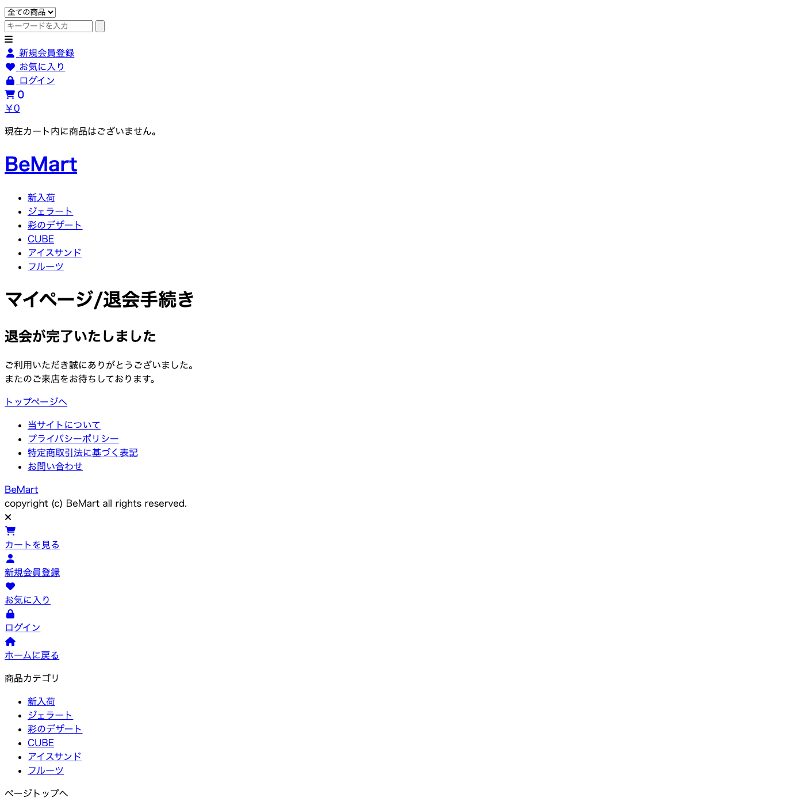](screenshots/20260611-web-db-all-routes/039-退会実行.png) |
| User | 退会完了 | /mypage/withdraw-complete | GET /mypage/withdraw-complete | ✔ |  |  |  |  | Resource + HTML test + flow-customer-account-maintenance | ✔ pass |  |
| User | お問い合わせ入力 | /contact | GET /contact | ✔ |  |  |  |  | Resource + HTML test + flow-customer-inquiry | ✔ pass | [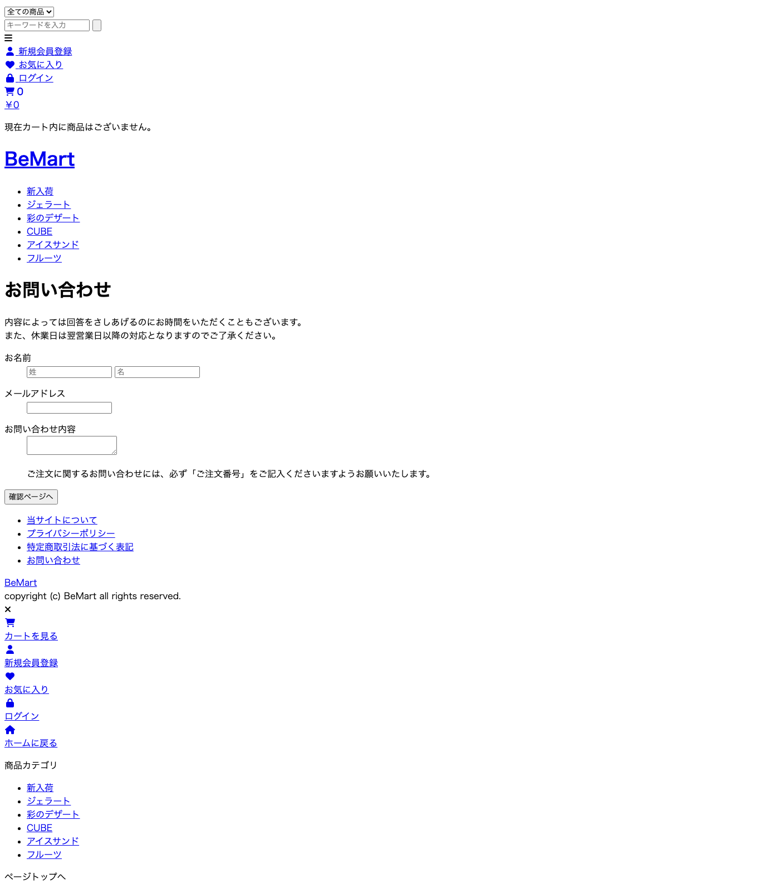](screenshots/20260611-web-db-all-routes/041-お問い合わせ入力.png) |
| User | お問い合わせ確認 | /contact/confirm | GET /contact/confirm; POST /contact | ✔ |  |  |  |  | Resource + HTML test + flow-customer-inquiry | ✔ pass（setup operation evidence） | [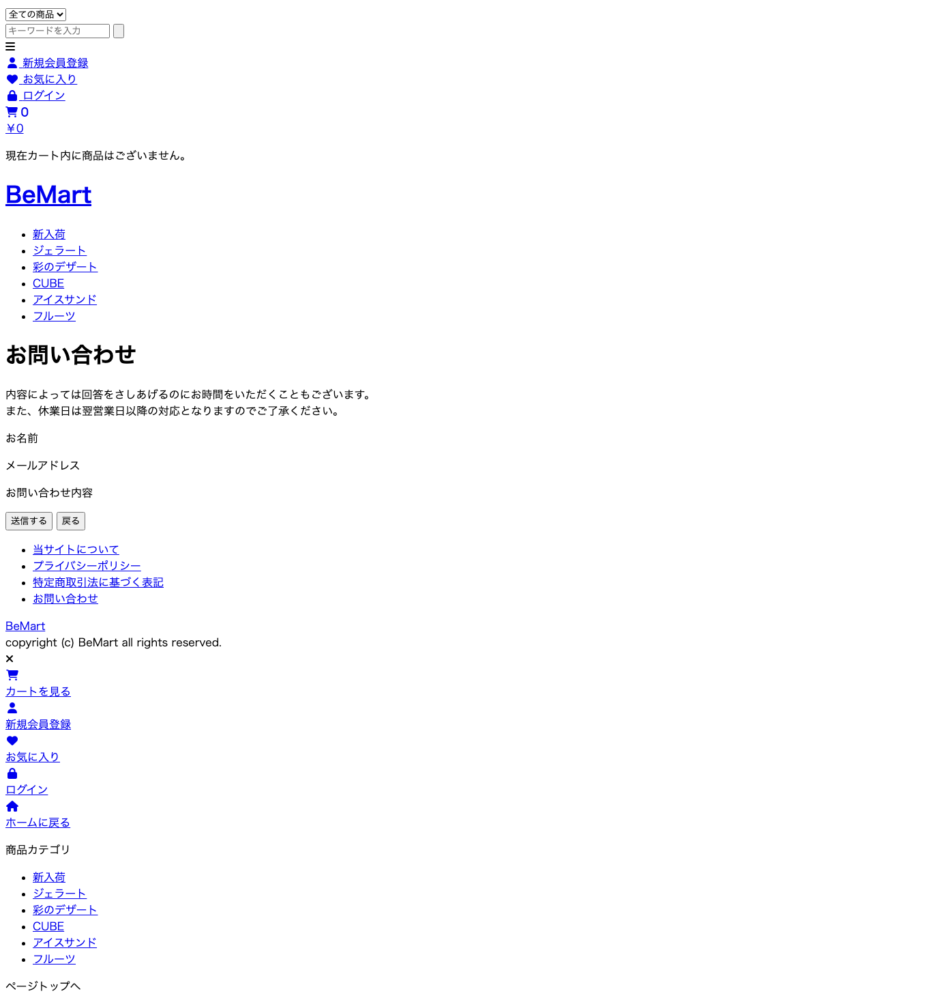](screenshots/20260611-web-db-all-routes/042-お問い合わせ確認.png) |
| User | お問い合わせ完了 | /contact/complete | GET /contact/complete | ✔ |  |  |  |  | Resource + HTML test + flow-customer-inquiry | ✔ pass | [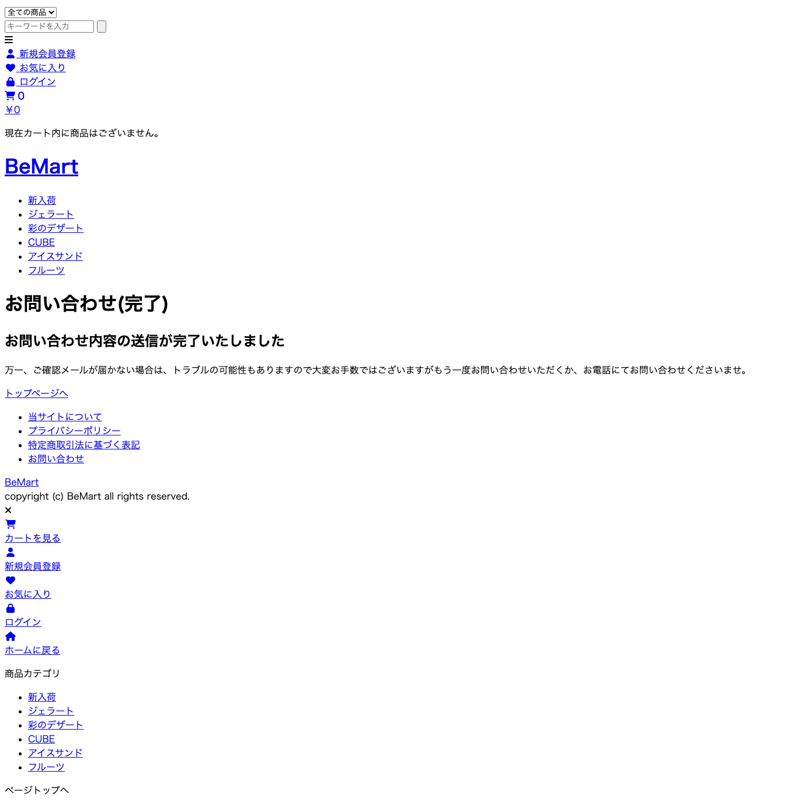](screenshots/20260611-web-db-all-routes/043-お問い合わせ完了.png) |
| User | 当サイトについて | /help/about | GET /help/about | ✔ |  |  |  |  | Resource + HTML test | ✔ pass | [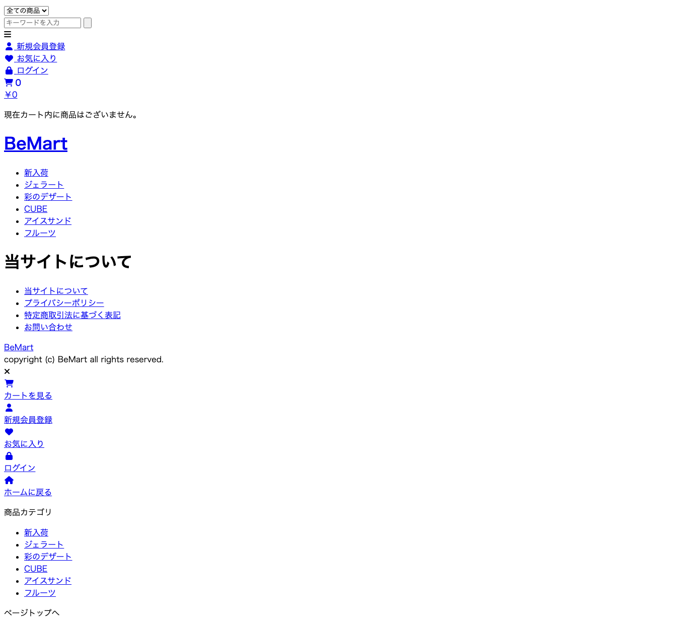](screenshots/20260611-web-db-all-routes/044-当サイトについて.png) |
| User | ご利用ガイド | /help/guide | GET /help/guide | ✔ |  |  |  |  | Resource + HTML test | ✔ pass |  |
| User | 利用規約 | /help/agreement | GET /help/agreement | ✔ |  |  |  |  | Resource + HTML test | ✔ pass |  |
| User | プライバシーポリシー | /help/privacy | GET /help/privacy | ✔ |  |  |  |  | Resource + HTML test | ✔ pass | [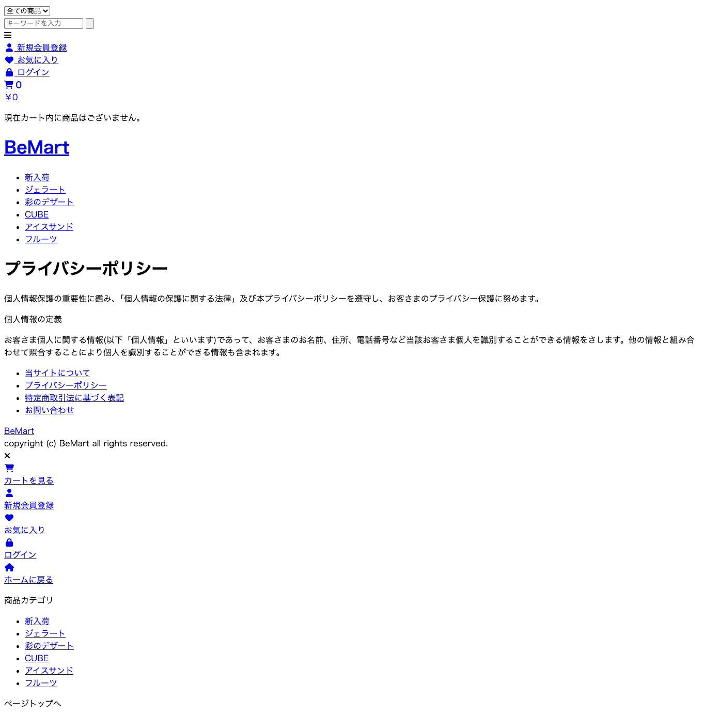](screenshots/20260611-web-db-all-routes/047-プライバシーポリシー.png) |
| User | 特定商取引法表示 | /help/trade-law | GET /help/trade-law | ✔ |  |  |  |  | Resource + HTML test | ✔ pass | [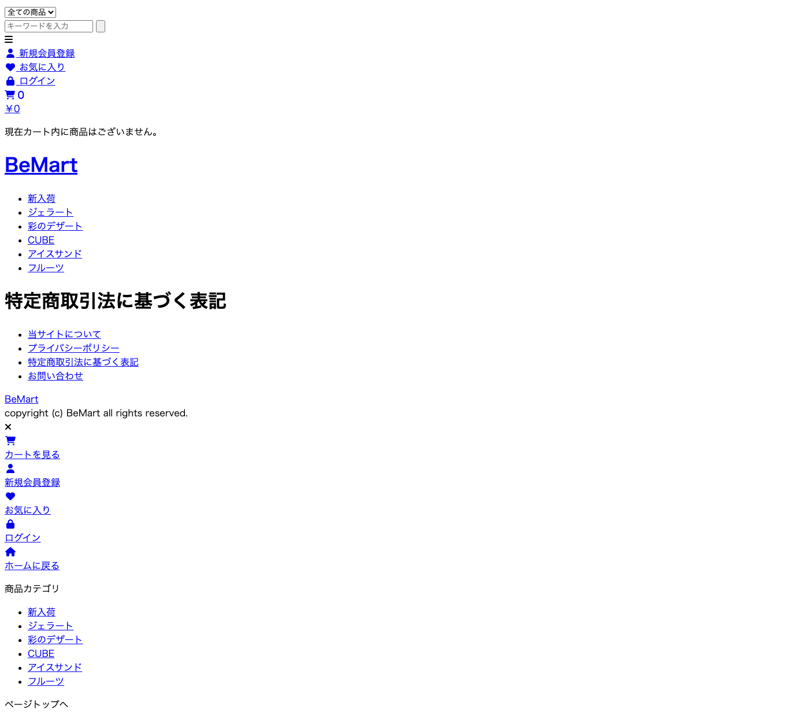](screenshots/20260611-web-db-all-routes/048-特定商取引法表示.png) |
| Admin | 管理ログイン | /admin/login | GET /admin/login; POST /admin/login | ✔ |  |  |  |  | Resource + HTML test + flow-admin-system-operation | ✔ pass（setup operation evidence） | [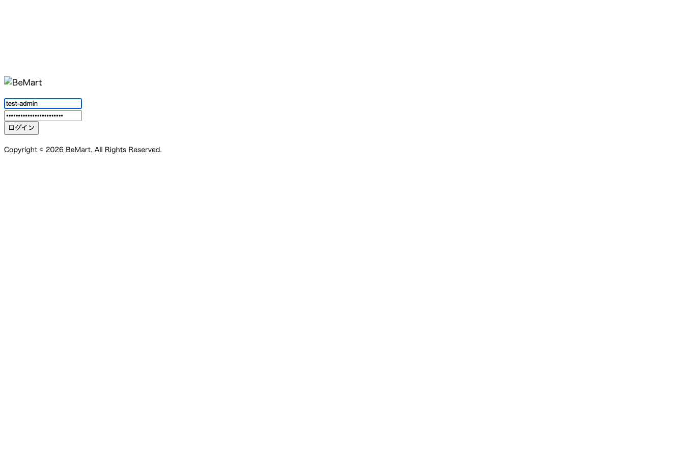](screenshots/20260611-web-db-all-routes/049-管理ログイン.png) |
| Admin | 管理ログアウト | 管理ヘッダー→ログアウト | POST /admin/logout | ✔ |  |  |  |  | Resource + flow-admin-system-operation | ✔ pass（setup operation evidence） |  |
| Admin | 管理ダッシュボード表示 | /admin | GET /admin/index | ✔ |  |  |  |  | Resource + HTML test + flow-admin-system-operation | ✔ pass | [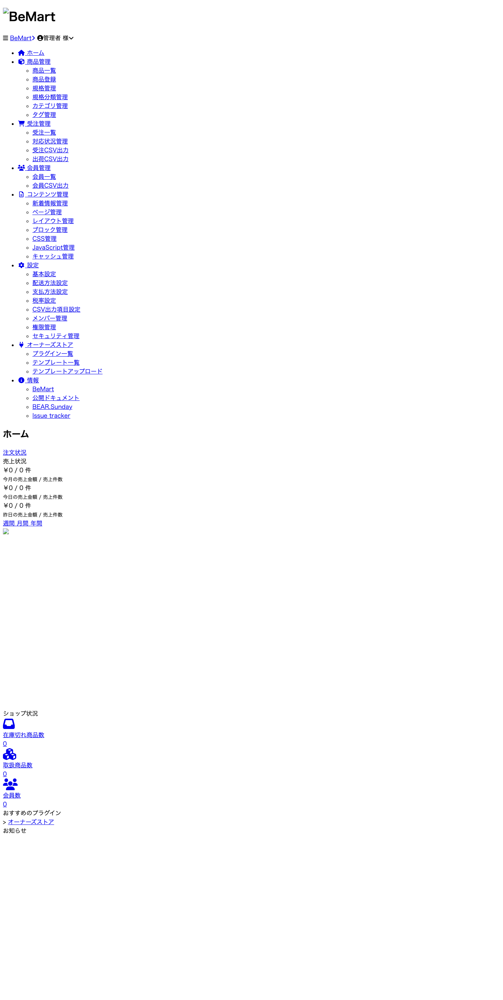](screenshots/20260611-web-db-all-routes/051-管理ダッシュボード表示.png) |
| Admin | 商品一覧表示 | 商品管理→商品一覧 | GET /admin/product-list | ✔ |  |  |  |  | Resource + HTML test + flow-admin-product-publish | ✔ pass |  |
| Admin | 商品検索 | 商品一覧検索フォーム | GET /admin/product-list | ✔ |  |  |  |  | Resource + flow-admin-product-publish | ✔ pass |  |
| Admin | 商品新規登録 | 商品管理→新規登録 | POST /admin/product | ✔ |  |  |  |  | Resource + flow-admin-product-publish | ✔ pass（setup operation evidence） | [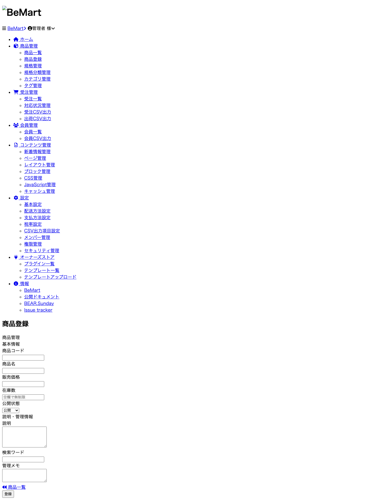](screenshots/20260611-web-db-all-routes/054-商品新規登録.png) |
| Admin | 商品詳細表示 | 商品一覧→詳細 | GET /admin/product | ✔ |  |  |  |  | Resource + HTML test + flow-admin-product-publish | ✔ pass |  |
| Admin | 商品編集 | 商品詳細→保存 | PUT /admin/product | ✔ |  |  |  |  | Resource + flow-admin-product-publish | ✔ pass（setup operation evidence） | [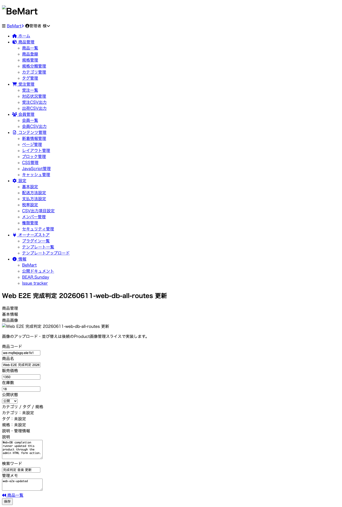](screenshots/20260611-web-db-all-routes/setup/admin-product-update.png) |
| Admin | 商品削除 | 商品詳細/一覧→削除 | DELETE /admin/product | ✔ |  |  |  |  | Resource test + OpenAPI schema | ✔ pass（setup operation evidence） |  |
| Admin | 商品コピー | 商品一覧→コピー | POST /admin/product-copy | ✔ |  |  |  |  | Resource test + browser verification docs | ✔ pass（setup operation evidence） | [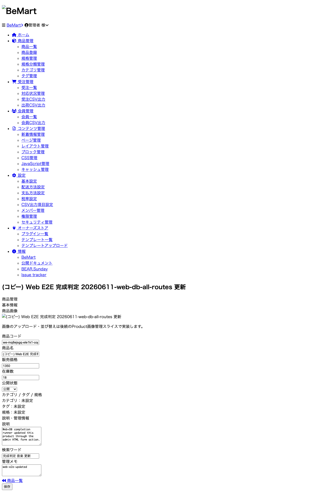](screenshots/20260611-web-db-all-routes/setup/admin-product-copy.png) |
| Admin | 商品公開状態一括変更 | 商品一覧→公開状態一括変更 | POST /admin/product-bulk-status | ✔ |  |  |  |  | Resource test + browser verification docs | ✔ pass（setup operation evidence） |  |
| Admin | 商品CSV出力 | 商品管理→CSV出力 | GET /admin/product-csv | ✔ |  |  |  |  | Resource + flow-admin-csv-exchange | ✔ pass（HTTP download evidence） | [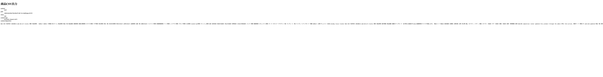](screenshots/20260611-web-db-all-routes/060-商品CSV出力.png) |
| Admin | 商品CSV取込 | 商品管理→CSV取込 | POST /admin/product-csv | ✔ |  |  |  |  | SQL HTML multipart regression + Web+DB runner readback | ✔ pass（setup operation evidence） | [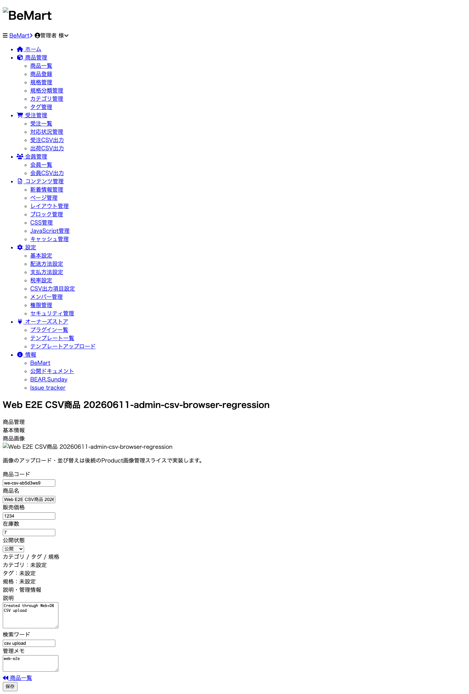](screenshots/20260611-admin-csv-browser-regression/setup/admin-product-csv-upload.png) |
| Admin | カテゴリ一覧表示 | カテゴリ管理 | GET /admin/category/category-list | ✔ |  |  |  |  | Resource + HTML test | ✔ pass |  |
| Admin | カテゴリ作成 | カテゴリ管理→追加 | POST /admin/category/category-list | ✔ |  |  |  |  | Resource/HTML tests | ✔ pass（setup operation evidence） |  |
| Admin | カテゴリ編集 | カテゴリ管理→編集 | PUT /admin/category/category | ✔ |  |  |  |  | Resource/HTML tests | ✔ pass（setup operation evidence） | [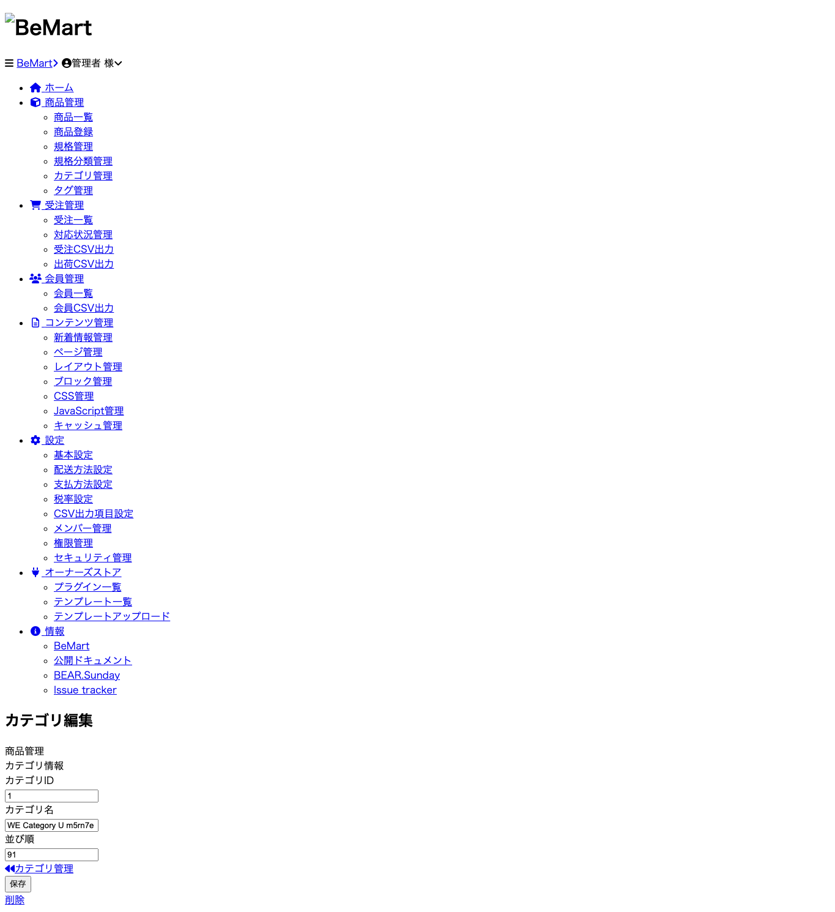](screenshots/20260611-web-db-all-routes/setup/admin-category-update.png) |
| Admin | カテゴリ削除 | カテゴリ管理→削除 | DELETE /admin/category/category | ✔ |  |  |  |  | Resource/HTML tests | ✔ pass（setup operation evidence） |  |
| Admin | カテゴリCSV出力 | カテゴリCSV | GET /admin/category/csv | ✔ |  |  |  |  | Resource + flow-admin-csv-exchange | ✔ pass（HTTP download evidence） | [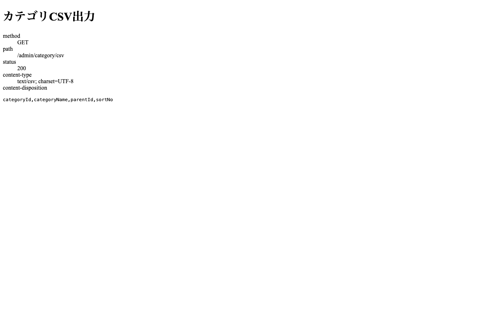](screenshots/20260611-web-db-all-routes/066-カテゴリCSV出力.png) |
| Admin | カテゴリCSV取込 | カテゴリCSV取込 | POST /admin/category/csv | ✔ |  |  |  |  | SQL HTML multipart regression + Web+DB runner readback | ✔ pass（setup operation evidence） | [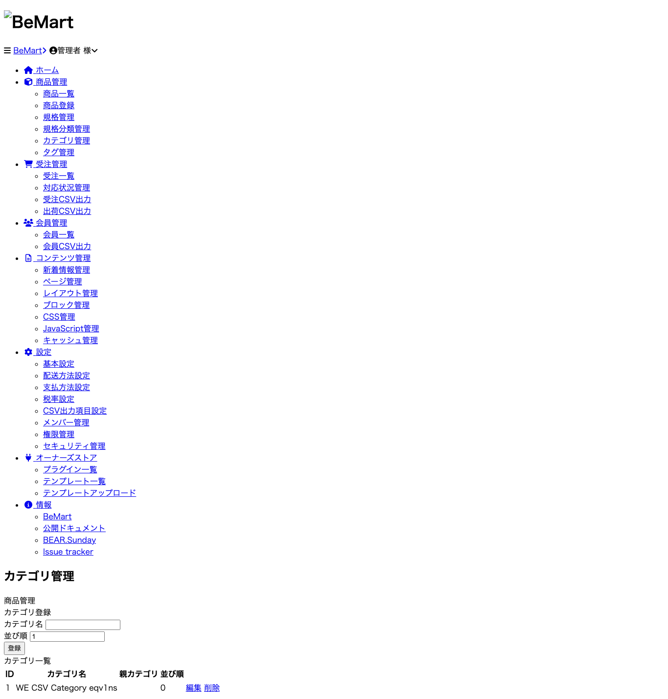](screenshots/20260611-admin-csv-browser-regression/setup/admin-category-csv-upload.png) |
| Admin | タグ一覧表示 | タグ管理 | GET /admin/tag/tag-list | ✔ |  |  |  |  | Resource + HTML test | ✔ pass |  |
| Admin | タグ作成 | タグ管理→追加 | POST /admin/tag/tag-list | ✔ |  |  |  |  | Resource test | ✔ pass（setup operation evidence） | [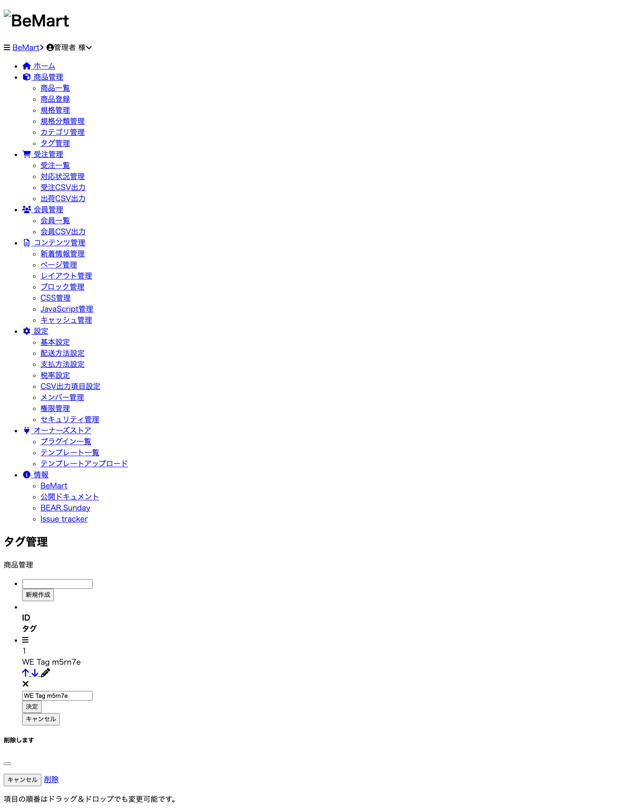](screenshots/20260611-web-db-all-routes/setup/admin-tag-create.png) |
| Admin | タグ削除 | タグ管理→削除 | DELETE /admin/tag/tag | ✔ |  |  |  |  | Resource test | ✔ pass（setup operation evidence） | [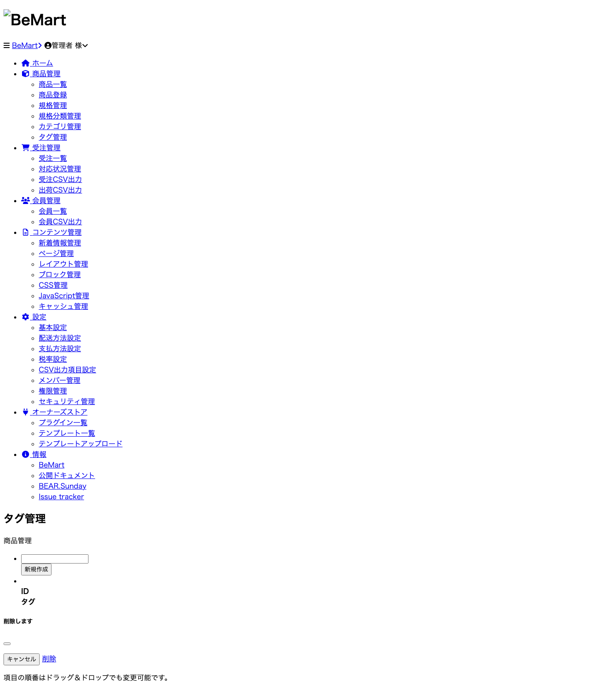](screenshots/20260611-web-db-all-routes/setup/admin-tag-delete.png) |
| Admin | 規格管理表示 | 規格管理 | GET /admin/class-name/class-name-list | ✔ |  |  |  |  | Resource + HTML test | ✔ pass | [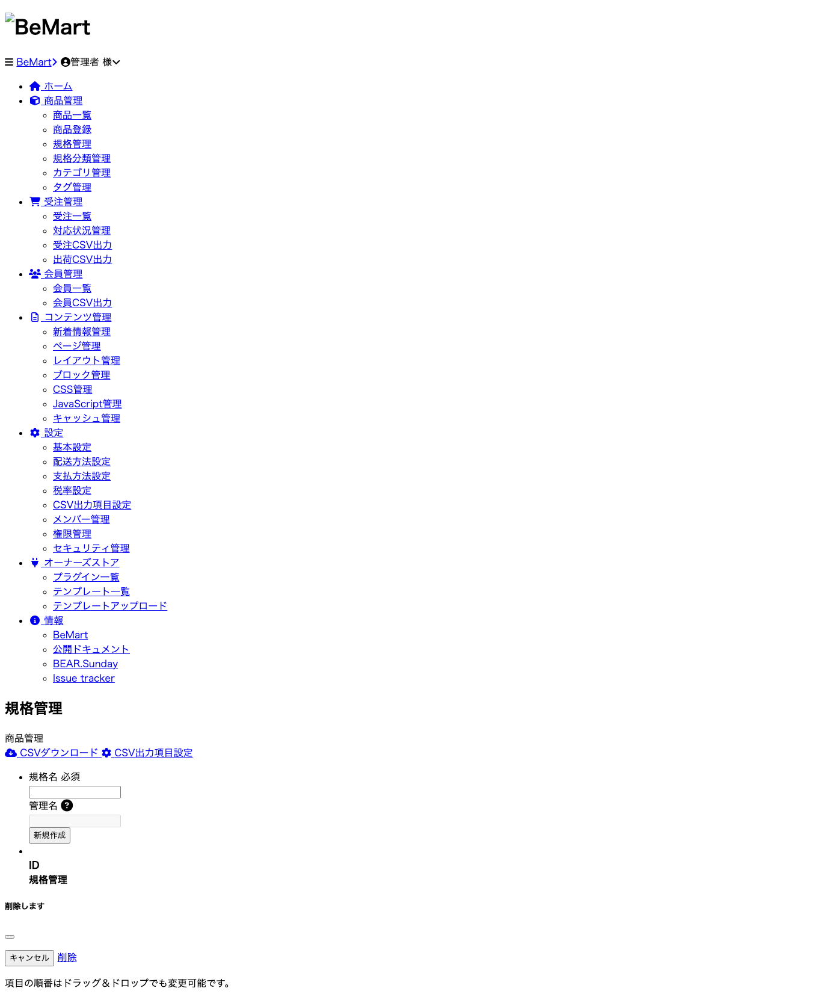](screenshots/20260611-admin-class-browser-regression-fixed/071-規格管理表示.png) |
| Admin | 規格作成 | 規格管理→追加 | POST /admin/class-name/class-name-list | ✔ |  |  |  |  | flow-admin-class-maintenance + browser setup evidence | ✔ pass（setup operation evidence） | [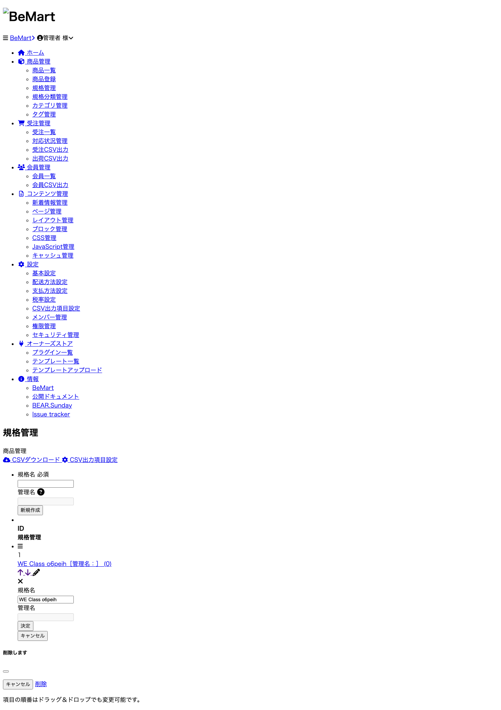](screenshots/20260611-admin-class-browser-regression-fixed/setup/admin-class-name-create.png) |
| Admin | 規格編集 | 規格管理→編集 | PUT /admin/class-name/class-name | ✔ |  |  |  |  | flow-admin-class-maintenance + browser setup evidence | ✔ pass（setup operation evidence） |  |
| Admin | 規格削除 | 規格管理→削除 | DELETE /admin/class-name/class-name | ✔ |  |  |  |  | flow-admin-class-maintenance + browser setup evidence | ✔ pass（setup operation evidence） |  |
| Admin | 規格CSV出力 | 規格CSV | GET /admin/class-name/class-name-export | ✔ |  |  |  |  | Resource + flow-admin-csv-exchange | ✔ pass（HTTP download evidence） | [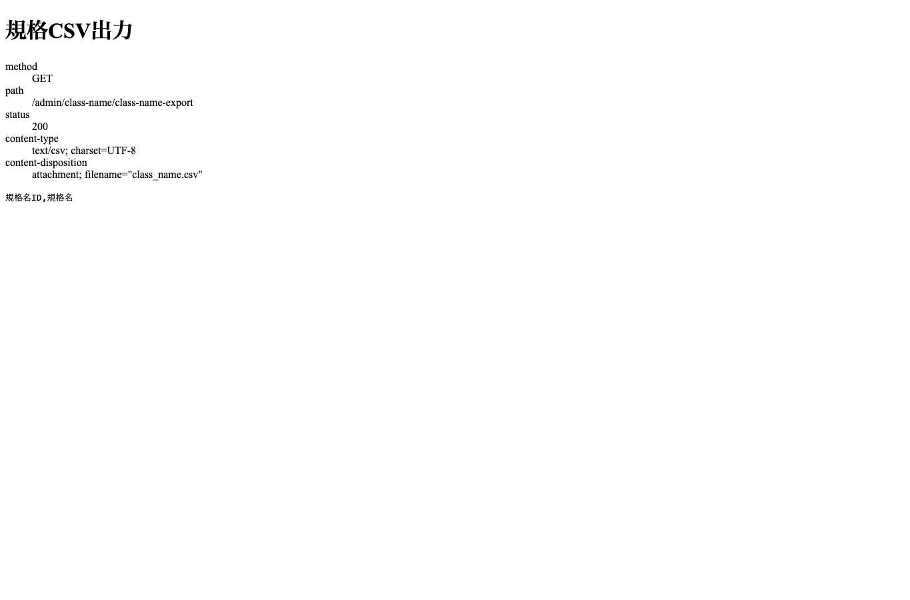](screenshots/20260611-admin-class-browser-regression-fixed/075-規格CSV出力.png) |
| Admin | 規格CSV取込 | 規格CSV取込 | POST /admin/product/csv-class-name |  | ✔ |  |  |  | Resource + flow-admin-csv-exchange; CSV upload/compat boundary | ✔ pass（setup operation evidence） | [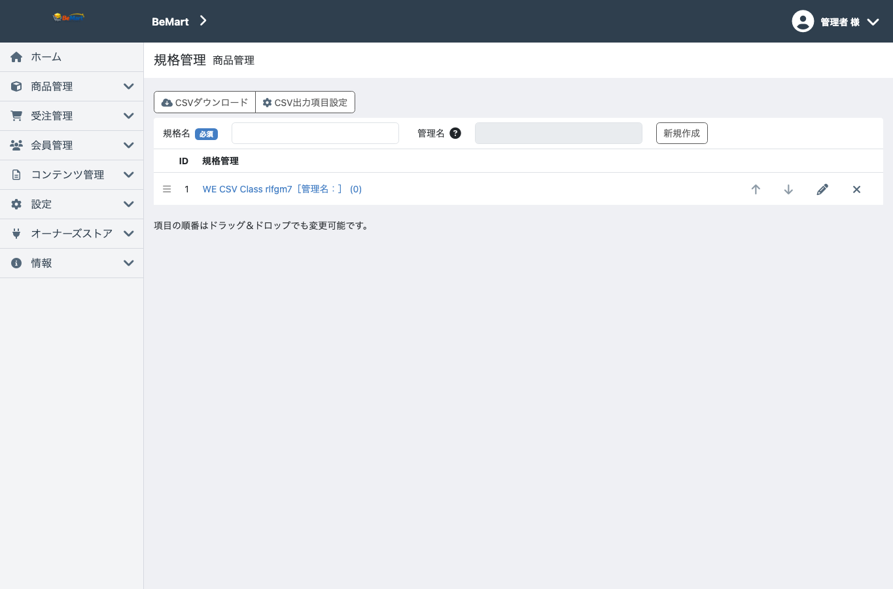](screenshots/20260611-admin-class-csv-browser-regression/setup/admin-class-name-csv-upload.png) |
| Admin | 規格分類管理表示 | 規格分類管理 | GET /admin/class-category/class-category-list | ✔ |  |  |  |  | Resource + HTML test | ✔ pass |  |
| Admin | 規格分類作成 | 規格分類管理→追加 | POST /admin/class-category/class-category-list | ✔ |  |  |  |  | flow-admin-class-maintenance + browser setup evidence | ✔ pass（setup operation evidence） |  |
| Admin | 規格分類編集 | 規格分類管理→編集 | PUT /admin/class-category/class-category | ✔ |  |  |  |  | flow-admin-class-maintenance + browser setup evidence | ✔ pass（setup operation evidence） | [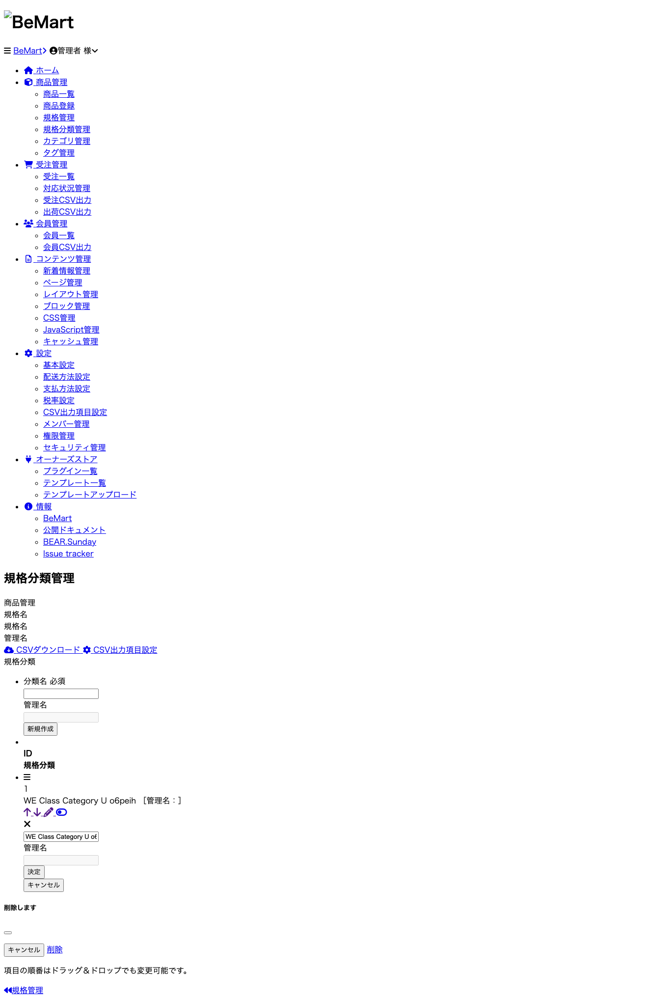](screenshots/20260611-admin-class-browser-regression-fixed/setup/admin-class-category-update.png) |
| Admin | 規格分類削除 | 規格分類管理→削除 | DELETE /admin/class-category/class-category | ✔ |  |  |  |  | flow-admin-class-maintenance + browser setup evidence | ✔ pass（setup operation evidence） | [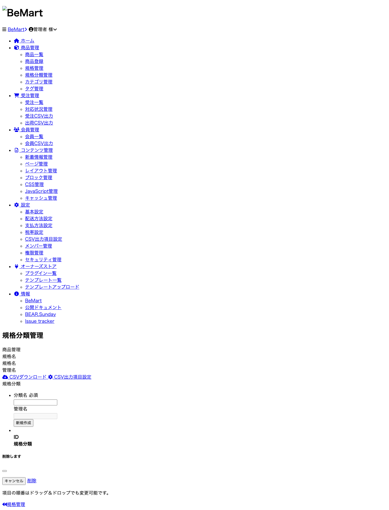](screenshots/20260611-admin-class-browser-regression-fixed/setup/admin-class-category-delete.png) |
| Admin | 規格分類CSV出力 | 規格分類CSV | GET /admin/class-category/class-category-export | ✔ |  |  |  |  | Resource + flow-admin-csv-exchange | ✔ pass（HTTP download evidence） |  |
| Admin | 規格分類CSV取込 | 規格分類CSV取込 | POST /admin/product/csv-class-category |  | ✔ |  |  |  | Resource + flow-admin-csv-exchange; CSV upload/compat boundary | ✔ pass（setup operation evidence） | [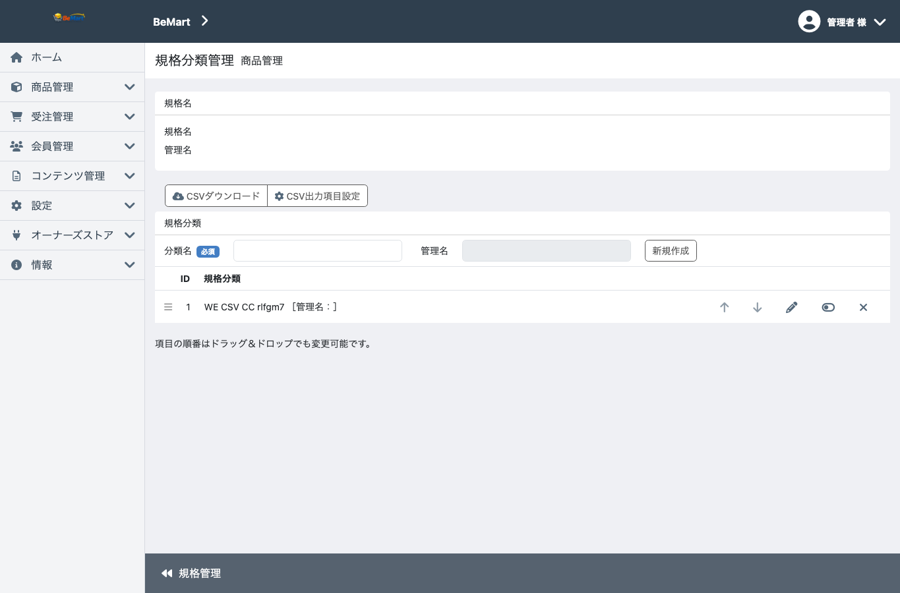](screenshots/20260611-admin-class-csv-browser-regression/setup/admin-class-category-csv-upload.png) |
| Admin | 商品規格編集 | 商品詳細→規格編集 | GET /admin/product/product-class; PUT /admin/product/product-class | ✔ |  |  |  |  | GET renderer only; ProductClass matrix read/update contract missing. See `20260610-web-db-followups.md` 083 stop reason | ✘ fail（unsafe operation not executed: PUT /admin/product/product-class） | [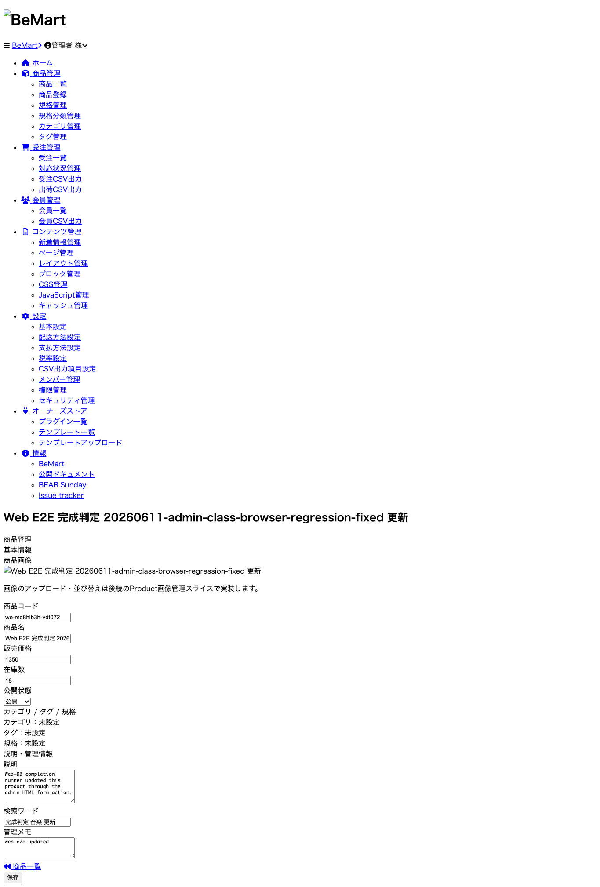](screenshots/20260611-admin-class-browser-regression-fixed/083-商品規格編集.png) |
| Admin | 会員一覧表示 | 会員管理→一覧 | GET /admin/customer-list | ✔ |  |  |  |  | Resource + HTML test | ✔ pass |  |
| Admin | 会員検索 | 会員一覧検索フォーム | GET /admin/customer-list | ✔ |  |  |  |  | Resource test | ✔ pass | [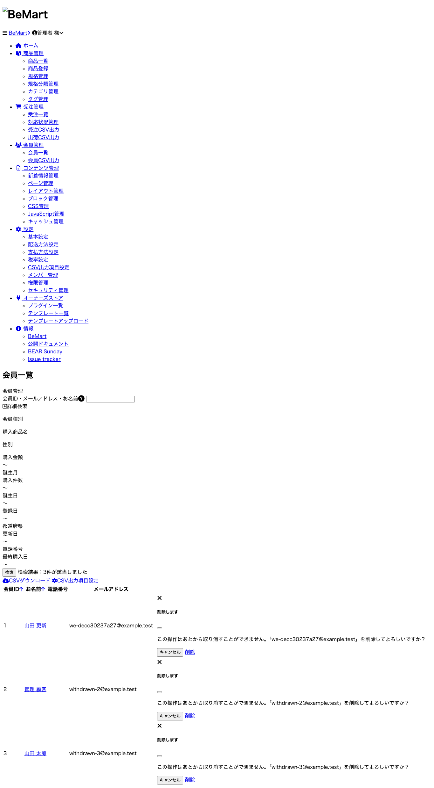](screenshots/20260611-web-db-all-routes/085-会員検索.png) |
| Admin | 会員詳細表示 | 会員一覧→詳細 | GET /admin/customer | ✔ |  |  |  |  | Resource + HTML test | ✔ pass |  |
| Admin | 会員作成 | 会員管理→新規作成 | POST /admin/create-customer | ✔ |  |  |  |  | Resource test | ✔ pass（setup operation evidence） |  |
| Admin | 会員編集 | 会員詳細→保存 | なし（GET /admin/customer のみ） |  |  |  | ✔ |  | HTML form は `/admin/customer?customerId=...` へPOSTするが、Resource/OpenAPI/ALPSにadmin更新transitionなし | ✔ pass |  |
| Admin | 会員削除 | 会員詳細/一覧→削除 | POST /admin/delete-customer | ✔ |  |  |  |  | Resource test | ✔ pass（setup operation evidence） | [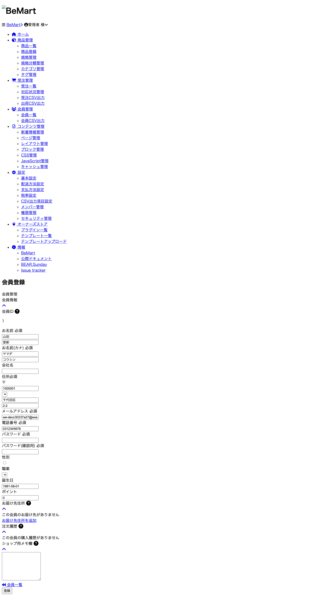](screenshots/20260611-web-db-all-routes/089-会員削除.png) |
| Admin | 会員配送先編集 | 会員詳細→配送先編集 | GET /admin/customer-delivery-edit のみ |  | ✔ |  |  |  | GET rendererのみ。HTML form は空action POSTだが、Resource/OpenAPI/ALPSに保存transitionなし | ✔ pass |  |
| Admin | 会員認証メール再送 | 会員詳細→認証メール再送 | POST /admin/customer/resend-activation-mail |  | ✔ |  |  |  | Resource exists; Web/HTTPで仮会員を作る導線なし。entry完了画面の仮登録表示と即時本会員保存の不一致を解消してから再検証する | ✘ fail（unsafe operation not executed: POST /admin/customer/resend-activation-mail） |  |
| Admin | 会員CSV出力 | 会員管理→CSV出力 | GET /admin/customer-csv | ✔ |  |  |  |  | Resource + flow-admin-csv-exchange | ✔ pass（HTTP download evidence） | [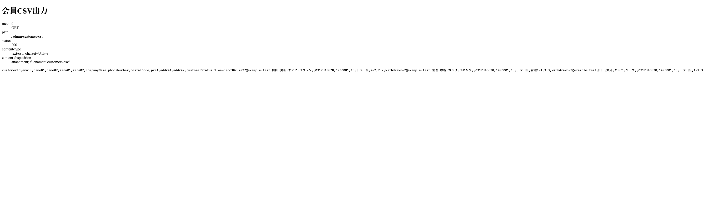](screenshots/20260611-web-db-all-routes/092-会員CSV出力.png) |
| Admin | 受注一覧表示 | 受注管理→一覧 | GET /admin/order-list | ✔ |  |  |  |  | Resource + HTML test + flow-admin-order-fulfillment | ✔ pass | [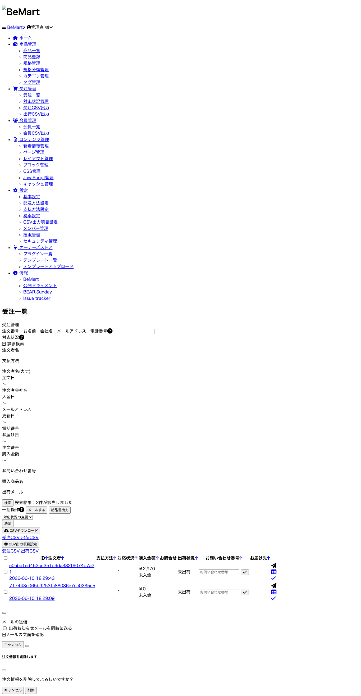](screenshots/20260611-web-db-all-routes/093-受注一覧表示.png) |
| Admin | 受注検索 | 受注一覧検索フォーム | GET /admin/order-list | ✔ |  |  |  |  | Resource + flow-admin-order-fulfillment | ✔ pass |  |
| Admin | 受注詳細表示 | 受注一覧→詳細 | GET /admin/order | ✔ |  |  |  |  | Resource + HTML test + flow-admin-order-fulfillment | ✔ pass | [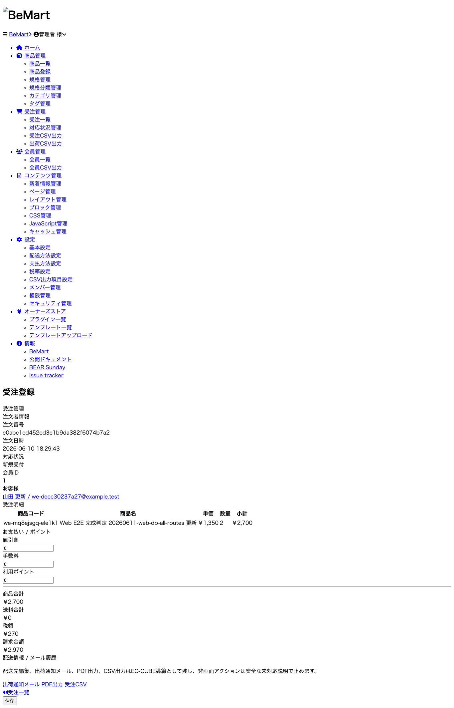](screenshots/20260611-web-db-all-routes/095-受注詳細表示.png) |
| Admin | 受注作成 | 受注管理→新規作成 | POST /admin/order/create | ✔ |  |  |  |  | Resource + HttpSqlAdminOrderCreateFormTest + Web+DB runner; 受注0件一覧の新規作成リンク、blank editor form action、303 Location、詳細readback | ✔ pass（setup operation evidence; limited browser regression） | [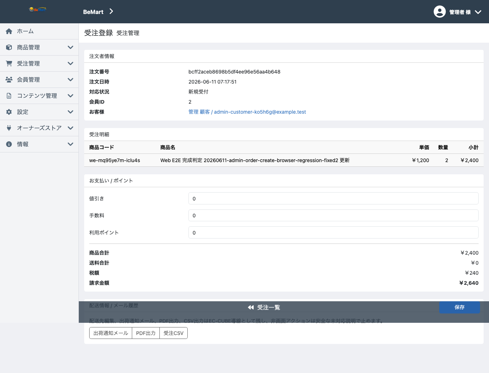](screenshots/20260611-admin-order-create-browser-regression-fixed2/setup/admin-order-create.png) |
| Admin | 受注編集 | 受注詳細→保存 | PUT /admin/order | ✔ |  |  |  |  | Resource + flow-admin-order-fulfillment + 20260611 admin order browser regression | ✔ pass（setup operation evidence; limited regression run） | [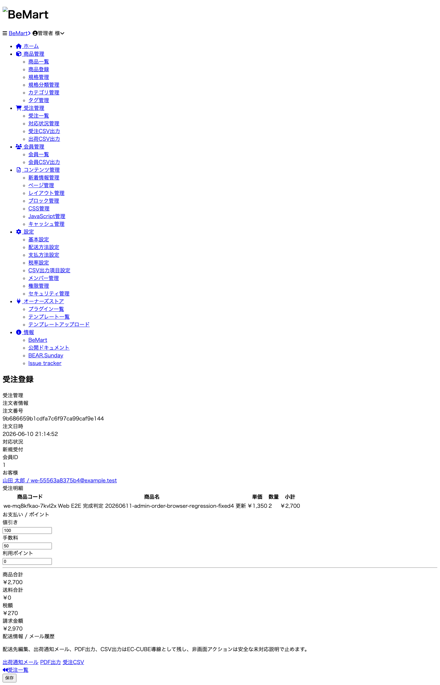](screenshots/20260611-admin-order-browser-regression-fixed4/setup/admin-order-update.png) |
| Admin | 受注削除 | 受注一覧→削除 | POST /admin/order/bulk-delete | ✔ |  |  |  |  | Resource + HTTP form regression + 20260611 admin order bulk-delete browser regression | ✔ pass（setup operation evidence; ids[] form -> 303 PRG -> 注文取消 readback） | [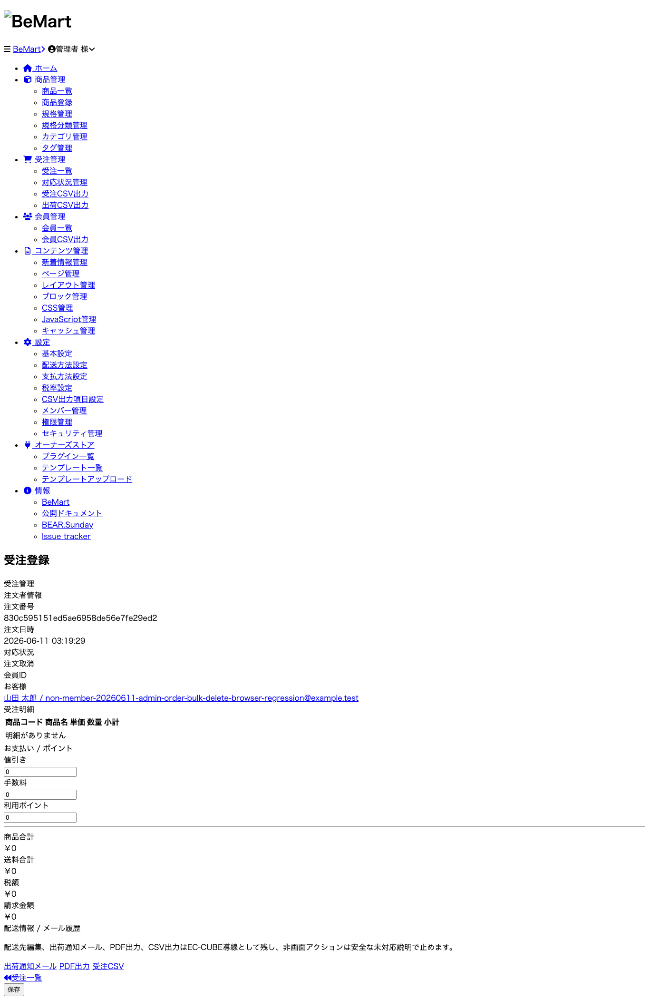](screenshots/20260611-admin-order-bulk-delete-browser-regression/setup/admin-order-bulk-delete.png) |
| Admin | 受注対応状況変更 | 受注一覧/詳細→対応状況変更 | POST /admin/order-status | ✔ |  |  |  |  | Resource + flow-admin-order-fulfillment + 20260611 admin order browser regression | ✔ pass（setup operation evidence; limited regression run） |  |
| Admin | 配送先編集 | 受注詳細→配送先編集 | GET /admin/order/shipping-address; PUT /admin/order/shipping-address | ✔ |  |  |  |  | Resource + flow-admin-order-fulfillment + 20260611 admin order browser regression | ✔ pass（setup operation evidence; limited regression run） | [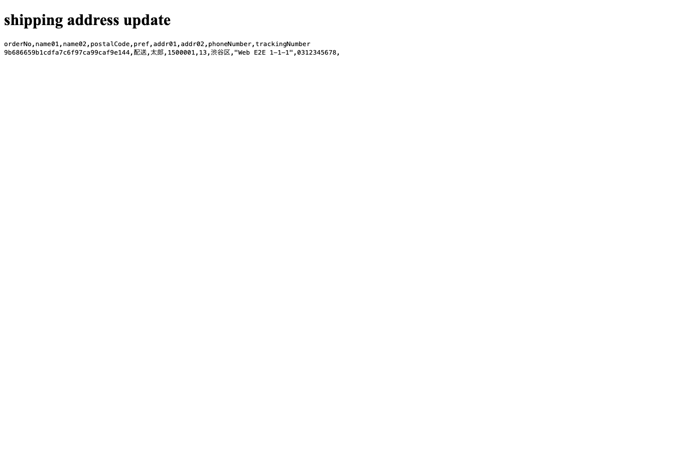](screenshots/20260611-admin-order-browser-regression-fixed4/setup/admin-order-shipping-address-update.png) |
| Admin | 追跡番号更新 | 受注詳細→追跡番号更新 | PUT /admin/order/tracking-number | ✔ |  |  |  |  | Resource + flow-admin-order-fulfillment + 20260611 admin order browser regression | ✔ pass（setup operation evidence; limited regression run） | [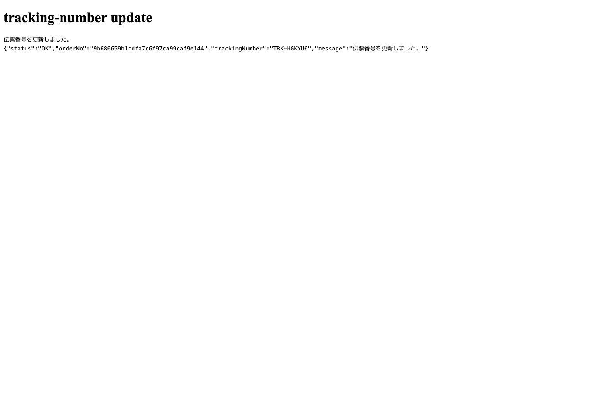](screenshots/20260611-admin-order-browser-regression-fixed4/setup/admin-order-tracking-number-update.png) |
| Admin | 出荷通知メール表示 | 受注詳細→出荷通知 | GET /admin/order/shipping-notify-mail | ✔ |  |  |  |  | Resource test + browser verification docs | ✔ pass | [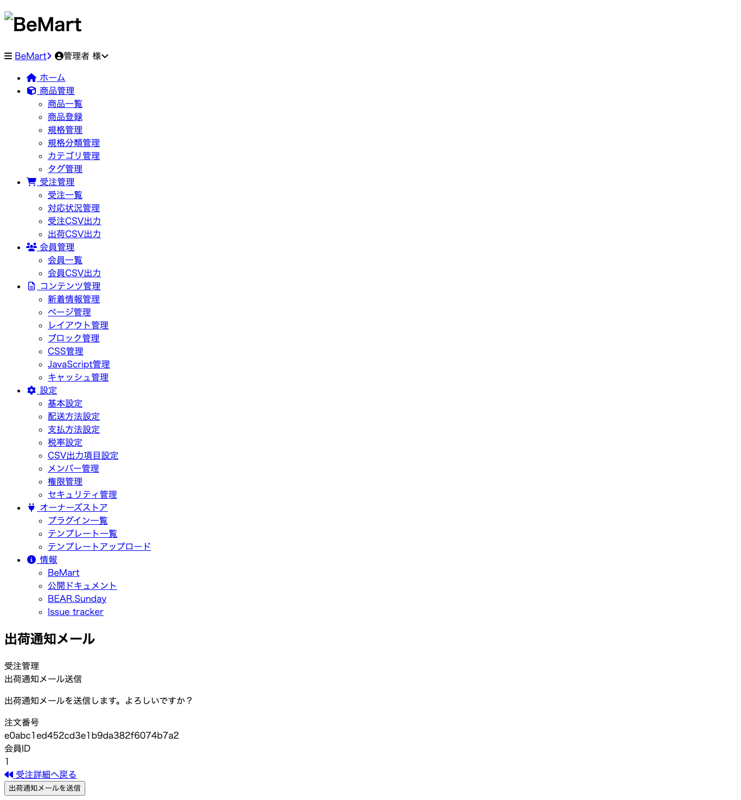](screenshots/20260611-web-db-all-routes/102-出荷通知メール表示.png) |
| Admin | 出荷通知メール送信 | 出荷通知→送信 | POST /admin/order/shipping-notify-mail |  | ✔ |  |  |  | Resource test; FakeMailer boundary + 20260611 admin order browser regression | ✔ pass（setup operation evidence; fake/noop boundary; limited regression run） | [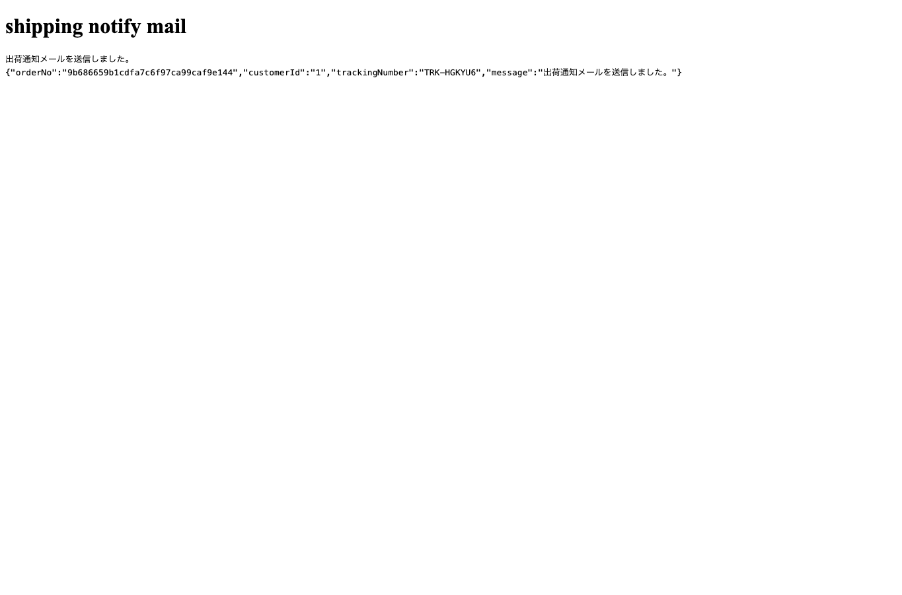](screenshots/20260611-admin-order-browser-regression-fixed4/setup/admin-order-shipping-notify-send.png) |
| Admin | 受注メール確認 | 受注詳細→メール確認 | GET /admin/order/mail-confirm | ✔ |  |  |  |  | Resource + flow-admin-order-fulfillment | ✔ pass | [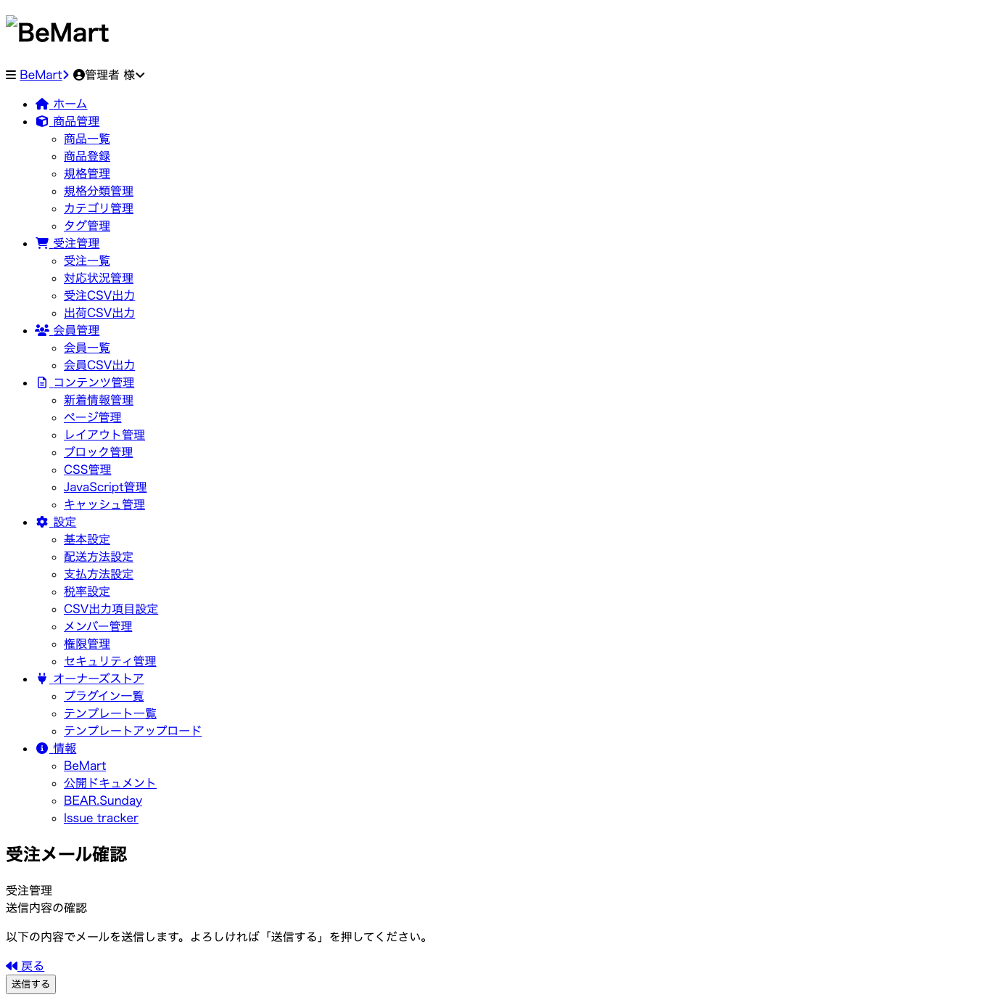](screenshots/20260611-web-db-all-routes/104-受注メール確認.png) |
| Admin | 受注メール送信 | 受注メール→送信 | POST /admin/order/send-mail |  | ✔ |  |  |  | Resource + flow-admin-mail-template-maintenance; FakeMailer boundary + 20260611 admin order browser regression | ✔ pass（setup operation evidence; fake/noop boundary; limited regression run） | [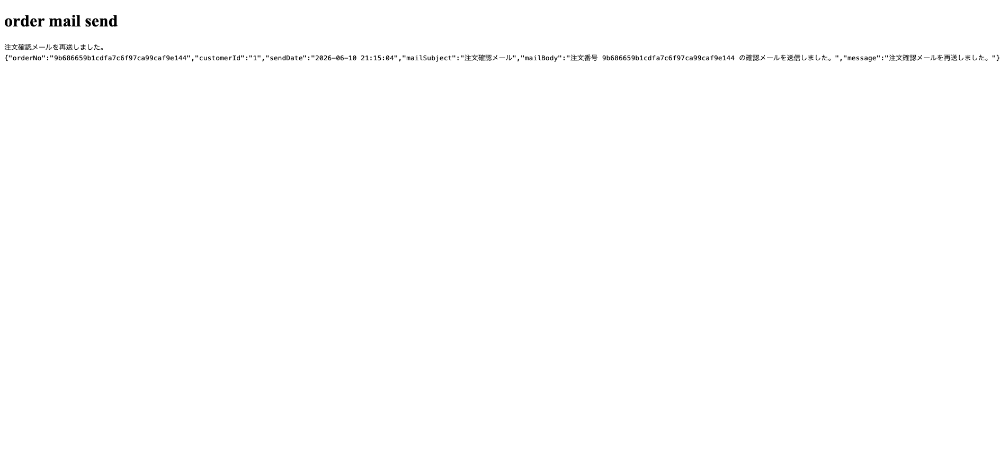](screenshots/20260611-admin-order-browser-regression-fixed4/setup/admin-order-mail-send.png) |
| Admin | 受注CSV出力 | 受注管理→受注CSV | GET /admin/order/export-order | ✔ |  |  |  |  | Resource + flow-admin-csv-exchange + 20260611 admin order browser regression | ✔ pass（HTTP download evidence; limited regression run） | [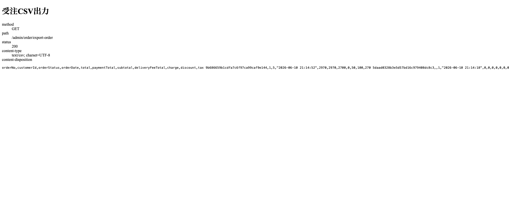](screenshots/20260611-admin-order-browser-regression-fixed4/106-受注CSV出力.png) |
| Admin | 出荷CSV出力 | 受注管理→出荷CSV | GET /admin/order/export-shipping | ✔ |  |  |  |  | Resource + flow-admin-csv-exchange + 20260611 admin order browser regression | ✔ pass（HTTP download evidence; limited regression run） | [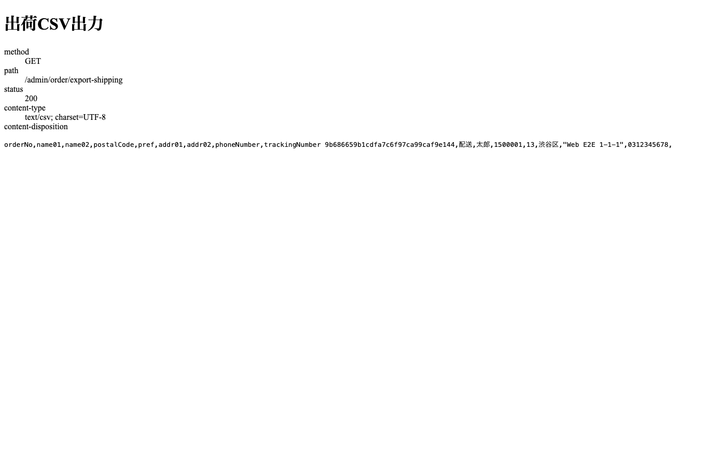](screenshots/20260611-admin-order-browser-regression-fixed4/107-出荷CSV出力.png) |
| Admin | 出荷CSV取込 | 受注管理→出荷CSV取込 | POST /admin/order/import-shipping | ✔ |  |  |  |  | Resource + flow-admin-order-fulfillment + Web+DB CSV upload/readback regression | ✔ pass（setup operation evidence; CSV upload後のexport readback） | [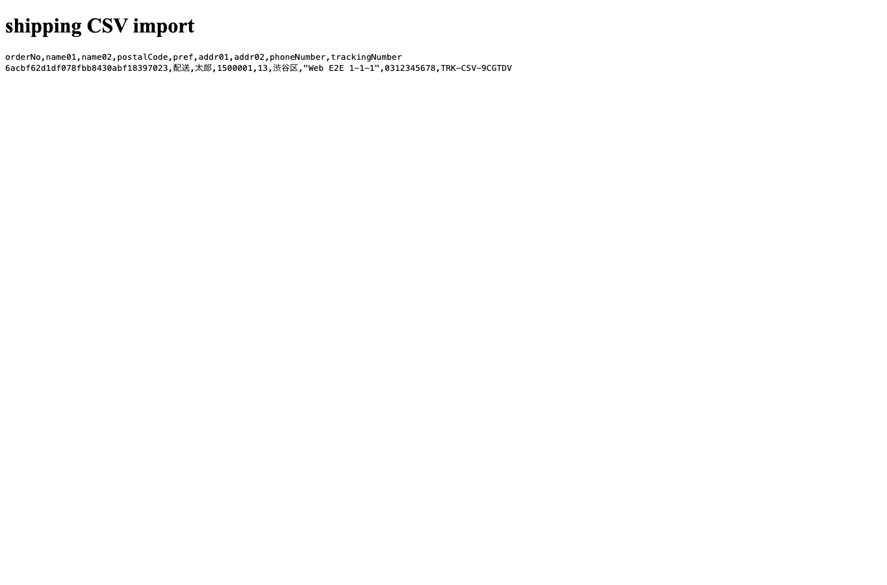](screenshots/20260611-admin-order-shipping-csv-import-regression-fixed/setup/admin-order-shipping-csv-import.png) |
| Admin | 受注PDF出力 | 受注詳細→PDF | GET /admin/order/export-order-pdf |  | ✔ |  |  |  | Resource + flow-admin-order-fulfillment; PDF payload boundary + 20260611 admin order browser regression | ✔ pass（HTTP download evidence; limited regression run） |  |
| Admin | 基本情報表示 | 店舗設定→基本情報 | GET /admin/base-info | ✔ |  |  |  |  | Resource + HTML test + flow-admin-shop-configuration | ✔ pass | [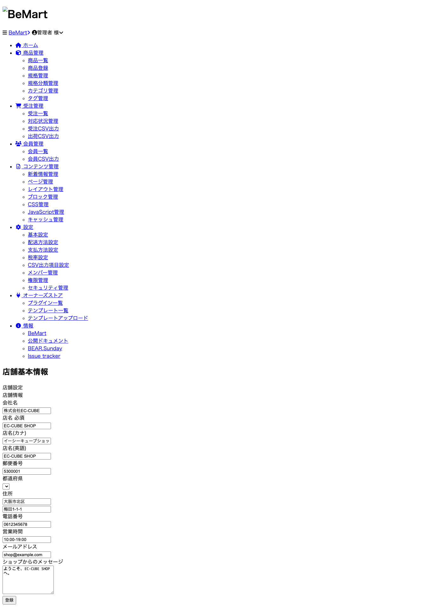](screenshots/20260611-web-db-all-routes/110-基本情報表示.png) |
| Admin | 基本情報更新 | 基本情報→保存 | POST /admin/base-info | ✔ |  |  |  |  | Resource + flow-admin-shop-configuration + 20260611 base-info browser regression | ✔ pass（setup operation evidence; limited regression run） | [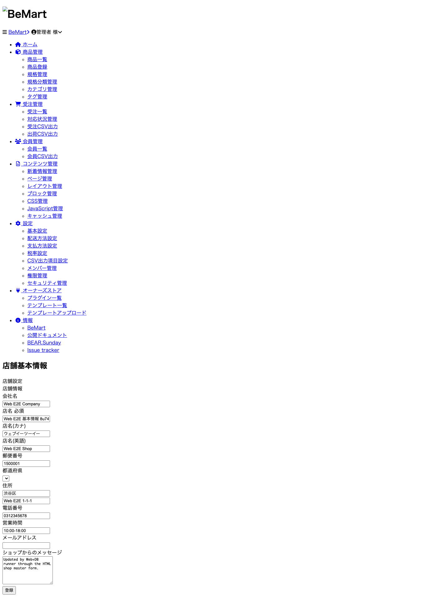](screenshots/20260611-admin-base-info-browser-regression/setup/admin-base-info-update.png) |
| Admin | 支払方法一覧表示 | 店舗設定→支払方法 | GET /admin/payment/payment-list | ✔ |  |  |  |  | Resource + HTML test + flow-admin-shop-configuration | ✔ pass | [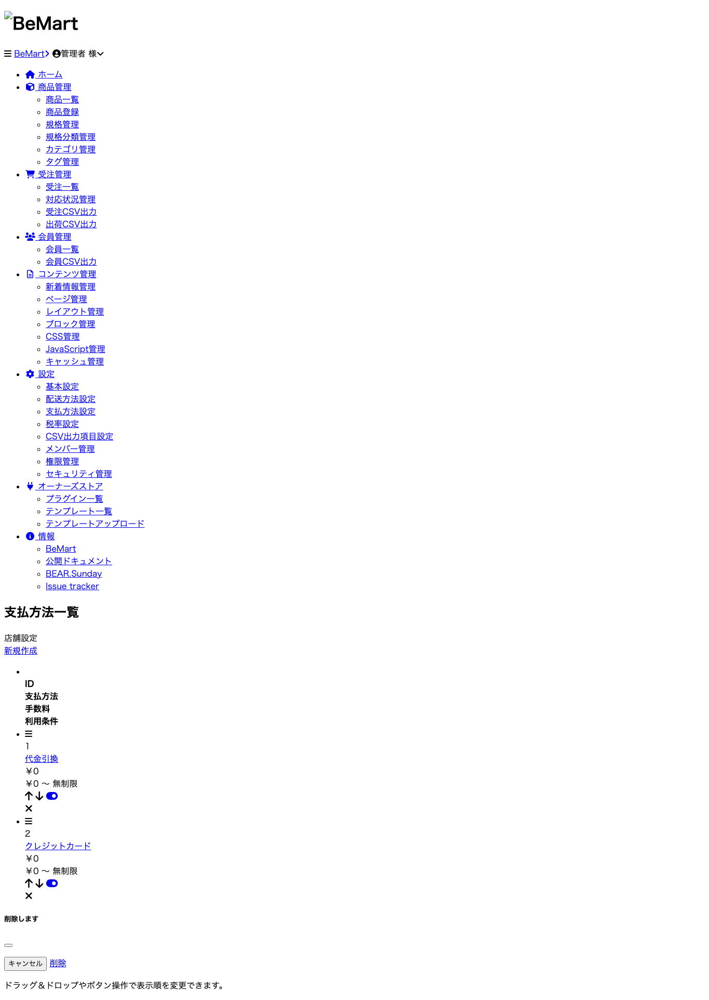](screenshots/20260611-web-db-all-routes/112-支払方法一覧表示.png) |
| Admin | 支払方法作成 | 支払方法→追加 | POST /admin/payment/payment-list | ✔ |  |  |  |  | Resource + flow-admin-shop-configuration | ✔ pass（setup operation evidence） | [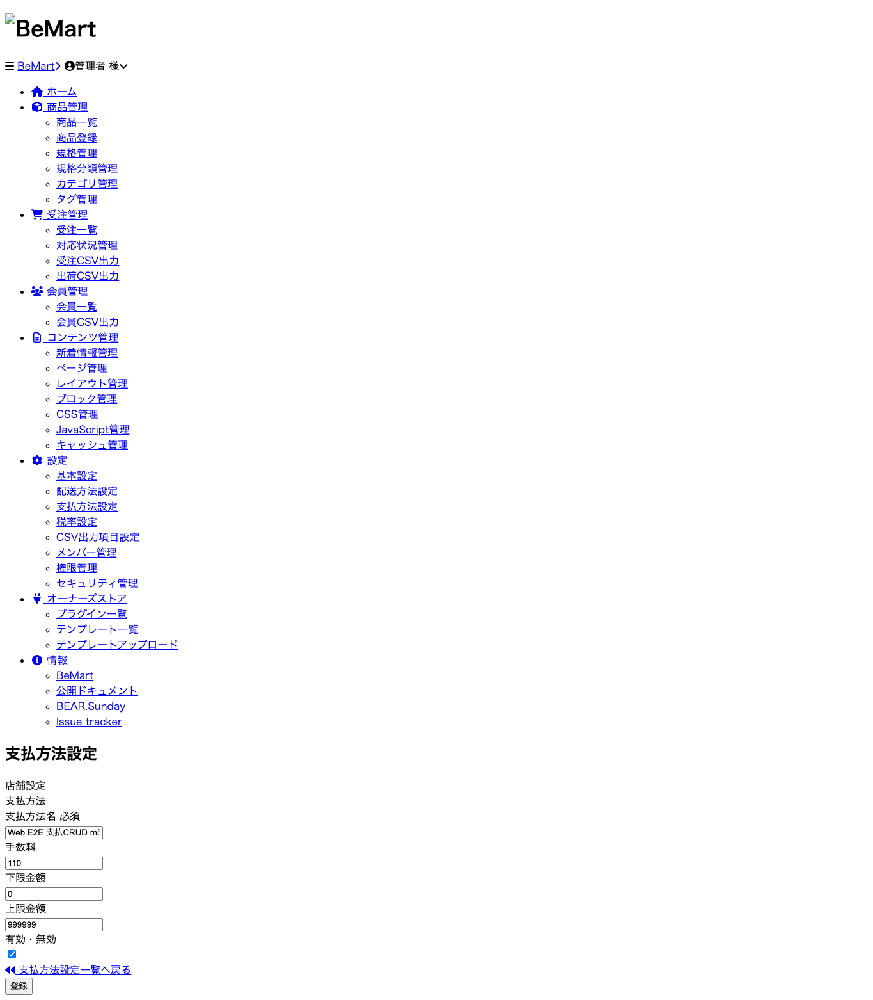](screenshots/20260611-web-db-all-routes/setup/admin-payment-maintenance-create.png) |
| Admin | 支払方法編集 | 支払方法→編集 | PUT /admin/payment/payment | ✔ |  |  |  |  | Resource + flow-admin-shop-configuration | ✔ pass（setup operation evidence） |  |
| Admin | 支払方法削除 | 支払方法→削除 | DELETE /admin/payment/payment | ✔ |  |  |  |  | Resource + flow-admin-shop-configuration | ✔ pass（setup operation evidence） |  |
| Admin | 配送方法一覧表示 | 店舗設定→配送方法 | GET /admin/delivery/delivery-list | ✔ |  |  |  |  | Resource + HTML test + flow-admin-shop-configuration | ✔ pass | [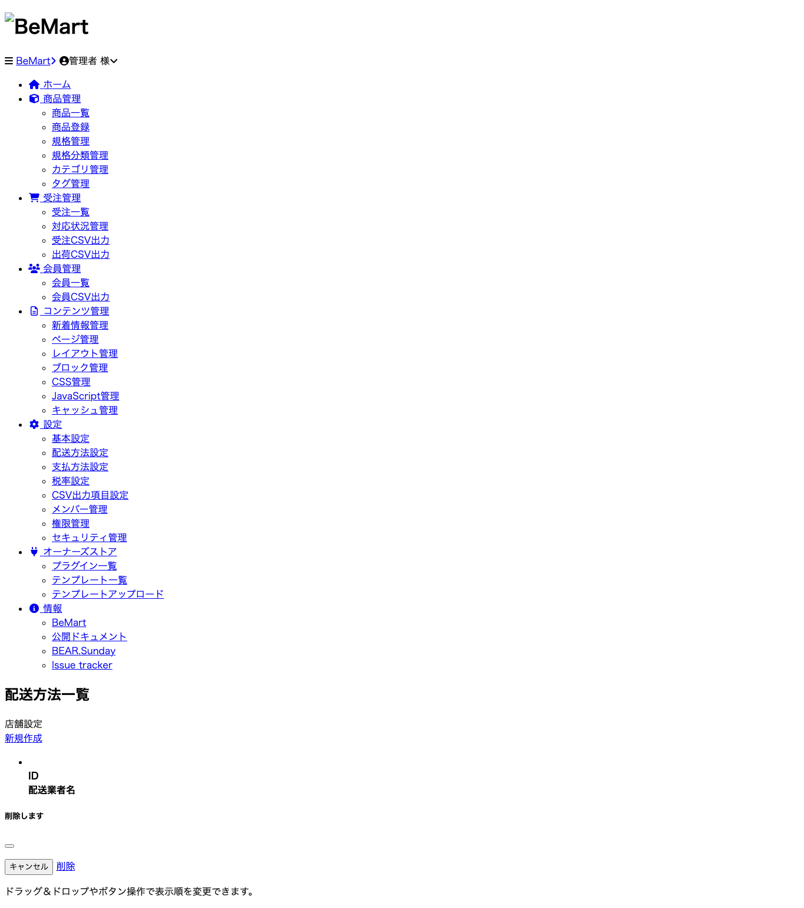](screenshots/20260611-web-db-all-routes/116-配送方法一覧表示.png) |
| Admin | 配送方法作成 | 配送方法→追加 | POST /admin/delivery/delivery-list | ✔ |  |  |  |  | Resource + flow-admin-shop-configuration + 20260611 delivery browser regression | ✔ pass（setup operation evidence; limited regression run） |  |
| Admin | 配送方法編集 | 配送方法→編集 | PUT /admin/delivery/delivery | ✔ |  |  |  |  | Resource + flow-admin-shop-configuration + 20260611 delivery browser regression | ✔ pass（setup operation evidence; limited regression run） | [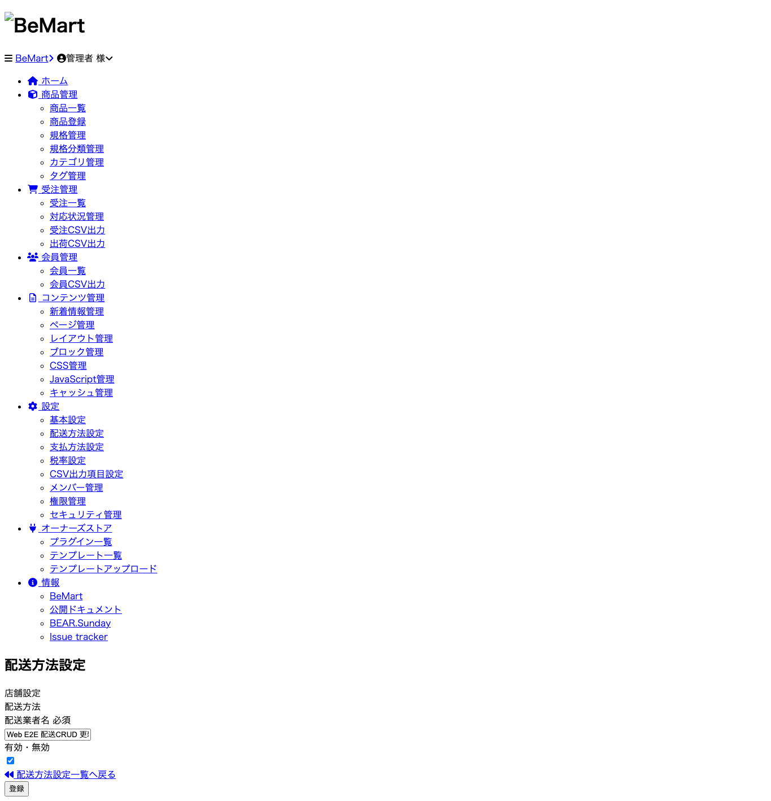](screenshots/20260611-admin-delivery-browser-regression/setup/admin-delivery-maintenance-update.png) |
| Admin | 配送方法削除 | 配送方法→削除 | DELETE /admin/delivery/delivery | ✔ |  |  |  |  | Resource + flow-admin-shop-configuration + 20260611 delivery browser regression | ✔ pass（setup operation evidence; limited regression run） |  |
| Admin | 税率設定一覧表示 | 店舗設定→税率 | GET /admin/tax-rule/tax-rule-list | ✔ |  |  |  |  | Resource + HTML test + flow-admin-shop-configuration | ✔ pass | [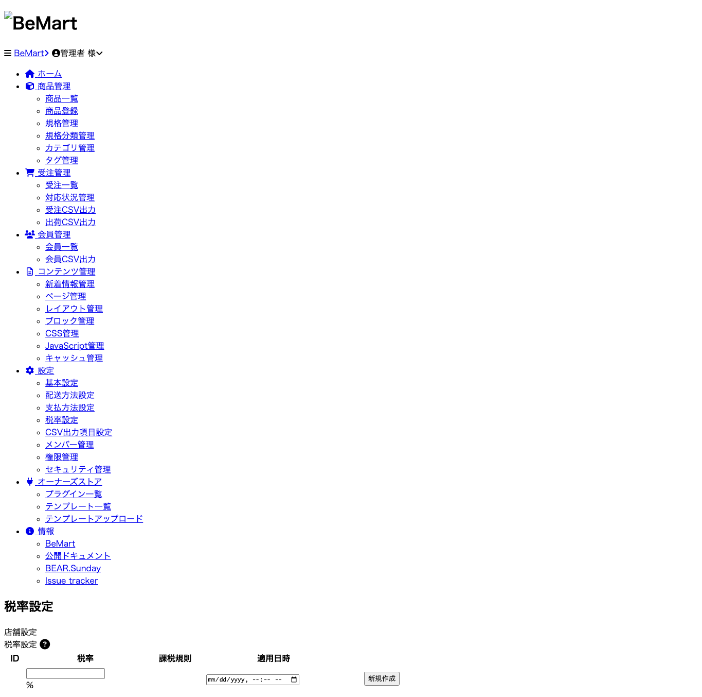](screenshots/20260611-web-db-all-routes/120-税率設定一覧表示.png) |
| Admin | 税率設定作成 | 税率→追加 | POST /admin/tax-rule/tax-rule-list | ✔ |  |  |  |  | Resource + flow-admin-shop-configuration + 20260611 tax-rule browser regression | ✔ pass（setup operation evidence; limited regression run） | [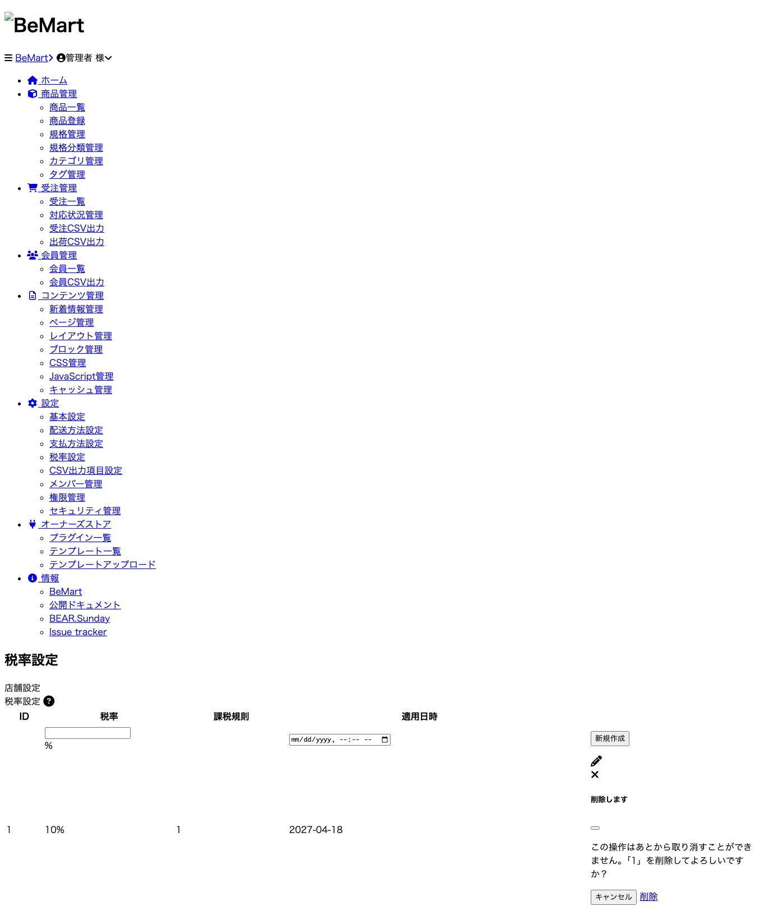](screenshots/20260611-admin-tax-rule-browser-regression-fixed2/setup/admin-tax-rule-create.png) |
| Admin | 税率設定削除 | 税率→削除 | DELETE /admin/tax-rule/tax-rule | ✔ |  |  |  |  | Resource + flow-admin-shop-configuration + 20260611 tax-rule browser regression | ✔ pass（setup operation evidence; limited regression run） |  |
| Admin | 定休日カレンダー表示 | 店舗設定→カレンダー | GET /admin/calendar | ✔ |  |  |  |  | Resource + HTML test + flow-admin-shop-configuration | ✔ pass | [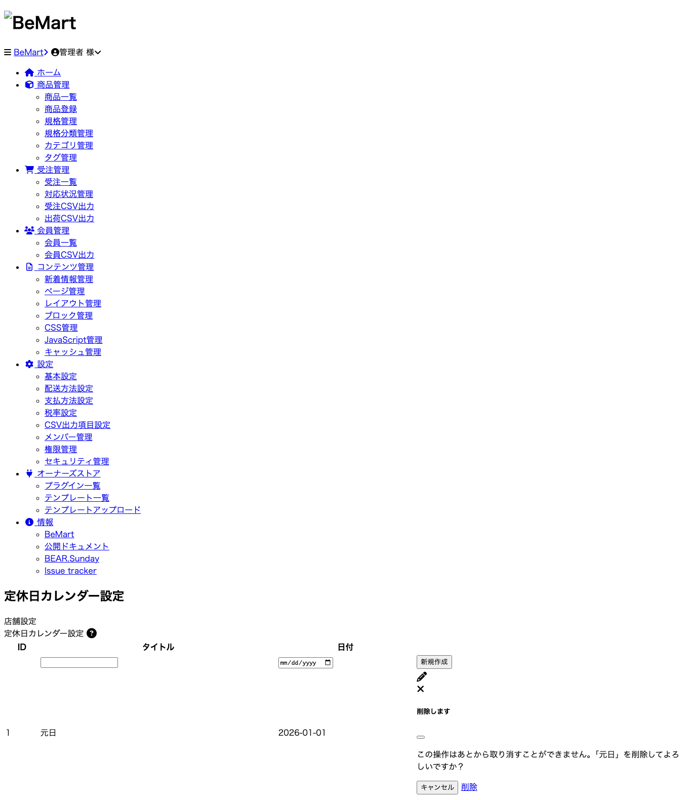](screenshots/20260611-web-db-all-routes/123-定休日カレンダー表示.png) |
| Admin | 定休日作成 | カレンダー→追加 | POST /admin/calendar | ✔ |  |  |  |  | Resource + flow-admin-shop-configuration + 20260611 calendar browser regression | ✔ pass（setup operation evidence; limited regression run） | [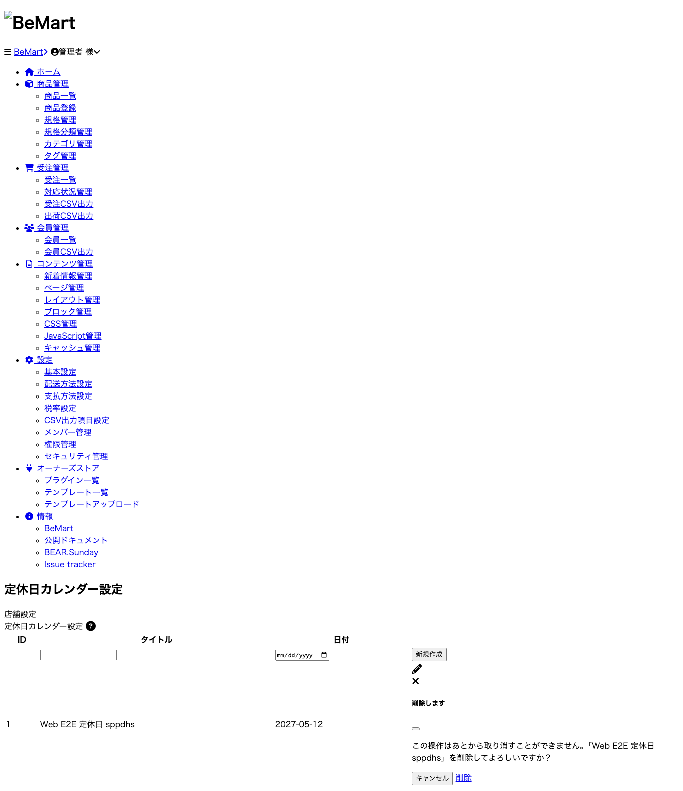](screenshots/20260611-admin-calendar-browser-regression-fixed/setup/admin-calendar-holiday-create.png) |
| Admin | 定休日削除 | カレンダー→削除 | DELETE /admin/calendar | ✔ |  |  |  |  | Resource + flow-admin-shop-configuration + 20260611 calendar browser regression | ✔ pass（setup operation evidence; limited regression run） | [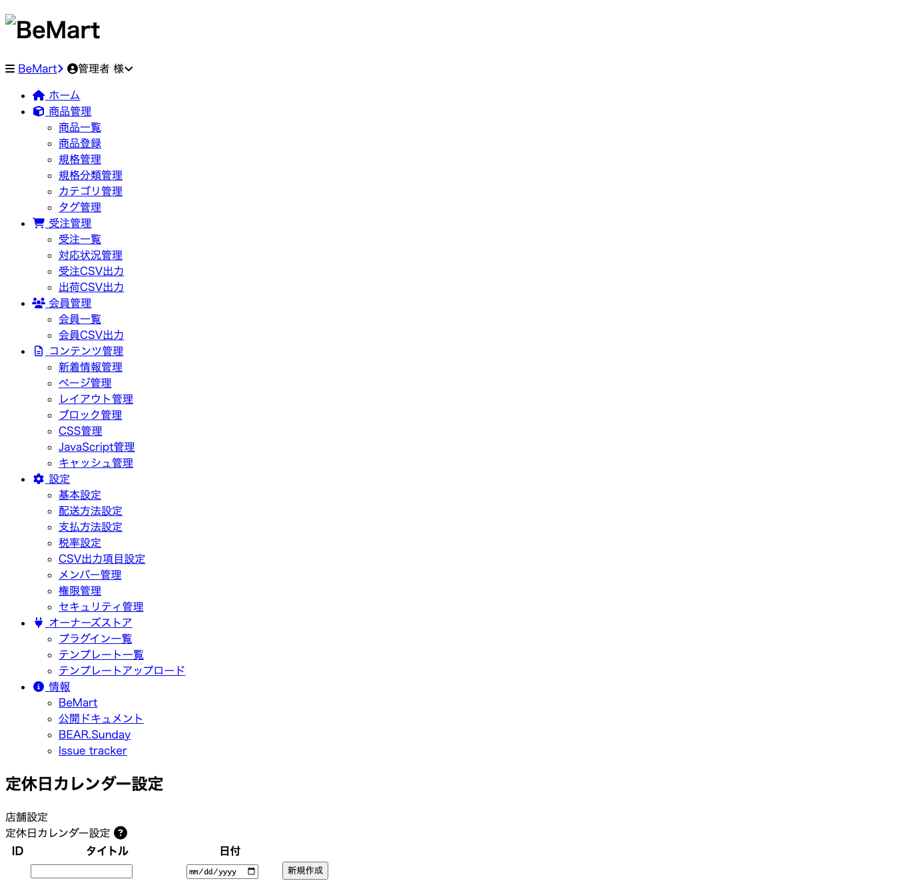](screenshots/20260611-admin-calendar-browser-regression-fixed/setup/admin-calendar-holiday-delete.png) |
| Admin | 特定商取引法表示 | 店舗設定→特商法 | GET /admin/trade-law | ✔ |  |  |  |  | Resource + HTML test + flow-admin-content-publish | ✔ pass | [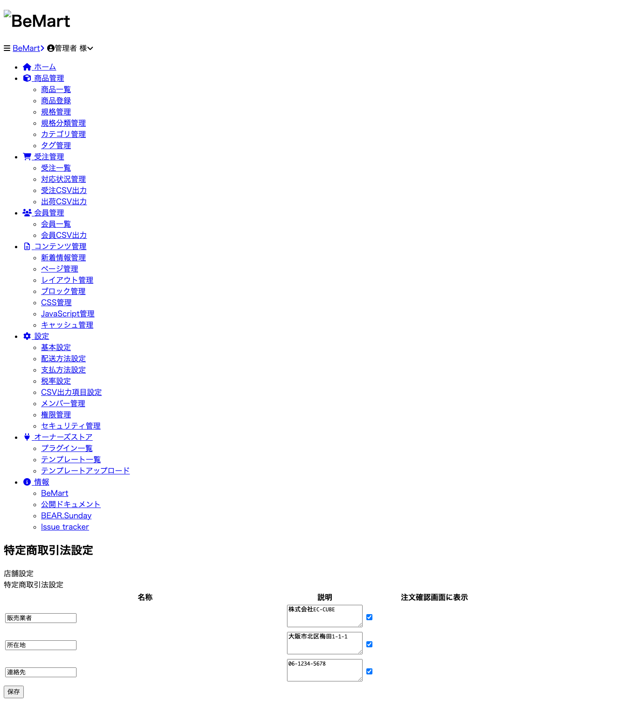](screenshots/20260611-web-db-all-routes/126-特定商取引法表示.png) |
| Admin | 特定商取引法更新 | 特商法→保存 | POST /admin/trade-law | ✔ |  |  |  |  | Resource + flow-admin-content-publish + SQL HTML form regression + 20260611 trade-law browser regression | ✔ pass（setup operation evidence; row form -> 303 PRG -> 管理画面readback） | [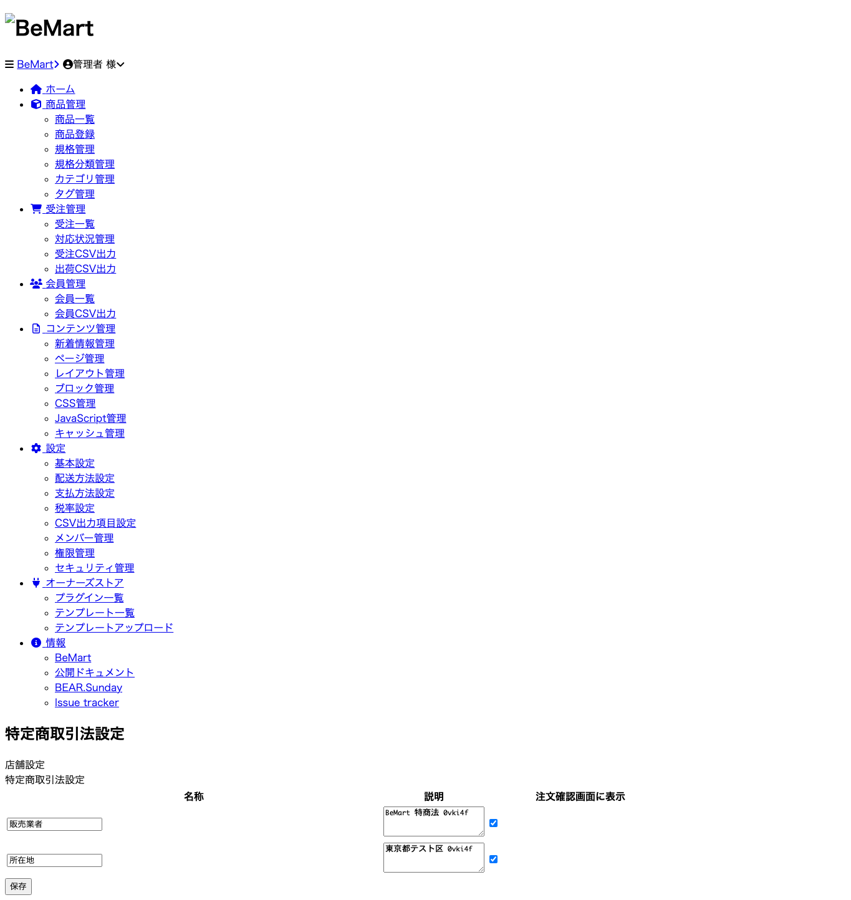](screenshots/20260611-admin-trade-law-browser-regression/setup/admin-trade-law-update.png) |
| Admin | 受注ステータス設定表示 | 店舗設定→受注ステータス | GET /admin/order-status | ✔ |  |  |  |  | Resource + HTML test | ✔ pass | [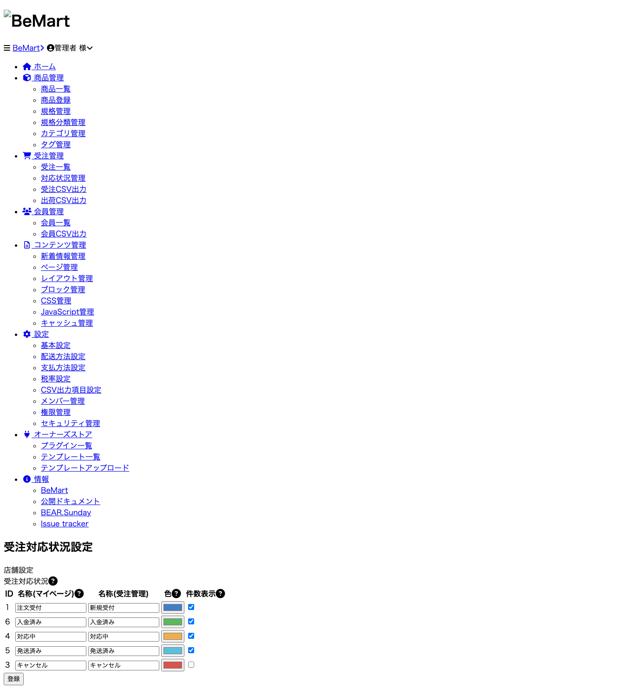](screenshots/20260611-web-db-all-routes/128-受注ステータス設定表示.png) |
| Admin | 受注ステータス設定更新 | 受注ステータス→保存 | PUT /admin/order-status | ✔ |  |  |  |  | Resource + HTML test + SQL HTML form regression + `20260611-admin-order-status-settings-browser-regression` | ✔ pass（setup operation evidence; settings form `_method=put` -> 303 PRG -> settings readback） |  |
| Admin | メールテンプレート一覧表示 | 店舗設定→メール | GET /admin/mail-template | ✔ |  |  |  |  | Resource + HTML test + flow-admin-mail-template-maintenance | ✔ pass |  |
| Admin | メールテンプレート編集 | メールテンプレート→保存 | POST /admin/mail-template | ✔ |  |  |  |  | Resource + flow-admin-mail-template-maintenance + SQL HTML form regression + `20260611-admin-mail-template-browser-regression` | ✔ pass（setup operation evidence; selected form `mail_subject` -> 303 PRG -> subject readback） | [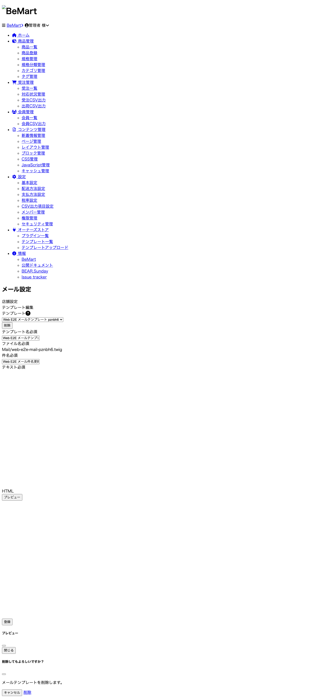](screenshots/20260611-admin-mail-template-browser-regression/setup/admin-mail-template-update.png) |
| Admin | メールテンプレート削除 | メールテンプレート→削除 | DELETE /admin/mail-template | ✔ |  |  |  |  | Resource + flow-admin-mail-template-maintenance + SQL HTML form regression + `20260611-admin-mail-template-browser-regression` | ✔ pass（setup operation evidence; rendered delete affordance -> 303 PRG -> select readback removed） | [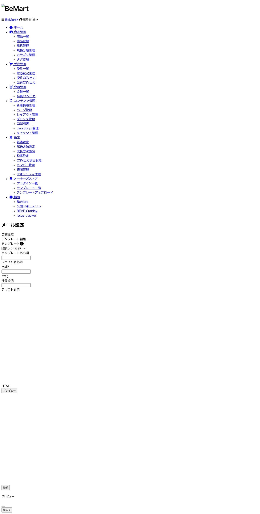](screenshots/20260611-admin-mail-template-browser-regression/setup/admin-mail-template-delete.png) |
| Admin | CSV設定表示 | 店舗設定→CSV設定 | GET /admin/csv-config | ✔ |  |  |  |  | Resource + HTML test + flow-admin-csv-exchange | ✔ pass |  |
| Admin | CSV設定更新 | CSV設定→保存 | POST /admin/csv-config | ✔ |  |  |  |  | Resource + flow-admin-csv-exchange + HTTP form regression + `20260611-admin-csv-config-browser-regression-2` | ✔ pass（setup operation evidence; CSV form submit -> 303 PRG -> order CSV header readback） | [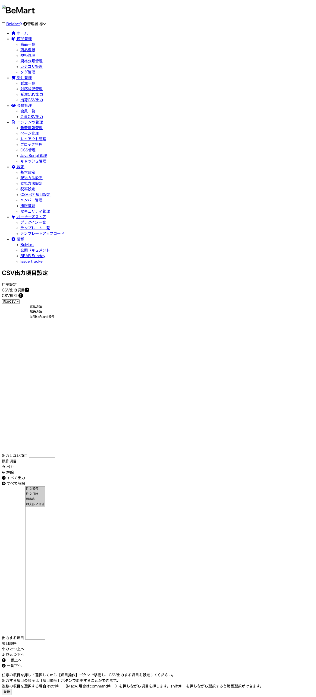](screenshots/20260611-admin-csv-config-browser-regression-2/setup/admin-csv-config-update.png) |
| Admin | マスタデータ表示 | システム→マスタデータ | GET /admin/master-data | ✔ |  |  |  |  | Resource + HTML test | ✔ pass |  |
| Admin | マスタデータ選択 | マスタデータ→種別選択 | PUT /admin/master-data | ✔ |  |  |  |  | Resource/HTTP test + HttpSqlAdminMasterDataFormTest + 20260611 master-data browser regression | ✔ pass（setup operation evidence; edit form rows readback） | [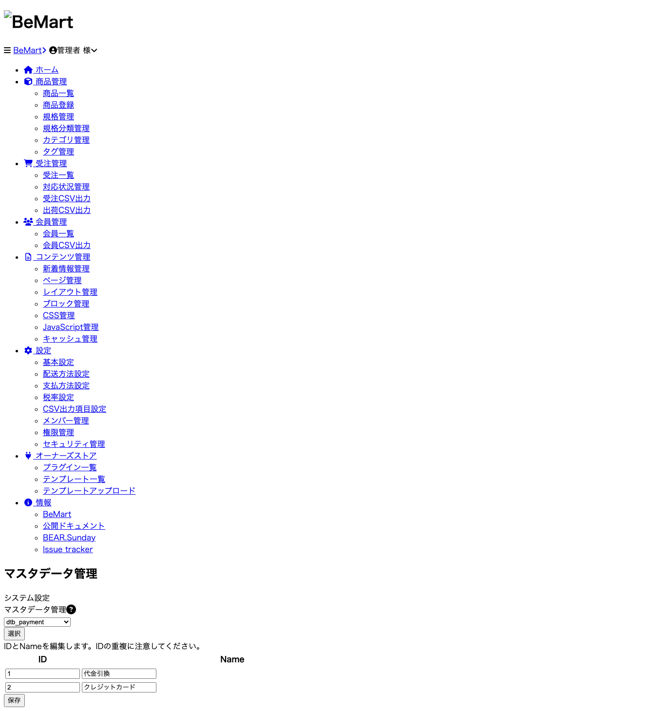](screenshots/20260611-admin-master-data-update-browser-regression/setup/admin-master-data-select.png) |
| Admin | マスタデータ更新 | マスタデータ→保存 | PUT /admin/master-data-edit | ✔ |  |  |  |  | Resource/HTTP test + HttpSqlAdminMasterDataFormTest + 20260611 master-data update browser regression | ✔ pass（setup operation evidence; payment row form save -> 303 PRG -> durable readback） | [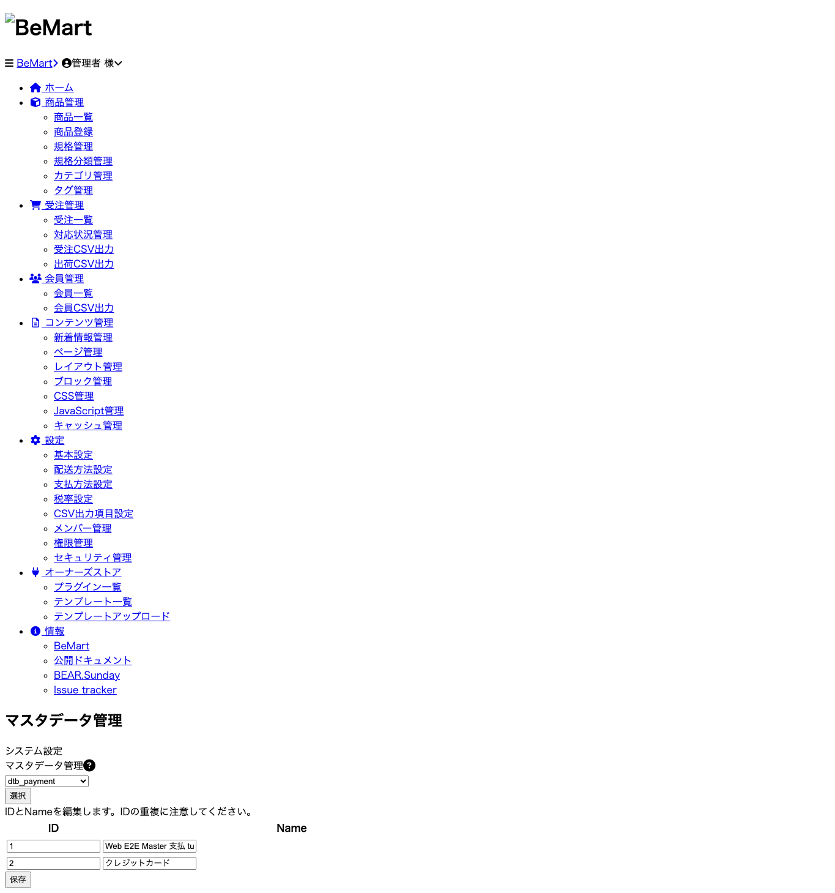](screenshots/20260611-admin-master-data-update-browser-regression/setup/admin-master-data-update.png) |
| Admin | メンバー一覧表示 | システム→メンバー | GET /admin/member-list | ✔ |  |  |  |  | Resource + HTML test + flow-admin-system-operation + HttpSqlAdminMemberFormTest | ✔ pass |  |
| Admin | メンバー作成 | メンバー→追加 | POST /admin/member | ✔ |  |  |  |  | Resource + flow-admin-system-operation + HttpSqlAdminMemberFormTest + Web+DB runner | ✔ pass（setup operation evidence; limited browser regression） | [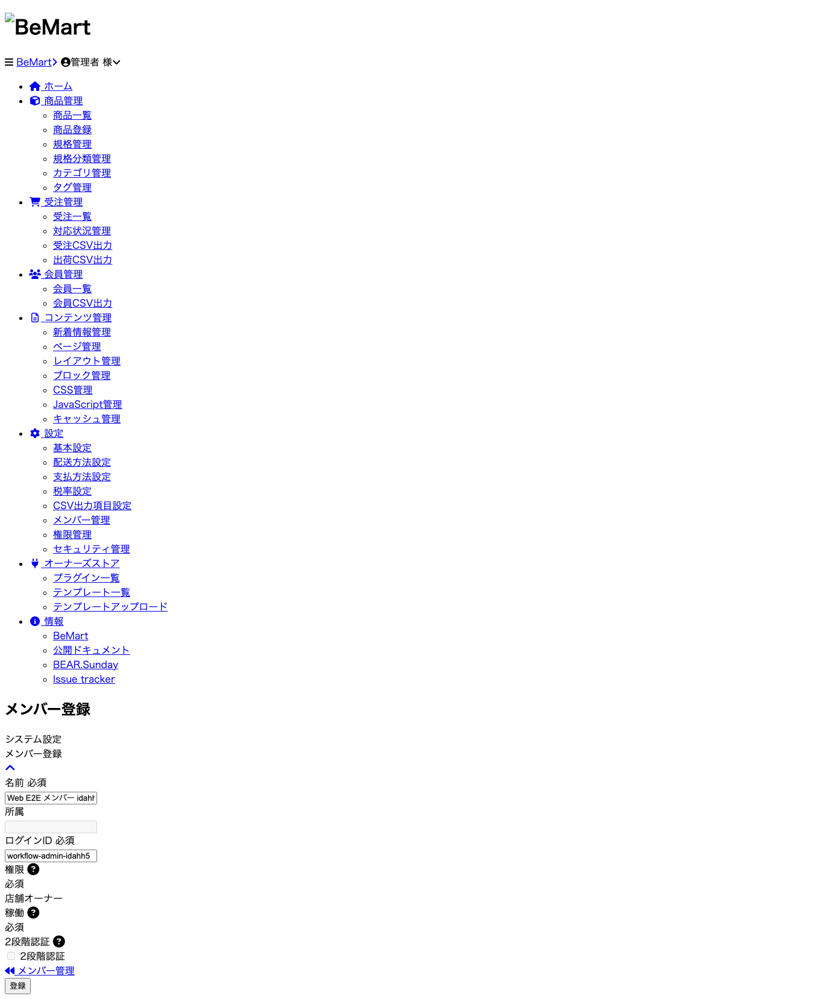](screenshots/20260611-admin-member-browser-regression-emailfix/setup/admin-member-create.png) |
| Admin | メンバー詳細表示 | メンバー一覧→詳細 | GET /admin/member | ✔ |  |  |  |  | Resource + HTML test + flow-admin-system-operation + HttpSqlAdminMemberFormTest + Web+DB runner | ✔ pass |  |
| Admin | メンバー編集 | メンバー詳細→保存 | PUT /admin/member | ✔ |  |  |  |  | Resource + flow-admin-system-operation + HttpSqlAdminMemberFormTest + Web+DB runner | ✔ pass（setup operation evidence; limited browser regression） | [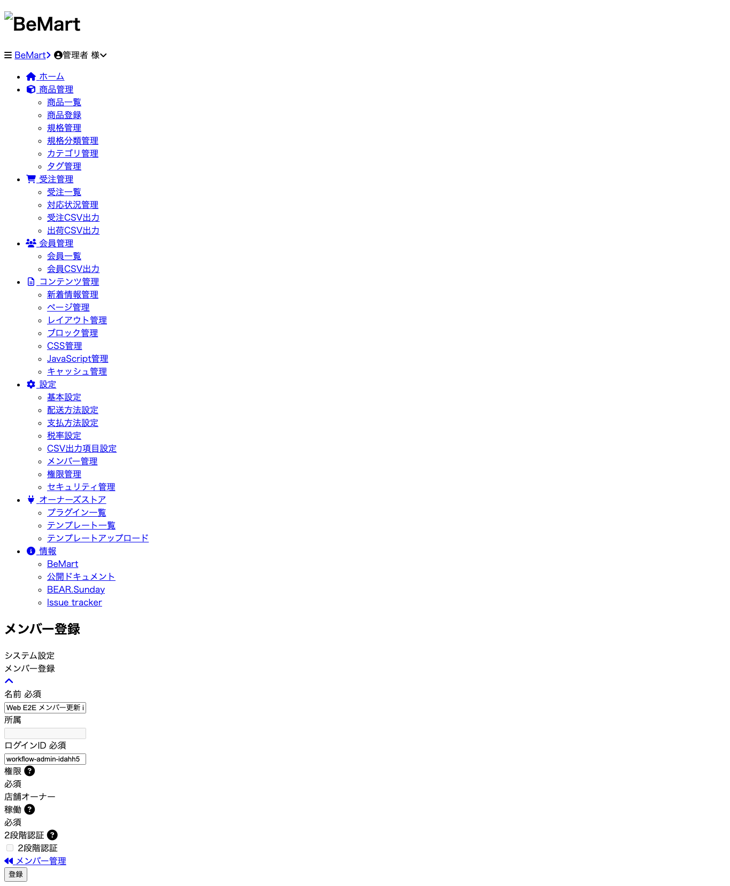](screenshots/20260611-admin-member-browser-regression-emailfix/setup/admin-member-update.png) |
| Admin | メンバー削除 | メンバー→削除 | DELETE /admin/member | ✔ |  |  |  |  | Resource test + HttpSqlAdminMemberFormTest + Web+DB runner | ✔ pass（setup operation evidence; limited browser regression） | [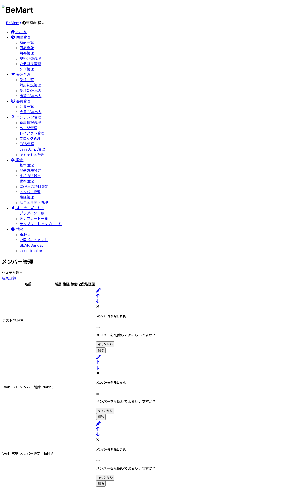](screenshots/20260611-admin-member-browser-regression-emailfix/setup/admin-member-delete.png) |
| Admin | 権限設定更新 | 権限設定→保存 | POST /admin/authority-role | ✔ |  |  |  |  | Resource + FlowAdminAuthorityRoleRulesTest + HttpSqlAdminAuthorityRoleFormTest + Web+DB runner | ✔ pass（setup operation evidence; form action + CSRF + 303 PRG + deny URL readback） | [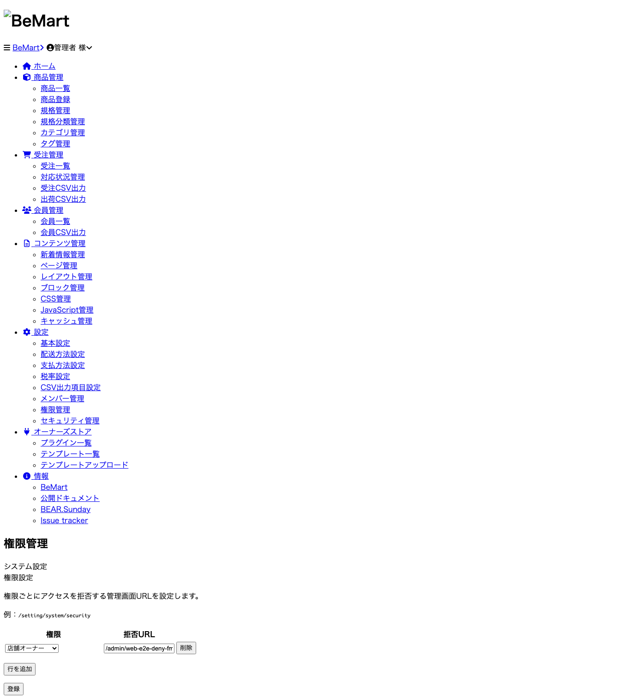](screenshots/20260611-admin-authority-role-browser-regression/setup/admin-authority-role-update.png) |
| Admin | ログイン履歴表示 | システム→ログイン履歴 | GET /admin/login-history | ✔ |  |  |  |  | Resource + HTML test + flow-admin-system-operation | ✔ pass | [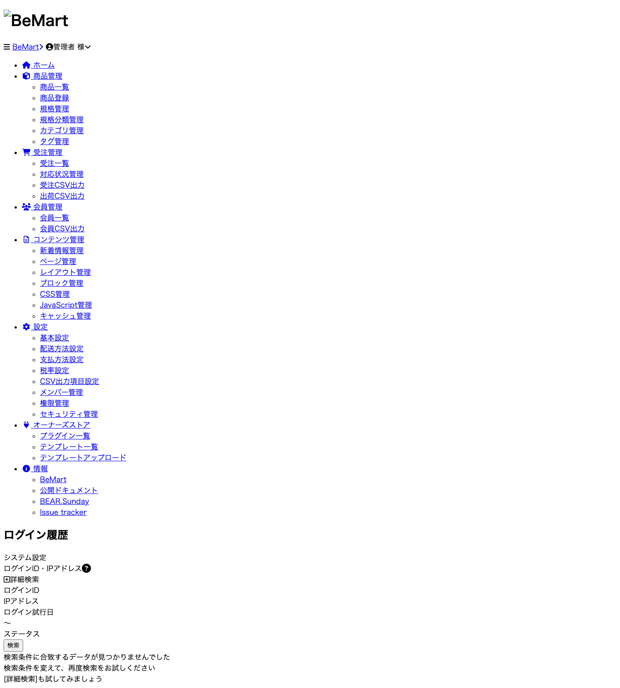](screenshots/20260611-web-db-all-routes/144-ログイン履歴表示.png) |
| Admin | セキュリティ設定表示 | システム→セキュリティ | GET /admin/security | ✔ |  |  |  |  | Resource + HTML test + flow-admin-system-operation | ✔ pass | [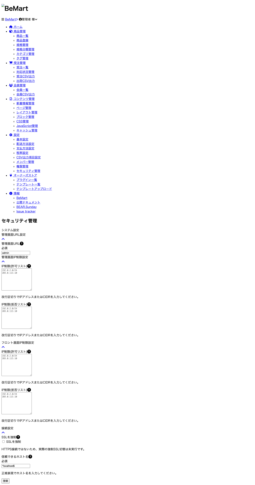](screenshots/20260611-web-db-all-routes/145-セキュリティ設定表示.png) |
| Admin | セキュリティ設定更新 | セキュリティ→保存 | PUT /admin/security |  | ✔ |  |  |  | Resource + flow-admin-system-operation + HttpSqlAdminSystemFormTest + Web+DB runner; security config writer runtime boundary | ✔ pass（setup operation evidence; limited browser regression; runtime readback） | [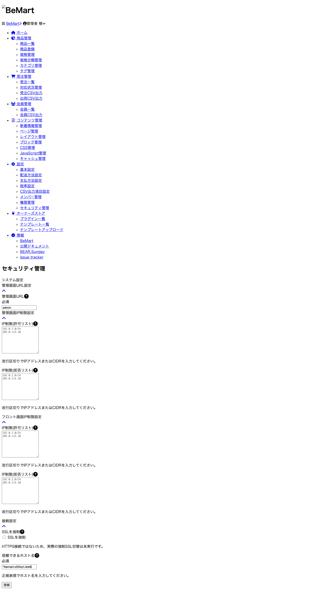](screenshots/20260611-admin-system-browser-regression-fixed/setup/admin-security-update.png) |
| Admin | 二要素認証設定表示 | システム→2FA設定 | GET /admin/two-factor-auth-set | ✔ |  |  |  |  | Resource + HTML test + flow-admin-system-operation | ✔ pass | [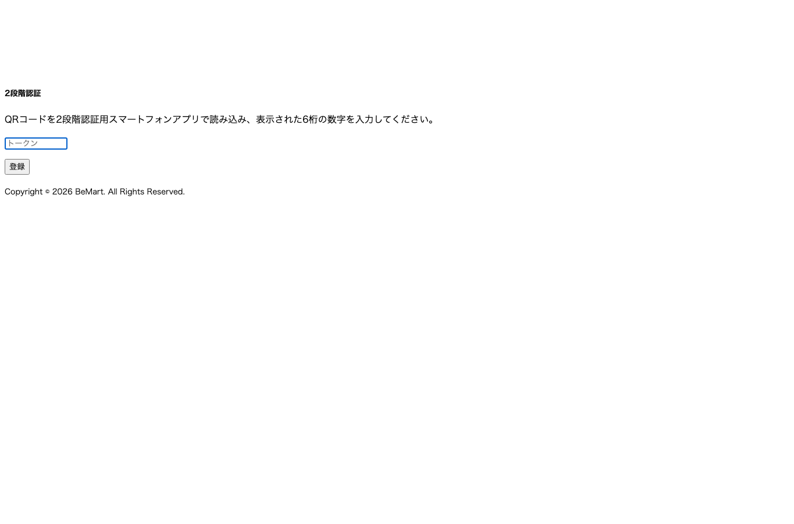](screenshots/20260611-web-db-all-routes/147-二要素認証設定表示.png) |
| Admin | 二要素認証設定更新 | 2FA設定→保存 | PUT /admin/two-factor-auth-set |  | ✔ |  |  |  | Resource + flow-admin-system-operation; FakeTwoFactorAuth boundary | ✔ pass（setup operation evidence） |  |
| Admin | 二要素認証表示 | 2FA確認 | GET /admin/two-factor-auth | ✔ |  |  |  |  | Resource + HTML test + flow-admin-system-operation | ✔ pass | [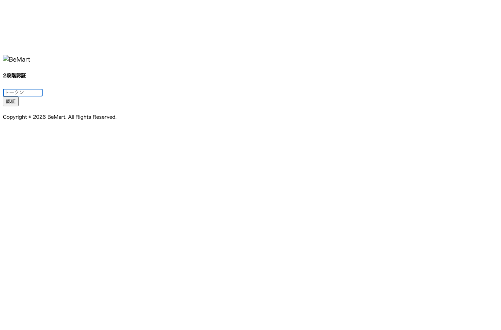](screenshots/20260611-web-db-all-routes/149-二要素認証表示.png) |
| Admin | 二要素認証実行 | 2FAコード送信 | POST /admin/two-factor-auth |  | ✔ |  |  |  | Resource + flow-admin-system-operation + HttpAdminLoginCookieFlowTest + Web+DB runner; FakeTwoFactorAuth boundary | ✔ pass（setup operation evidence; limited browser regression） | [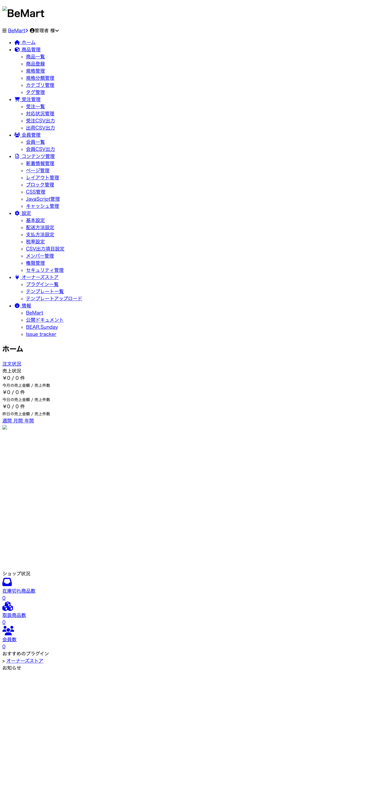](screenshots/20260611-admin-system-browser-regression-fixed/setup/admin-two-factor-verify.png) |
| Admin | システム情報表示 | システム→情報 | GET /admin/system | ✔ |  |  |  |  | Resource + HTML test + flow-admin-system-operation | ✔ pass | [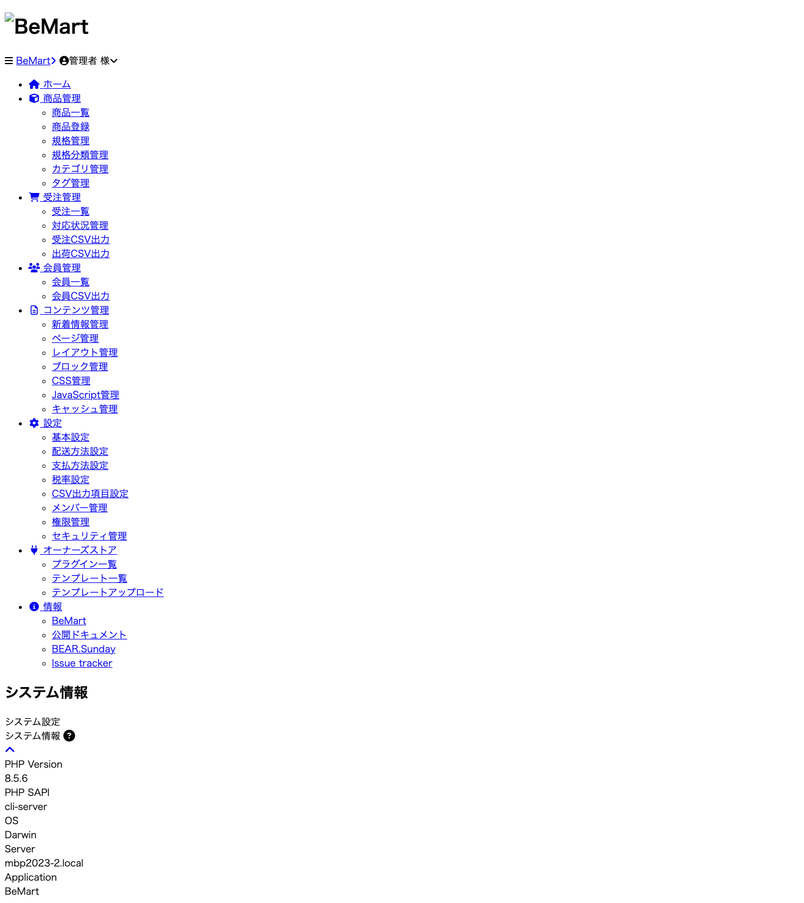](screenshots/20260611-web-db-all-routes/151-システム情報表示.png) |
| Admin | ログ表示 | システム→ログ | GET /admin/log | ✔ |  |  |  |  | Resource + HTML/Resource test | ✔ pass |  |
| Admin | キャッシュ管理表示 | コンテンツ→キャッシュ | GET /admin/content/cache | ✔ |  |  |  |  | Resource + flow-admin-system-operation | ✔ pass |  |
| Admin | キャッシュ削除 | キャッシュ→削除 | PUT /admin/content/cache |  | ✔ |  |  |  | Resource + flow-admin-system-operation + HttpSqlAdminContentOperationFormTest; FakeCacheClearer boundary | ✔ pass（setup operation evidence; limited browser regression） |  |
| Admin | メンテナンス表示 | コンテンツ→メンテナンス | GET /admin/content/maintenance | ✔ |  |  |  |  | Resource + flow-admin-system-operation | ✔ pass |  |
| Admin | メンテナンス切替 | メンテナンス→切替 | PUT /admin/content/maintenance |  | ✔ |  |  |  | Resource + flow-admin-system-operation + HttpSqlAdminContentOperationFormTest; marker-file boundary | ✔ pass（setup operation evidence; limited browser regression; var/tmp marker readback） | [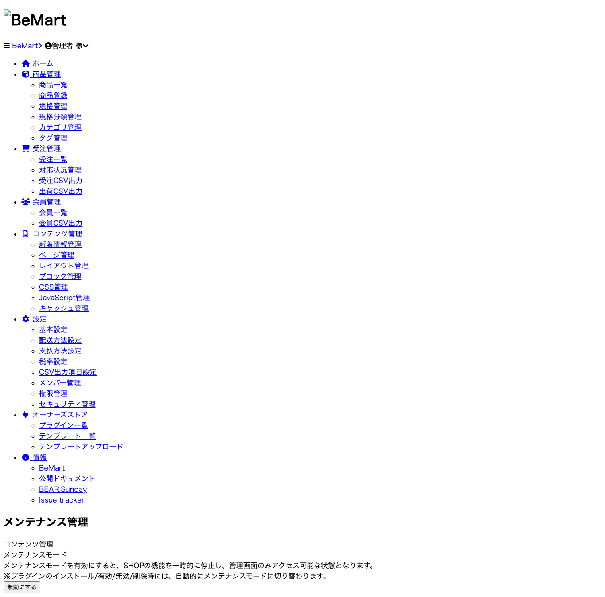](screenshots/20260611-content-operation-browser-regression/setup/admin-maintenance-enable.png) |
| Admin | ニュース一覧表示 | コンテンツ→ニュース | GET /admin/news/news-list | ✔ |  |  |  |  | Resource + HTML test + flow-admin-content-publish | ✔ pass |  |
| Admin | ニュース作成 | ニュース→追加 | POST /admin/news/news-list | ✔ |  |  |  |  | Resource + flow-admin-content-publish + SQL HTML form regression + 20260611 admin news browser regression | ✔ pass（setup operation evidence; limited regression run） | [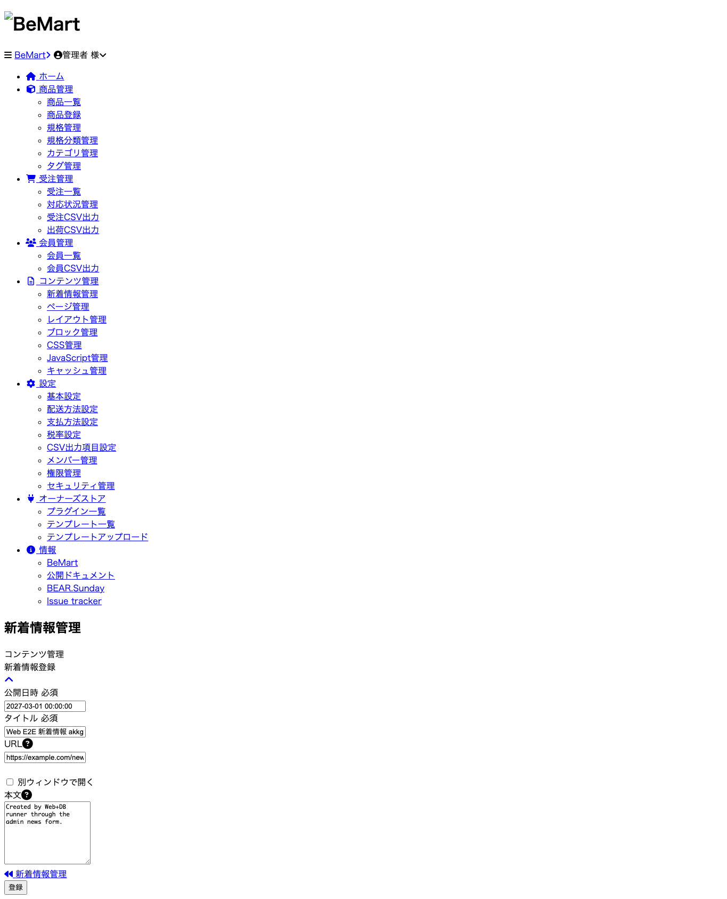](screenshots/20260611-admin-news-browser-regression-fixed/setup/admin-news-create.png) |
| Admin | ニュース編集 | ニュース→編集 | PUT /admin/news/news | ✔ |  |  |  |  | Resource + flow-admin-content-publish + SQL HTML form regression + 20260611 admin news browser regression | ✔ pass（setup operation evidence; limited regression run） |  |
| Admin | ニュース削除 | ニュース→削除 | DELETE /admin/news/news | ✔ |  |  |  |  | Resource + flow-admin-content-publish + SQL HTML form regression + 20260611 admin news browser regression | ✔ pass（setup operation evidence; limited regression run） | [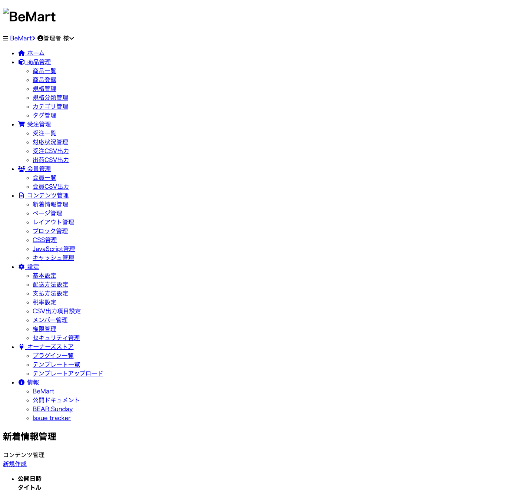](screenshots/20260611-admin-news-browser-regression-fixed/setup/admin-news-delete.png) |
| Admin | ページ一覧表示 | コンテンツ→ページ | GET /admin/page/page-list | ✔ |  |  |  |  | Resource + HTML test + flow-admin-content-publish | ✔ pass | [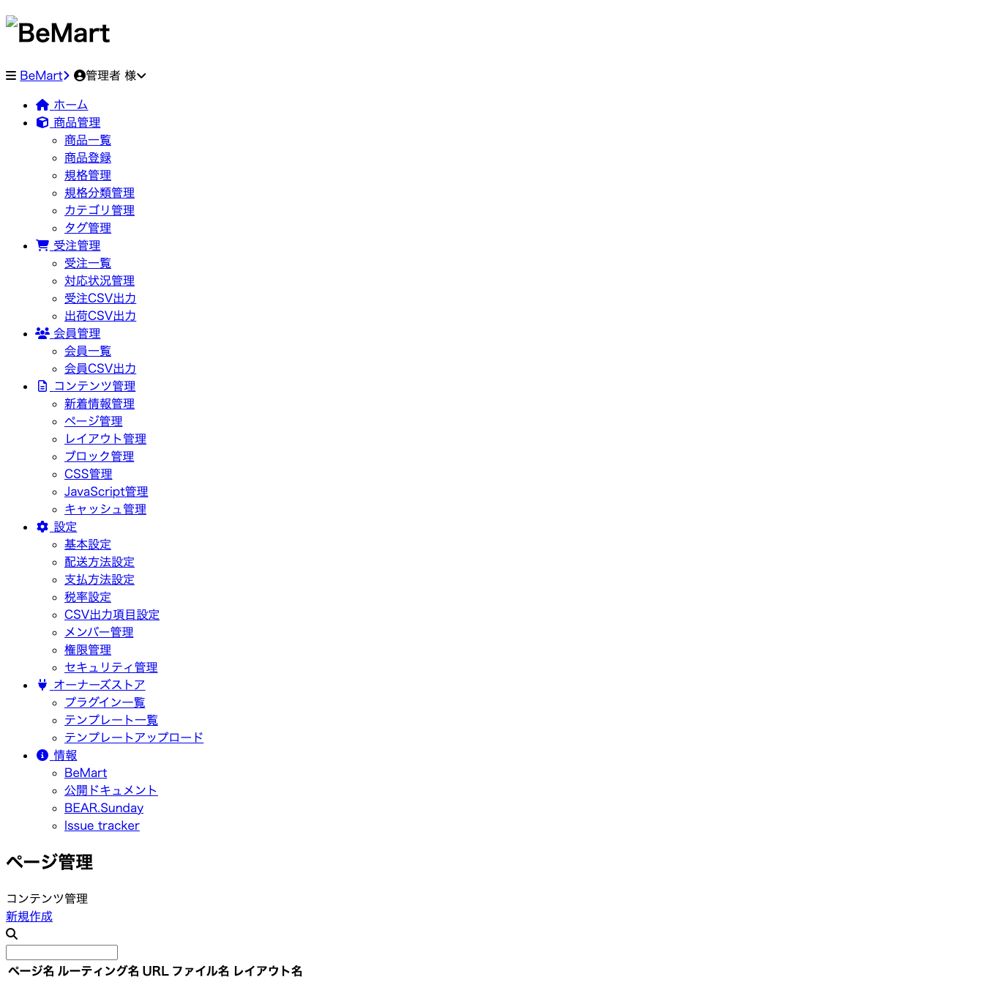](screenshots/20260611-web-db-all-routes/161-ページ一覧表示.png) |
| Admin | ページ作成 | ページ→追加 | POST /admin/page/page-list | ✔ |  |  |  |  | Resource + flow-admin-content-publish + SQL HTML form regression + 20260611 admin page browser regression | ✔ pass（setup operation evidence; limited regression run） | [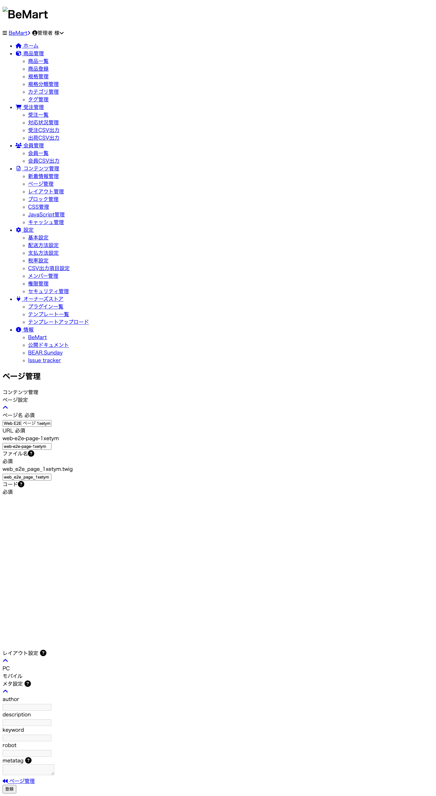](screenshots/20260611-admin-page-browser-regression-fixed/setup/admin-page-create.png) |
| Admin | ページ編集 | ページ→編集 | PUT /admin/page/page | ✔ |  |  |  |  | Resource + flow-admin-content-publish + SQL HTML form regression + 20260611 admin page browser regression | ✔ pass（setup operation evidence; limited regression run） |  |
| Admin | ページ削除 | ページ→削除 | DELETE /admin/page/page | ✔ |  |  |  |  | Resource + flow-admin-content-publish + SQL HTML form regression + 20260611 admin page browser regression | ✔ pass（setup operation evidence; limited regression run） |  |
| Admin | ブロック一覧表示 | コンテンツ→ブロック | GET /admin/block/block-list | ✔ |  |  |  |  | Resource + HTML test + flow-admin-content-publish | ✔ pass |  |
| Admin | ブロック作成 | ブロック→追加 | POST /admin/block/block-list | ✔ |  |  |  |  | Resource + flow-admin-content-publish + SQL HTML form regression + 20260611 admin block browser regression | ✔ pass（setup operation evidence; limited regression run） | [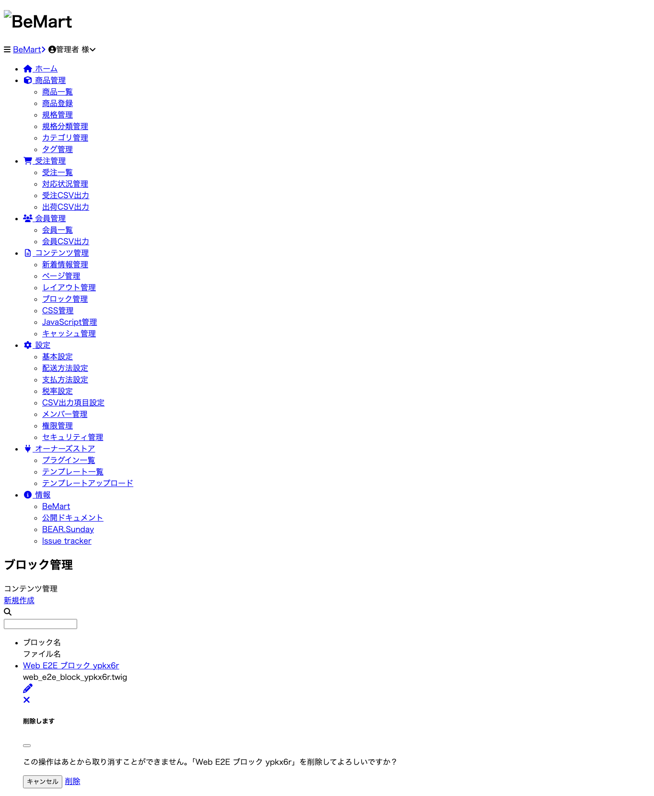](screenshots/20260611-admin-block-browser-regression/setup/admin-block-create.png) |
| Admin | ブロック編集 | ブロック→編集 | PUT /admin/block/block | ✔ |  |  |  |  | Resource + flow-admin-content-publish + SQL HTML form regression + 20260611 admin block edit browser regression | ✔ pass（setup operation evidence; edit form prefill -> PUT -> list readback） | [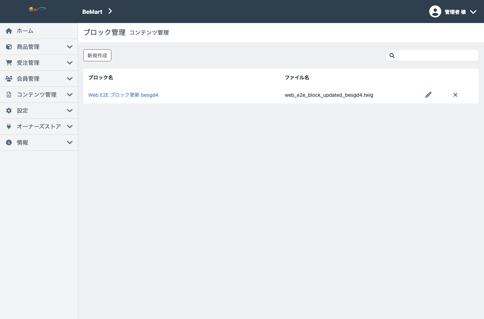](screenshots/20260611-admin-block-edit-browser-regression/setup/admin-block-update.png) |
| Admin | ブロック削除 | ブロック→削除 | DELETE /admin/block/block | ✔ |  |  |  |  | Resource + flow-admin-content-publish + SQL HTML form regression + 20260611 admin block browser regression | ✔ pass（setup operation evidence; limited regression run） | [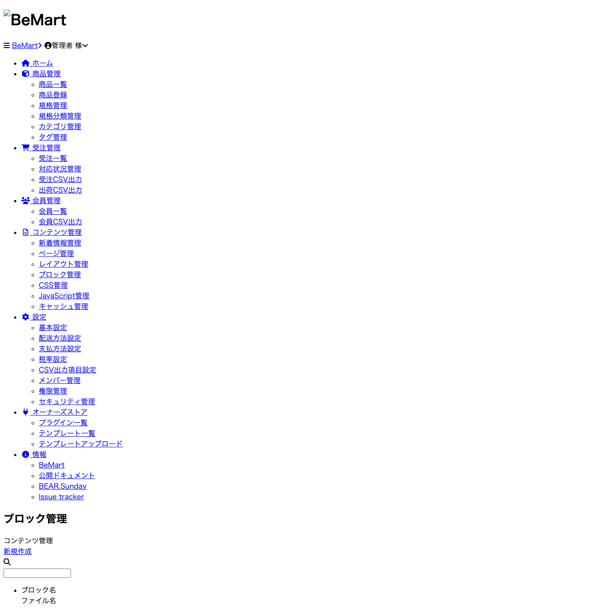](screenshots/20260611-admin-block-browser-regression/setup/admin-block-delete.png) |
| Admin | レイアウト一覧表示 | コンテンツ→レイアウト | GET /admin/layout/layout-list | ✔ |  |  |  |  | Resource + HTML test + flow-admin-content-publish | ✔ pass | [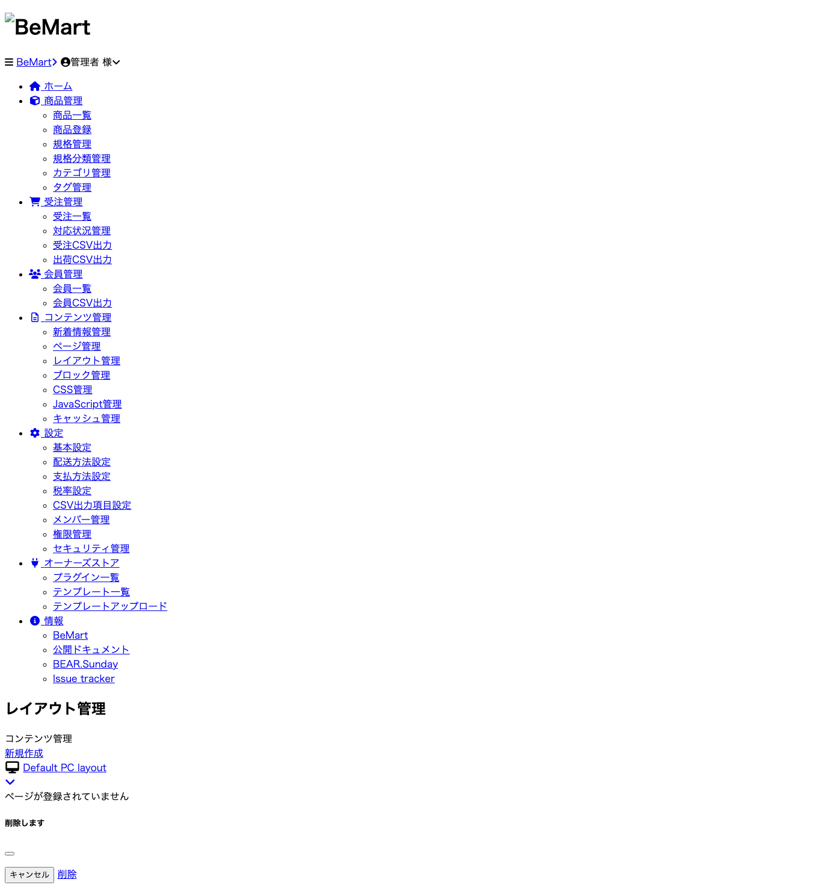](screenshots/20260611-web-db-all-routes/169-レイアウト一覧表示.png) |
| Admin | レイアウト編集 | レイアウト→保存 | PUT /admin/layout/layout |  | ✔ |  |  |  | Resource + flow-admin-content-publish + SQL HTML form regression + 20260611 admin layout browser regression; block-position designer remains deferred boundary | ✔ pass（setup operation evidence; edit form prefill -> PUT -> list readback） | [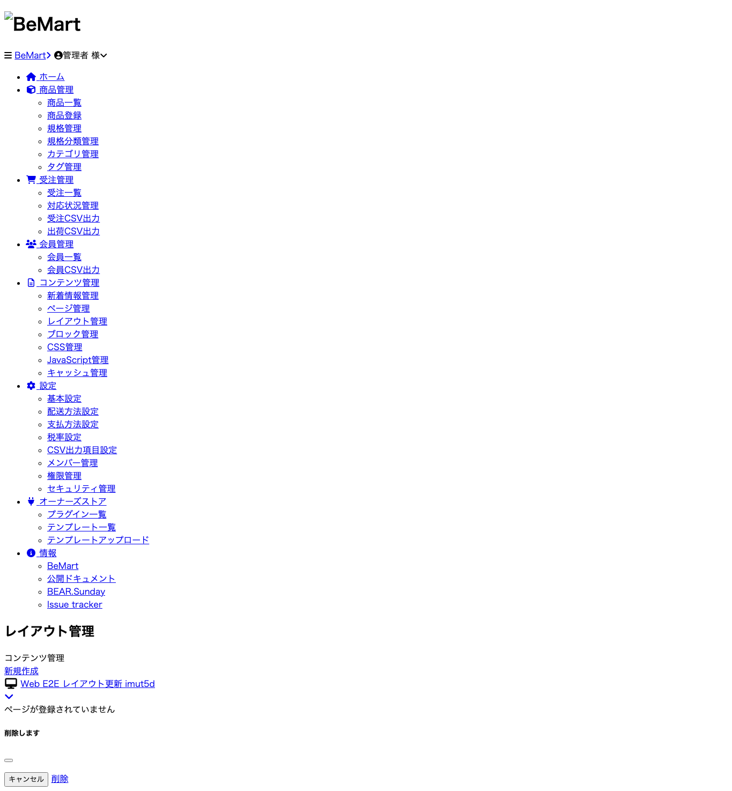](screenshots/20260611-admin-layout-browser-regression/setup/admin-layout-update.png) |
| Admin | CSS管理表示 | コンテンツ→CSS | GET /admin/content/css | ✔ |  |  |  |  | Resource + flow-admin-content-publish | ✔ pass |  |
| Admin | CSS更新 | CSS→保存 | PUT /admin/content/css |  | ✔ |  |  |  | Resource + flow-admin-content-publish + HttpSqlAdminContentOperationFormTest + 20260611 content CSS/JS browser regression | ✔ pass（setup operation evidence; textarea readback） |  |
| Admin | JavaScript管理表示 | コンテンツ→JavaScript | GET /admin/content/js | ✔ |  |  |  |  | Resource + flow-admin-content-publish | ✔ pass |  |
| Admin | JavaScript更新 | JavaScript→保存 | PUT /admin/content/js |  | ✔ |  |  |  | Resource + flow-admin-content-publish + HttpSqlAdminContentOperationFormTest + 20260611 content CSS/JS browser regression | ✔ pass（setup operation evidence; textarea readback） | [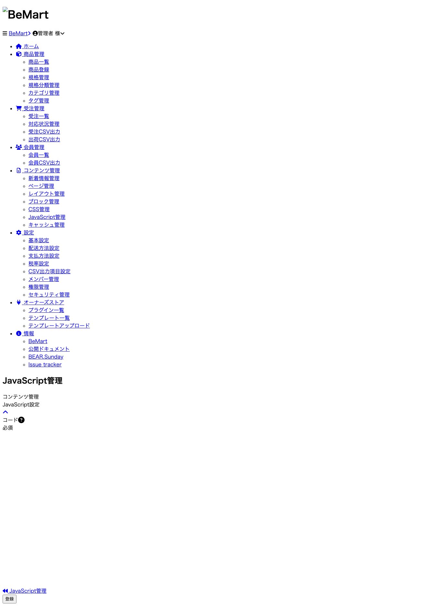](screenshots/20260611-admin-content-css-js-browser-regression-fixed/setup/admin-content-js-update.png) |
| Admin | テンプレート一覧表示 | オーナーズストア→テンプレート | GET /admin/template/template-list | ✔ |  |  |  |  | Resource + HTML test + flow-admin-template-lifecycle | ✔ pass |  |
| Admin | テンプレート追加 | テンプレート→追加 | POST /admin/template/template-add |  | ✔ |  |  |  | Resource + flow-admin-template-lifecycle + HttpSqlAdminTemplateFormTest + 20260611 template active browser regression | ✔ pass（setup operation evidence; multipart upload readback） | [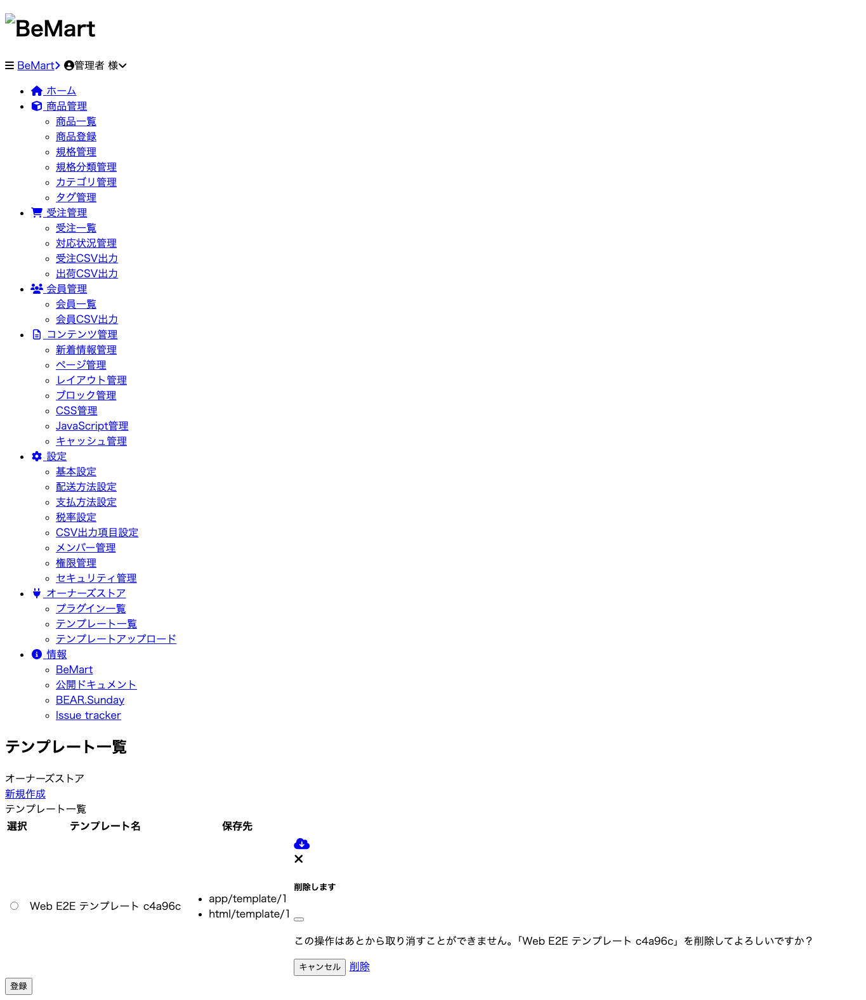](screenshots/20260611-admin-template-active-browser-regression/setup/admin-template-upload.png) |
| Admin | テンプレート有効化 | テンプレート→有効化 | PUT /admin/template/template-list |  | ✔ |  |  |  | Resource + flow-admin-template-lifecycle + HttpSqlAdminTemplateFormTest + 20260611 template active browser regression | ✔ pass（setup operation evidence; selected radio checked readback） |  |
| Admin | テンプレート削除 | テンプレート→削除 | DELETE /admin/template/template-list |  | ✔ |  |  |  | Resource + flow-admin-template-lifecycle + HttpSqlAdminTemplateFormTest + 20260611 template active browser regression | ✔ pass（setup operation evidence; delete readback） | [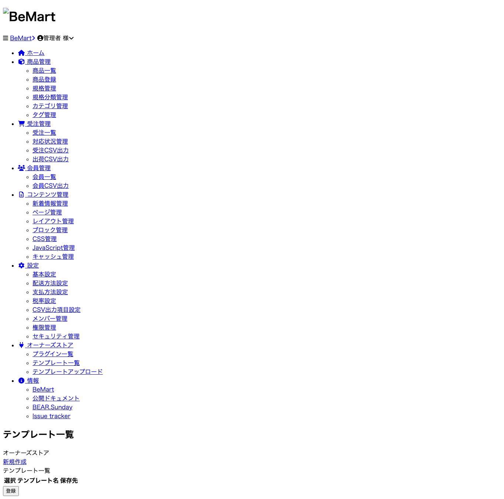](screenshots/20260611-admin-template-active-browser-regression/setup/admin-template-delete.png) |
| Admin | プラグイン一覧表示 | オーナーズストア→プラグイン | GET /admin/plugin-list | ✔ |  |  |  |  | Resource + HTML test | ✔ pass | [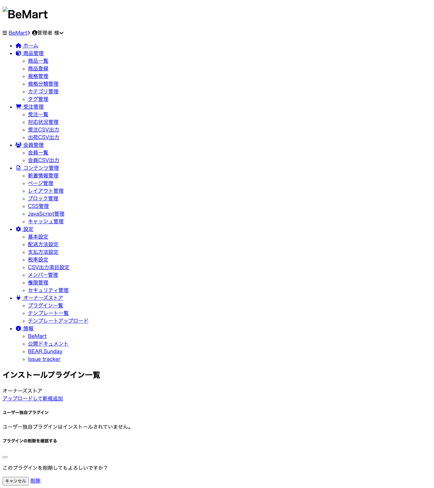](screenshots/20260611-web-db-all-routes/179-プラグイン一覧表示.png) |
| Admin | プラグインインストール | プラグイン→インストール | POST /admin/plugin-list |  |  | ✔ |  |  | Plugin upload/install runtime は migration scope 外。HTML install form なし | — 対象外（plugin install/search runtime scope外） | — 対象外 |
| Admin | プラグイン有効化 | プラグイン→有効化 | POST /admin/plugin-enable |  |  | ✔ |  |  | Plugin lifecycle runtime は migration scope 外。Webで前提plugin行を作れない | — 対象外（plugin lifecycle runtime scope外） | — 対象外 |
| Admin | プラグイン無効化 | プラグイン→無効化 | POST /admin/plugin-disable |  |  | ✔ |  |  | Plugin lifecycle runtime は migration scope 外。Webで前提plugin行を作れない | — 対象外（plugin lifecycle runtime scope外） | — 対象外 |
| Admin | プラグイン削除 | プラグイン→削除 | DELETE /admin/plugin |  |  | ✔ |  |  | Plugin lifecycle runtime は migration scope 外。Webで前提plugin行を作れない | — 対象外（plugin lifecycle runtime scope外） | — 対象外 |
| Boundary | 実決済ゲートウェイ送信 | 外部決済サービス送信 | なし/外部境界 |  |  | ✔ |  |  | BeMart demoではFakePaymentGatewayで境界化 | — 対象外 | — — 対象外（外部/本番運用境界） |
| Boundary | 実メール配送 | SMTP/外部メール配送 | なし/外部境界 |  |  | ✔ |  |  | BeMart demoではFakeMailerで境界化 | — 対象外 | — — 対象外（外部/本番運用境界） |
| Boundary | 本番運用ファイル破壊的変更 | 実CSS/JS/テンプレート/メンテナンス運用反映 | なし/運用境界 |  |  | ✔ |  |  | デモ安全性のためwriter/fake境界で扱う | — 対象外 | — — 対象外（外部/本番運用境界） |

## 次の更新方法

- ブラウザで確認した行は `Web操作結果` を `✔ pass` / `✘ fail` / `— 対象外` に更新する。
- スクリーンショットは最終runの `docs/web-e2e/screenshots/<run-id>/` に保存し、相対パスを `Screenshot` に記録する。途中runや同一内容のPNGは重複証跡として追加しない。
- 問題を見つけてもこの台帳では修正しない。`実装見落とし` または `要調査` に分類し、根拠へ再現情報を書く。
